# 附录2 谓词标注对照手册
## A、基本构图谓词
基本构图谓词有三个，分别是Shape(图形)、Collinear(点共线)和Cocircular(点共圆)。推理器可以根据这三个构图谓词自动扩展出基本谓词，其扩展树如下图所示：  

    

### Shape(*)
Shape是最基本的构图谓词，它使用若干个边或弧来声明一个几何图形，这个几何图形可以是一条边，可以是一个角，也可以是边和弧围成的图形。使用Shape声明几何图形时，我们需要依据有序原则、逆时针原则和旋转不变原则，这三大原则的介绍可参考cowork.md。  

    

**1.声明一个点**  
如图1所示，P是圆O的圆心，我们可以这样声明一个点：  

    Shape(P)

**2.声明一条线段**  
如图2所示，AB是线段的两点，我们可以这样声明线段：  

    Shape(AB)

当使用Shape声明线段时，默认线段是无向的，所以这样声明也是合法的：

    Shape(BA)

**3.声明一个角**  
如图3所示，角B由两条线段构成。需要注意，在声明角时，线段是有向的，两条线出现的顺序按照逆时针的方向，首尾相接。因此角B可以表示为：  

    Shape(AB,BC)

**4.声明一个封闭图形**  
如果一个边一个边或一个角一个角来声明图形，未免也太麻烦了。我们可以直接声明一个由若干线段和弧构成的图形，在构图阶段，推理器会自动扩展出图形中的角、线和弧。因此我们在标注图形的构图语句时，先使用Shape声明所有的最小封闭图形，然后在把那些不封闭的最小图形如角、线段、点等声明，就可以声明整个图形。  
对于图3中的四边形，我们可以这样声明：  

    Shape(AB,BC,CD,DA)
    Shape(BC,CD,DA,AB)
    Shape(CD,DA,AB,BC)
    Shape(DA,AB,BC,CD)

根据旋转不变原则，一个四边形有上述四种表示，我们选择一种就可以。  
更复杂的图形，如图4，可以声明为：  

    Shape(OAB,BE,EA)
    Shape(OBC,CE,EB)
    Shape(EC,OCD,DP,PE)
    Shape(AE,EP,PD,ODA)

需注意，虽然EP和PD是共线的，但在声明封闭图形时，不能直接声明ED，需要把最小的边都声明出来。  
封闭图形可以由线和弧构成，线有两个方向，弧只有一个方向。在声明线时，需要按照逆时针的方向，各点首尾相接；声明弧时，需注意弧只有一种表示方法。  
当弧单独出现时，不需要使用Shape来声明，因为弧的出现必然伴随着Cocircular谓词，所有弧将会由Cocircular谓词自动扩展得到。  

### Collinear(*)
Collinear用来声明3个及3个以上的共线点，2点一定是共线的，所以不用声明2点。  

    

共线声明是及其简单的，只要按顺序列出一条线上所有的点即可，如图1中的共线可声明为：  

    Collinear(AMB)

共线没有方向之分，从另一个方向声明也是合法的：  

    Collinear(BMA)

图2中的共线可声明为：  

    Collinear(BCDEF)

图3中的共线可声明为：  

    Collinear(ADB)
    Collinear(AEC)

共线会在推理器中自动扩展出所有的线和平角，如Collinear(AMB)会扩展得到Line(AM),Line(MB),Line(AM),Angle(AMB),Angle(BMA)。  

### Cocircular(O,*)
Cocircular用来声明共圆的若干个点，与Collinear相同，按照顺序列出若干点即可；但也与Collinear不同，一是即使1个点在圆上也要声明，二是共圆的声明按照逆时针方向，且从任何点开始都可。  

    

在图1中，共圆的几点可声明为：  

    Cocircular(O,ABCD)
    Cocircular(O,BCDA)
    Cocircular(O,CDAB)
    Cocircular(O,DABC)

依据三大原则，图1的共圆声明可以有上述4种形式，任选其1即可。图2到图4是几种比较特殊的共圆声明。
图2的圆上只有1个点，也要声明：  

    Cocircular(O,A)

图3圆上没有点，也要声明：  

    Cocircular(O)

图4两圆有公共点，要分别声明：  

    Cocircular(O,AB)
    Cocircular(P,BA)

共圆声明后，会自动扩展出所有的弧和圆。  

## B、基本实体
基本实体是由基本构图扩展来的实体，在构图结束后不会再改变。我们无需声明基本实体，下述内容是为了让我们理解形式化系统的内在逻辑。基本构图谓词声明一个图形的结构信息，也就是点的相对位置信息。基本实体相当于是基本构图的 'unzip' 版本，在推理过程中更方便使用。目前推理器内置了10个基本实体。  

### Point(A)
就是点，没什么好说的。  

    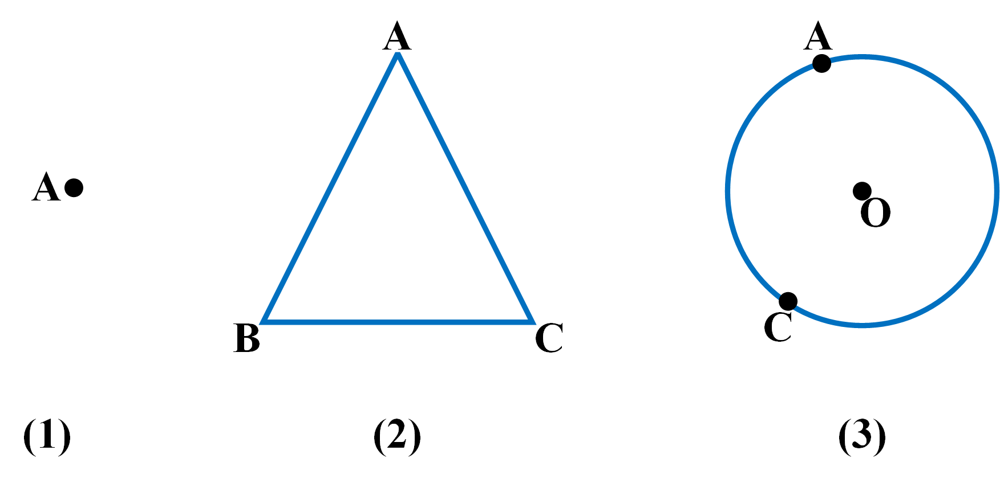

图1-3的点的声明：  

    Point(A)
    Point(A),Point(B),Point(C)
    Point(A),Point(C),Point(O)

### Line(AB)
Line声明一个无向线段。

    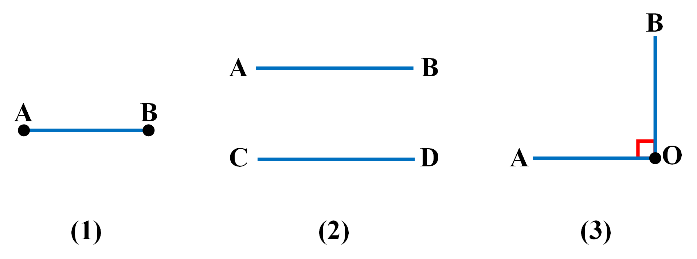

因为是无向的，所以图1的线段有两种声明方法，选其一即可：  

    Line(AB)
    Line(BA)

图2和图3的线段声明：  

    Line(AB),Line(CD)  
    Line(AO),Line(BO) 

### Arc(OAB)
Arc声明一段弧，由3个点组成，第1个点是弧所在的圆，其余2点是构成弧的点，按照逆时针的方向有序列出。  

    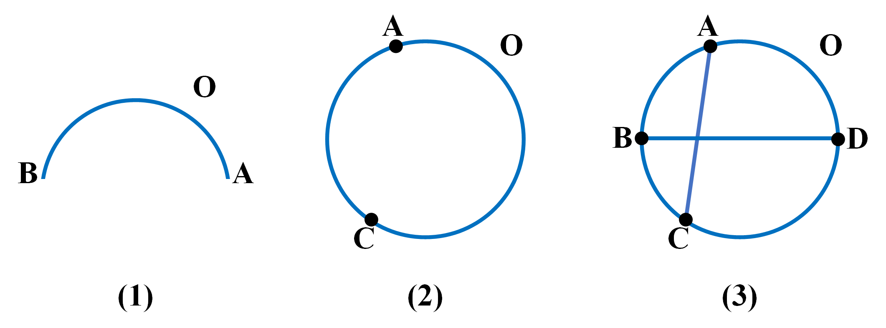

图1-3中弧的声明：  

    Arc(OAB)
    Arc(OAC),Arc(OCA)
    Arc(OAB),Arc(OBC),Arc(OCD),Arc(ODA)

### Angle(ABC)
角由3个点构成，在声明角时，需要按照逆时针原则。  

    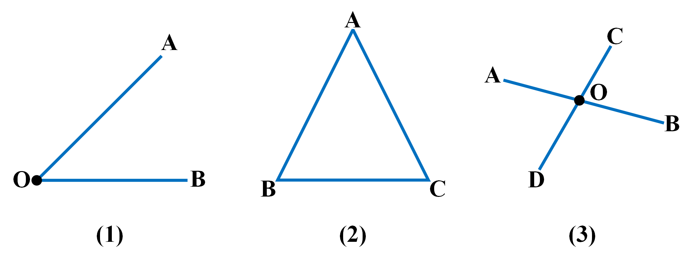

图1-3的角的声明：  

    Angle(AOB)
    Angle(ABC),Angle(BCA),Angle(CAB)
    Angle(AOC),Angle(COB),Angle(BOD),Angle(DOA)

### Polygon(*)
多边形由若干个直线构成，按照逆时针的方向列出所有的点。依据旋转不变原则，一个n边形有n种表示方式。  

    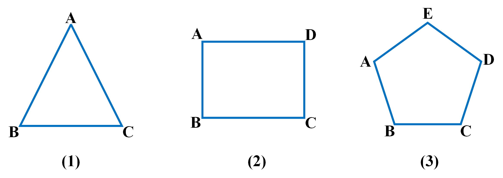

    Polygon(ABC),Polygon(BCA),Polygon(CAB)
    Polygon(ABCD),Polygon(BCDA),Polygon(CDAB),Polygon(DABC)
    Polygon(ABCDE),Polygon(BCDEA),Polygon(CDEAB),Polygon(DEABC),Polygon(EABCD)

### Circle(O)
Circle用于声明一个圆，O表示圆心。  

    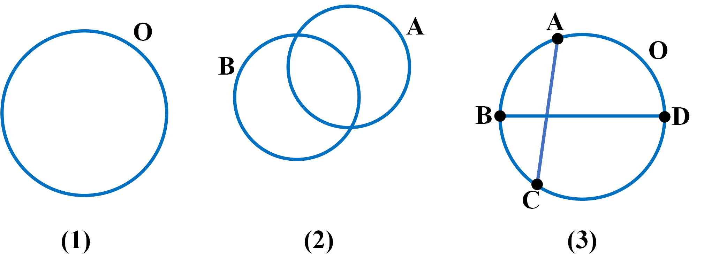

图1-3中圆的声明： 

    Cirlce(O)
    Cirlce(B),Cirlce(A)
    Cirlce(O)

## C、实体
### RightTriangle(ABC)

    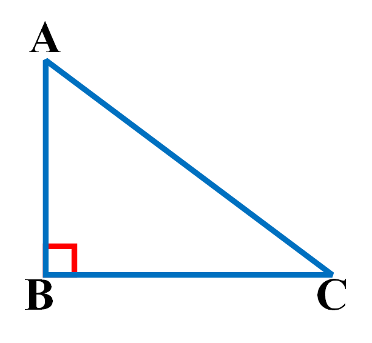

    ee_check: Polygon(ABC)
    multi: 
    extend: PerpendicularBetweenLine(AB,CB)
**Notes**:  
1.有一个角是直角的三角形称为直角三角形  
2.按照逆时针原则标注点的顺序  
3.∠ABC为直角  

### IsoscelesTriangle(ABC)

    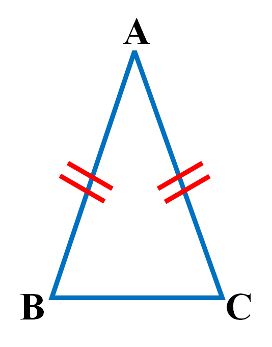

    ee_check: Polygon(ABC)
    multi: 
    extend: Equal(LengthOfLine(AB),LengthOfLine(AC))
**Notes**:  
1.两腰相等的三角形称为等腰三角形  
2.按照逆时针原则标注点的顺序  
3.第一个点作为顶点，与其他两点的连线作为腰，如IsoscelesTriangle(ABC)的两腰为AB和AC  

### IsoscelesRightTriangle(ABC)

    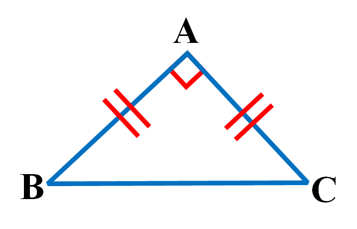

    ee_check: Polygon(ABC)
    multi: 
    extend: RightTriangle(CAB)
            IsoscelesTriangle(ABC)
**Notes**:  
1.参照等腰三角形标注方法  

### EquilateralTriangle(ABC)

    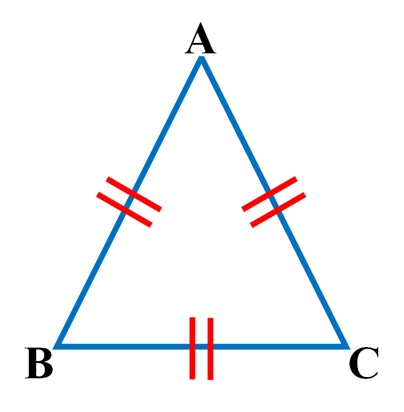

    ee_check: Polygon(ABC)
    multi: BCA
           CAB
    extend: IsoscelesTriangle(ABC)
            IsoscelesTriangle(BCA)
            IsoscelesTriangle(CAB)
**Notes**:  
1.三条边相等的三角形称为等边三角形  
2.按照逆时针原则标注点的顺序  
3.根据旋转不变性原则，有3种表示方法，选其一即可  

### Kite(ABCD)

    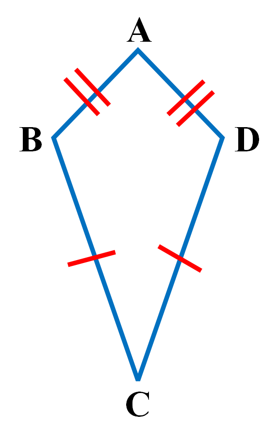

    ee_check: Polygon(ABCD)
    multi: CDAB
    extend: Equal(LengthOfLine(AB),LengthOfLine(AD))
            Equal(LengthOfLine(CB),LengthOfLine(CD))
**Notes**:  
1.两组临边相等的四边形称为风筝形  
2.按照逆时针原则标注点的顺序  
3.第一个点和第三个点分别作为两组临边的交点，如Quadrilateral(ABCD)是AB=AD，CB=CD  
4.根据旋转不变性原则，1个风筝形有2种表示方法，选其一即可  

### Parallelogram(ABCD)

    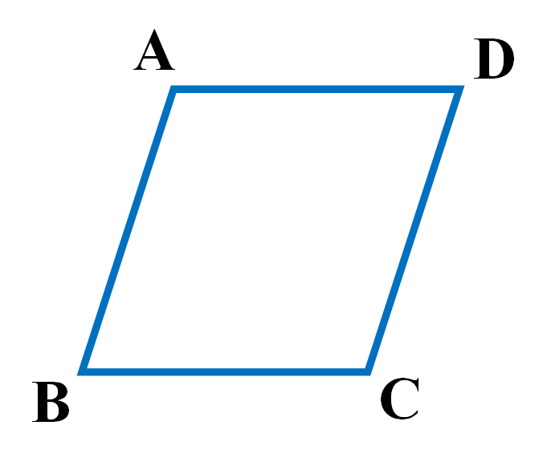

    ee_check: Polygon(ABCD)
    multi: BCDA
           CDAB
           DABC
    extend: ParallelBetweenLine(AD,BC)
            ParallelBetweenLine(BA,CD)
**Notes**:  
1.两组对边分别平行的四边形称为平行四边形  
2.按照逆时针原则标注点的顺序  
3.根据旋转不变性原则，1个平行四边形有4种表示方法，选其一即可  

### Rhombus(ABCD)

    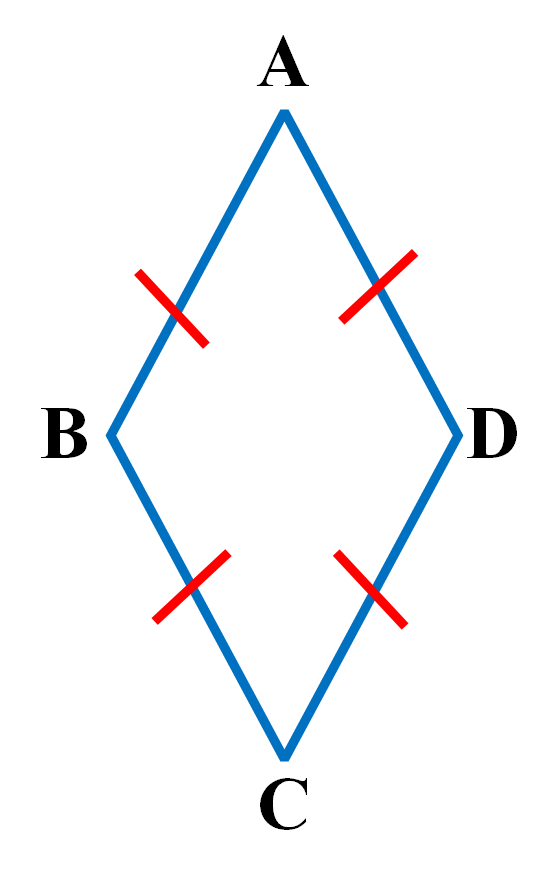

    ee_check: Polygon(ABCD)
    multi: BCDA
           CDAB
           DABC
    extend: Parallelogram(ABCD)
            Kite(ABCD)
            Kite(BCDA)
**Notes**:  
1.四条边相等的四边形称为菱形  
2.按照逆时针原则标注点的顺序  
3.根据旋转不变性原则，1个菱形有4种表示方法，选其一即可  

### Rectangle(ABCD)

    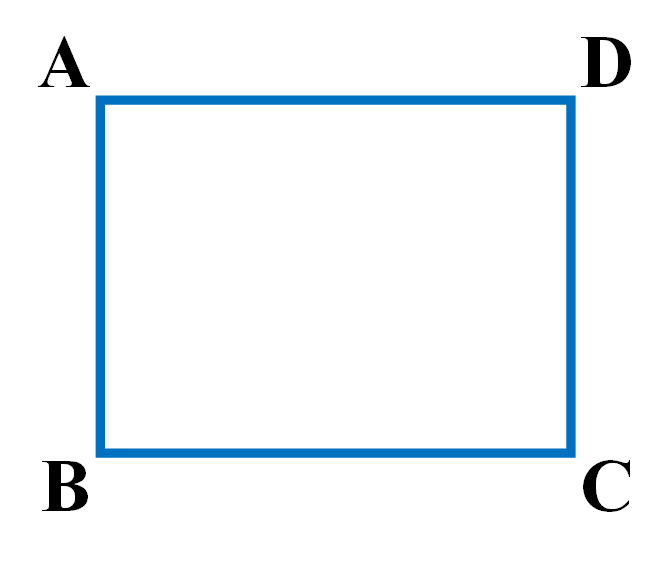

    ee_check: Polygon(ABCD)
    multi: BCDA
           CDAB
           DABC
    extend: Parallelogram(ABCD)
            PerpendicularBetweenLine(AB,CB)
            PerpendicularBetweenLine(BC,DC)
            PerpendicularBetweenLine(CD,AD)
            PerpendicularBetweenLine(DA,BA)
**Notes**:  
1.四个角都是直角的四边形称为矩形  
2.按照逆时针原则标注点的顺序  
3.根据旋转不变性原则，1个矩形有4种表示方法，选其一即可  

### Square(ABCD)

    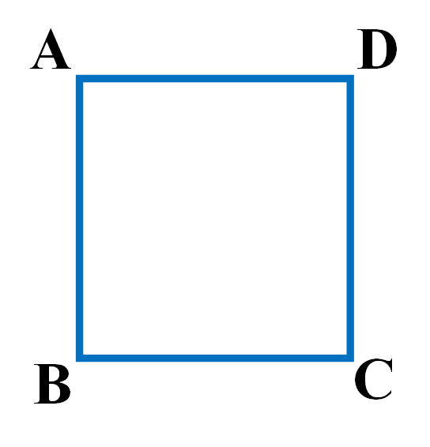

    ee_check: Polygon(ABCD)
    multi: BCDA
           CDAB
           DABC
    extend: Rhombus(ABCD)
            Rectangle(ABCD)
**Notes**:  
1.四个角都是直角且四条边相等的四边形称为正方形  
2.按照逆时针原则标注点的顺序  
3.根据旋转不变性原则，1个正方形有4种表示方法，选其一即可  

### Trapezoid(ABCD)

    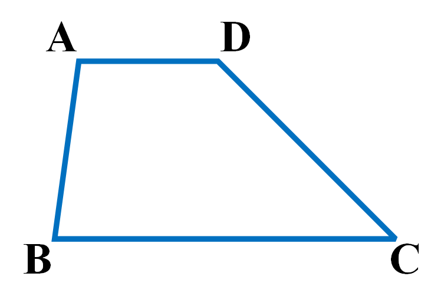

    ee_check: Polygon(ABCD)
    multi: CDAB
    extend: ParallelBetweenLine(AD,BC)
**Notes**:  
1.一组对边平行且另一组对边延长后相交的四边形称为梯形  
2.按照逆时针原则标注点的顺序  
3.前两个点和后两个点构成腰，如Trapezoid(ABCD)的两腰为AB和CD  
4.根据旋转不变性原则，1个梯形有2种表示方法，选其一即可  

### IsoscelesTrapezoid(ABCD)

    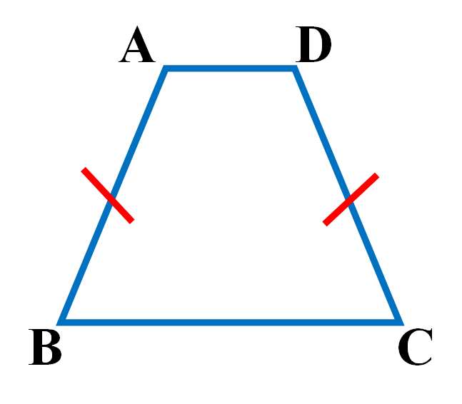

    ee_check: Polygon(ABCD)
    multi: CDAB
    extend: Trapezoid(ABCD)
            Equal(LengthOfLine(AB),LengthOfLine(CD))
**Notes**:  
1.腰相等的梯形称为等腰梯形  
2.按照逆时针原则标注点的顺序  
3.根据旋转不变性原则，1个等腰梯形有2种表示方法，选其一即可  

### RightTrapezoid(ABCD)

    

    ee_check: Polygon(ABCD)
    multi: 
    extend: Trapezoid(ABCD)
            PerpendicularBetweenLine(DA,BA)
            PerpendicularBetweenLine(AB,CB)
**Notes**:  
1.一侧角是直角的梯形称为直角梯形  
2.按照逆时针原则标注点的顺序  
3.左侧的两个角为直角，如RightTrapezoid(ABCD)表示角A和角B为直角  

## D、实体关系
### IsMidpointOfLine(M,AB)

    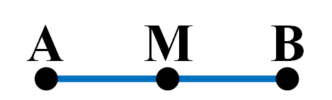

    ee_check: Point(M)
              Line(AB)
              Collinear(AMB)
    fv_check: M,AB
    multi: M,BA
    extend: Equal(LengthOfLine(AM),LengthOfLine(MB))
**Notes**:  
1.点M是线AB的中点  
2.根据旋转不变性原则，有2种表示，选其一即可  

### IsMidpointOfArc(M,OAB)

    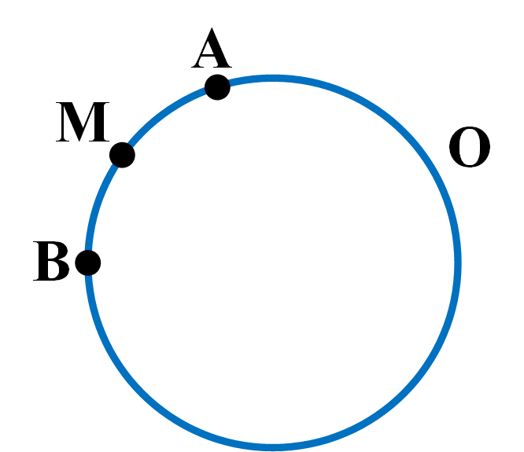

    ee_check: Point(M)
              Arc(OAB)
              Cocircular(O,AMB)
    fv_check: M,OAB
    multi: 
    extend: Equal(LengthOfArc(OAM),LengthOfArc(OMB))
**Notes**:  
1.点M是弧OAB的中点  

### ParallelBetweenLine(AB,CD)

    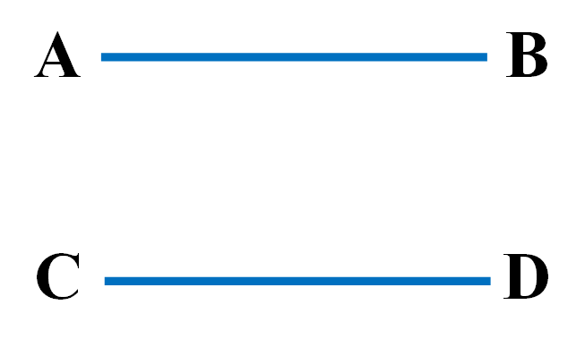

    ee_check: Line(AB)
              Line(CD)
    fv_check: AB,CD
    multi: DC,BA
    extend: 
**Notes**:  
1.线AB和线CD相互平行  
2.从左到右，从上到下原则，AB是上面的直线，CD是下面的直线  
3.根据旋转不变性原则，有2种表示，选其一即可  

### PerpendicularBetweenLine(AO,CO)

    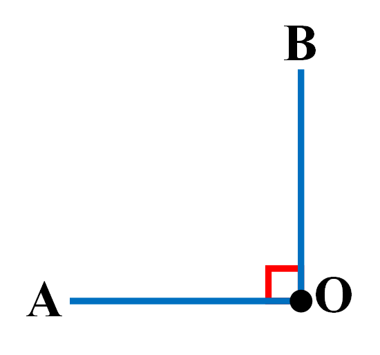

    ee_check: Line(AO)
              Line(CO)
    fv_check: AO,CO
    multi: 
    extend: Equal(MeasureOfAngle(AOC),90)
**Notes**:  
1.线AO和线CO相互垂直  
2.按照逆时针原则，AO是直角的第一条边，CO是直角的第二条边  
3.遇到角的朝向与示例不同，可以想象着把直角转到朝向第二象限  

### IsPerpendicularBisectorOfLine(CO,AB)

    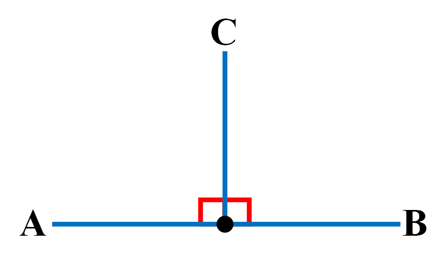

    ee_check: Line(CO)
              Line(AB)
              Collinear(AOB)
    fv_check: CO,AB
    multi: 
    extend: PerpendicularBetweenLine(AO,CO)
            PerpendicularBetweenLine(CO,BO)
            IsMidpointOfLine(O,AB)
**Notes**:  
1.线CO是线AB的垂直平分线，与AB交与点O  
2.从左到右，从上到下原则  

### IsBisectorOfAngle(BD,ABC)

    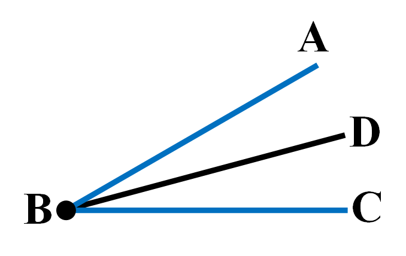

    ee_check: Line(BD)
              Angle(ABC)
    fv_check: BD,ABC
    multi: 
    extend: Equal(MeasureOfAngle(ABD),MeasureOfAngle(DBC))
**Notes**:  
1.线BD是角ABC的平分线，与角ABC交与点B  
2.角要按照逆时针原则标注，角平分线的第一个点应是角的顶点  

### IsMedianOfTriangle(AD,ABC)

    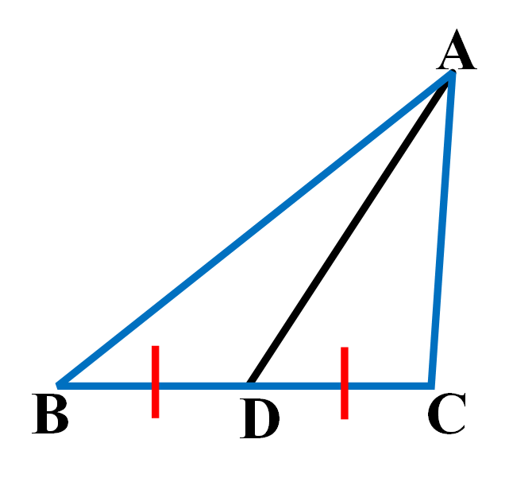

    ee_check: Line(AD)
              Polygon(ABC)
              Collinear(BDC)
    fv_check: AD,ABC
    multi: 
    extend: IsMidpointOfLine(D,BC)
**Notes**:  
1.线AD是三角形ABC的中线，即顶点A与底边BC重点D的连线  
2.线的第一个点应是三角形的顶点  

### IsAltitudeOfTriangle(AD,ABC)

    

    ee_check: Line(AD)
              Polygon(ABC)
    fv_check: AD,ABC
    multi: 
    extend: Equal(LengthOfLine(AD),HeightOfTriangle(ABC))
            PerpendicularBetweenLine(BD,AD)
            PerpendicularBetweenLine(AD,CD)
**Notes**:  
1.线AD是三角形ABC的高  
2.线的第一个点应是三角形的顶点  
3.要跟属性HeightOfTriangle区分开来，这里是声明线和三角形的关系，属性那里是表示高的长度  

### IsMidsegmentOfTriangle(DE,ABC)

    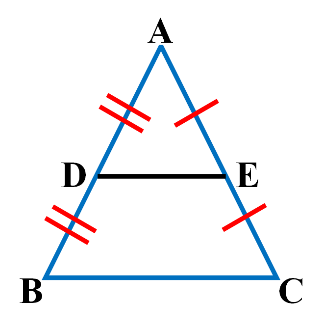

    ee_check: Line(DE)
              Polygon(ABC)
              Collinear(ADB)
              Collinear(AEC)
    fv_check: DE,ABC
    multi: 
    extend: IsMidpointOfLine(D,AB)
            IsMidpointOfLine(E,AC)
**Notes**:  
1.线DE是三角形ABC的中位线，即三角形两腰中点的连线  
2.线DE点的顺序应和三角形ABC底边BC点的顺序一致  

### IsCircumcenterOfTriangle(O,ABC)

    

    ee_check: Point(O)
              Polygon(ABC)
    fv_check: O,ABC
    multi: O,BCA
           O,CAB
    extend: 
**Notes**:  
1.点O是三角形ABC的外心  
2.外心是三角形外接圆的圆心，是三角形三边垂直平分线的交点  

### IsIncenterOfTriangle(O,ABC)

    

    ee_check: Point(O)
              Polygon(ABC)
    fv_check: O,ABC
    multi: O,BCA
           O,CAB
    extend: IsBisectorOfAngle(AO,CAB)
            IsBisectorOfAngle(BO,ABC)
            IsBisectorOfAngle(CO,BCA)
**Notes**:  
1.点O是三角形ABC的内心  
2.内心是三角形内切圆的圆心，是三角形三角的角平分线的交点  

### IsCentroidOfTriangle(O,ABC)

    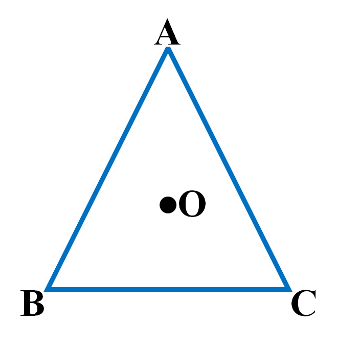

    ee_check: Point(O)
              Polygon(ABC)
    fv_check: O,ABC
    multi: O,BCA
           O,CAB
    extend: 
**Notes**:  
1.点O是三角形ABC的重心  
2.内心是三角形三边的中线的交点  

### IsOrthocenterOfTriangle(O,ABC)

    

    ee_check: Point(O)
              Polygon(ABC)
    fv_check: O,ABC
              A,ABC
              B,ABC
              C,ABC
    multi: O,BCA
           O,CAB
    extend: 
**Notes**:  
1.点O是三角形ABC的垂心  
2.垂心是三角形三个底边上的高的交点  

### CongruentBetweenTriangle(ABC,DEF)

    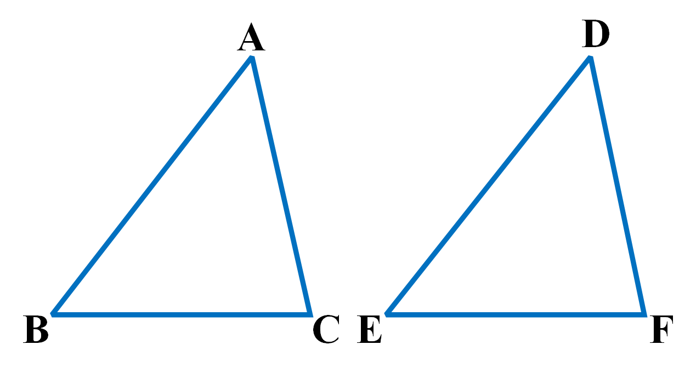

    ee_check: Polygon(ABC)
              Polygon(DEF)
    multi: BCA,EFD
           CAB,FDE
    extend: 
**Notes**:  
1.三角形ABC与三角形DEF全等  
2.两个三角形的点应一一对应  
3.根据旋转不变性原则，有6种表示方法，选其一即可  
4.在这6中表示中，(ABC,DEF)和(DEF,ABC)是等价的，为了方便计算，我们一般只在3种表示方法种选其1  

### MirrorCongruentBetweenTriangle(ABC,DEF)

    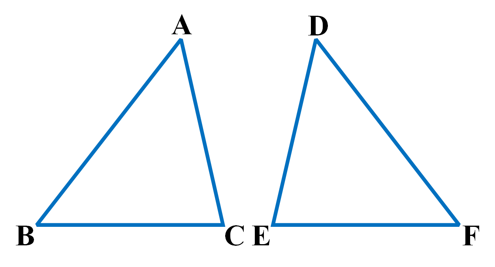

    ee_check: Polygon(ABC)
              Polygon(DEF)
    multi: BCA,FDE
           CAB,EFD
    extend: 
**Notes**:  
1.三角形ABC与三角形DEF镜像全等  
2.标注方法：①点一一对应得(ABC,DFE)②没有三角形DFE，第一个点D不动，将其他点逆序，得DEF③标注(ABC,DEF)  
3.根据旋转不变性原则，有6种表示方法  
4.在这6中表示中，(ABC,DEF)和(DEF,ABC)是等价的，为了方便计算，我们一般只在3种表示方法种选其1  

### SimilarBetweenTriangle(ABC,DEF)

    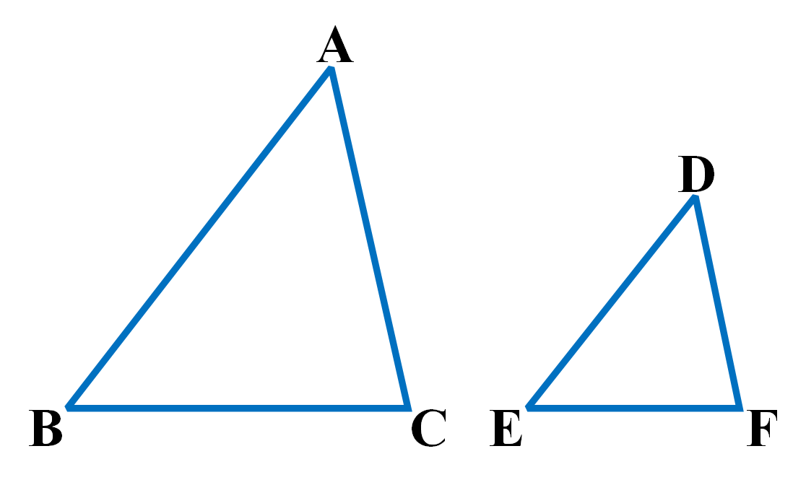

    ee_check: Polygon(ABC)
              Polygon(DEF)
    multi: BCA,EFD
           CAB,FDE
    extend: 
**Notes**:  
1.三角形ABC与三角形DEF相似  
2.两个三角形的点应一一对应  
3.根据旋转不变性原则，有6种表示方法，选其一即可  
4.在这6中表示中，(ABC,DEF)和(DEF,ABC)相似比互为倒数，所以为了方便计算，我们一般只在3种表示方法种选其一  

### MirrorSimilarBetweenTriangle(ABC,DEF)

    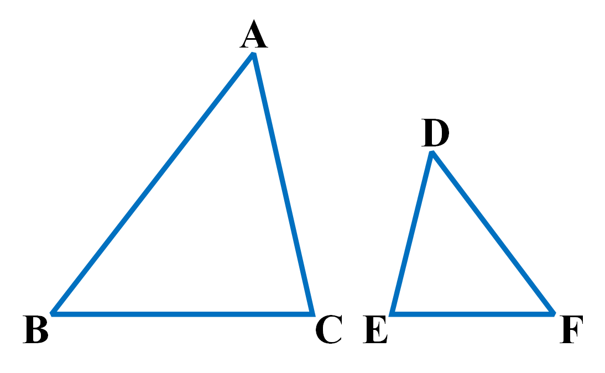

    ee_check: Polygon(ABC)
              Polygon(DEF)
    multi: BCA,FDE
           CAB,EFD
    extend: 
**Notes**:  
1.三角形ABC与三角形DEF镜像相似  
2.标注方法：①点一一对应得(ABC,DFE)②没有三角形DFE，第一个点D不动，将其他点逆序，得DEF③标注(ABC,DEF)  
3.根据旋转不变性原则，有6种表示方法  
4.在这6中表示中，(ABC,DEF)和(DEF,ABC)是等价的，为了方便计算，我们一般只在3种表示方法种选其1  

### IsAltitudeOfQuadrilateral(EF,ABCD)

    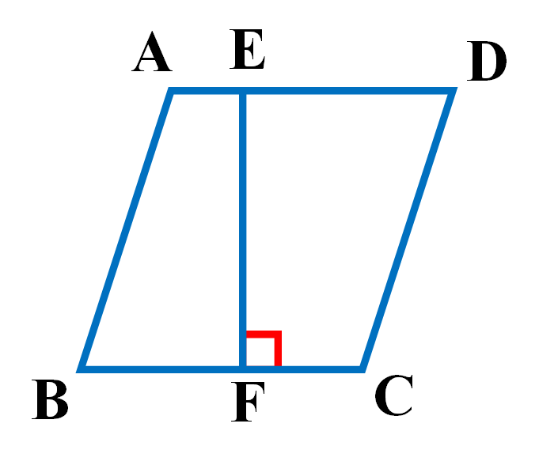

    ee_check: Line(EF)
              Polygon(ABCD)
    fv_check: EF,ABCD
              AF,ABCD
              DF,ABCD
              AC,ABCD
              DB,ABCD
    multi: 
    extend: Equal(LengthOfLine(EF),HeightOfQuadrilateral(ABCD))
            PerpendicularBetweenLine(BF,EF)
            PerpendicularBetweenLine(EF,CF)
            PerpendicularBetweenLine(DE,FE)
            PerpendicularBetweenLine(FE,AE)
**Notes**:  
1.线EF是四边形ABCD的高  
2.线的第一个点应是四边形的第一个点  
3.要跟属性HeightOfQuadrilateral区分开来  
4.注意，平行四边形每个边都有高，梯形只有平行边有高，筝形没有高  

### IsMidsegmentOfQuadrilateral(EF,ABCD)

    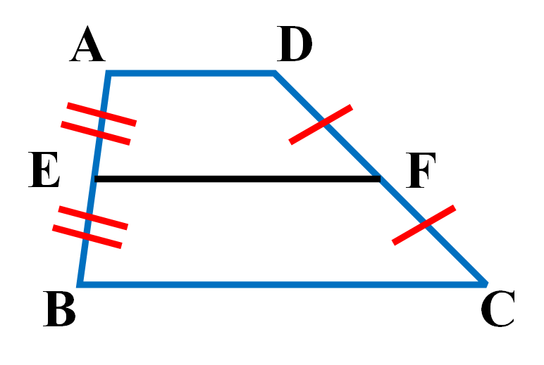

    ee_check: Line(EF)
              Polygon(ABCD)
              Collinear(AEB)
              Collinear(DFC)
    fv_check: FE,CDAB
    multi: FE,CDAB
    extend: IsMidpointOfLine(E,AB)
            IsMidpointOfLine(F,CD)
**Notes**:  
1.线EF是四边形ABCD的中位线，即AB中点和CD中点的连线  
2.线DE点的顺序应和四边形ABCD底边BC点的顺序一致  
3.根据旋转不变性原则，有2种表示方法，选其一即可  

### IsCircumcenterOfQuadrilateral(O,ABCD)

    

    ee_check: Point(O)
              Polygon(ABCD)
    fv_check: O,ABCD
    multi: O,BCDA
           O,CDAB
           O,DABC
    extend: 
**Notes**:  
1.点O是四边形ABCD的外心  
2.外心是四边形外接圆的圆心，但不一定有  

### IsIncenterOfQuadrilateral(O,ABCD)

    

    ee_check: Point(O)
              Polygon(ABCD)
    fv_check: O,ABCD
    multi: O,BCDA
           O,CDAB
           O,DABC
    extend: IsBisectorOfAngle(AO,DAB)
            IsBisectorOfAngle(BO,ABC)
            IsBisectorOfAngle(CO,BCD)
            IsBisectorOfAngle(DO,CDA)
**Notes**:  
1.点O是四边形ABCD的内心  
2.内心是四边形内切圆的圆心，但不一定有  

### CongruentBetweenQuadrilateral(ABCD,EFGH)

    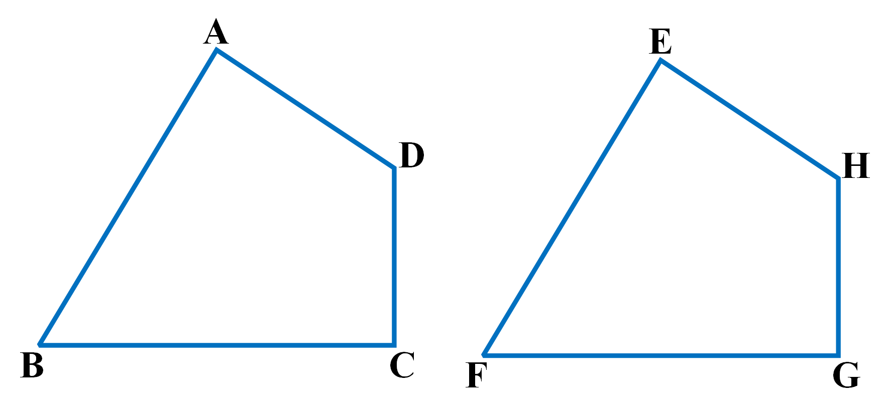

    ee_check: Polygon(ABCD)
              Polygon(EFGH)
    multi: BCDA,FGHE
           CDAB,GHEF
           DABC,HEFG
    extend: 
**Notes**:  
1.四边形ABCD与四边形EFGH全等  
2.根据旋转不变性，有8种表示方法，有4种是等价的，为了方便计算，只在4种选其1  

### MirrorCongruentBetweenQuadrilateral(ABCD,EFGH)

    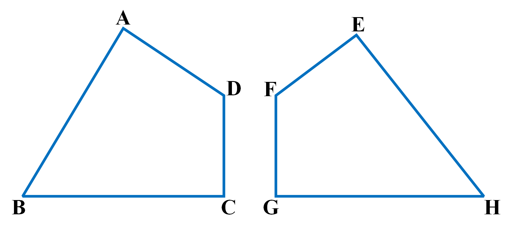

    ee_check: Polygon(ABCD)
              Polygon(EFGH)
    multi: BCDA,HEFG
           CDAB,GHEF
           DABC,FGHE
    extend: 
**Notes**:  
1.四边形ABCD与四边形EFGH镜像全等  
2.根据旋转不变性，有8种表示方法，有4种是等价的，为了方便计算，只在4种选其1  

### SimilarBetweenQuadrilateral(ABCD,EFGH)

    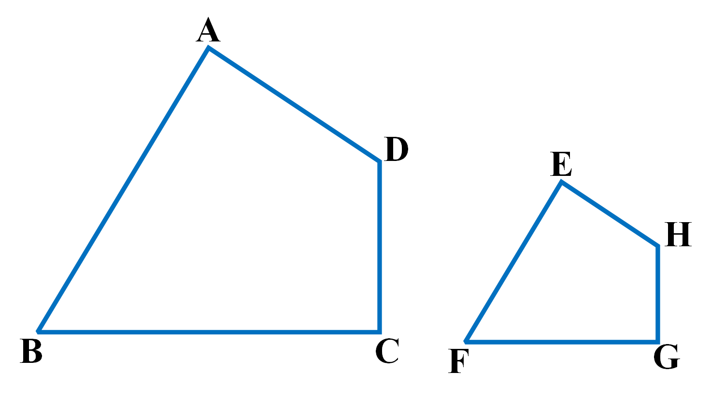

    ee_check: Polygon(ABCD)
              Polygon(EFGH)
    multi: BCDA,FGHE
           CDAB,GHEF
           DABC,HEFG
    extend: 
**Notes**:  
1.四边形ABCD与四边形EFGH相似  
2.根据旋转不变性，有8种表示方法，有4种是等价的，为了方便计算，只在4种选其1  

### MirrorSimilarBetweenQuadrilateral(ABCD,EFGH)

    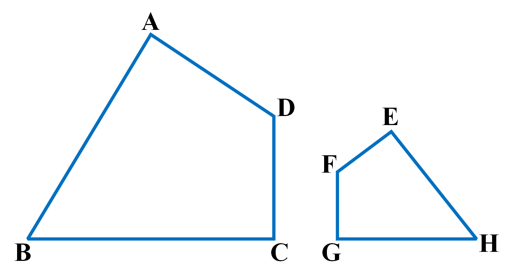

    ee_check: Polygon(ABCD)
              Polygon(EFGH)
    multi: BCDA,HEFG
           CDAB,GHEF
           DABC,FGHE
    extend: 
**Notes**:  
1.四边形ABCD与四边形EFGH镜像相似  
2.根据旋转不变性，有8种表示方法，有4种是等价的，为了方便计算，只在4种选其1  

### CongruentBetweenArc(OAB,OCD)

    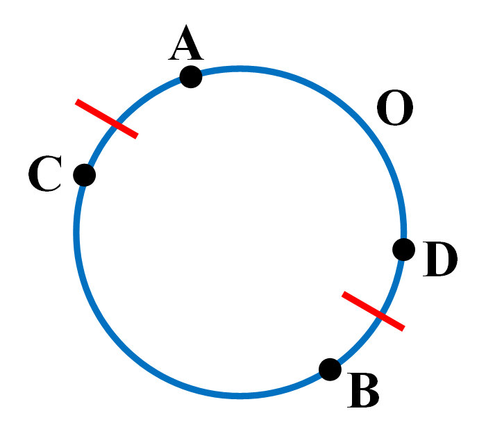

    ee_check: Arc(OAB)
              Arc(OCD)
    multi: 
    extend: 
**Notes**:  
1.两个弧全等  
2.两个弧在同一个圆上才有意义  

### SimilarBetweenArc(OAB,OCD)

    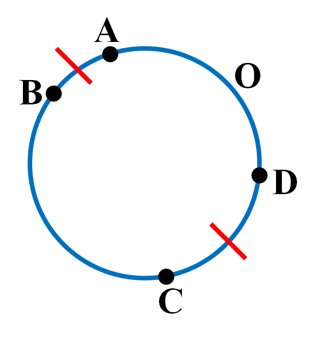

    ee_check: Arc(OAB)
              Arc(OCD)
    multi: 
    extend: 
**Notes**:  
1.两个弧相似  
2.两个弧在同一个圆上才有意义  

### IsDiameterOfCircle(AB,O)

    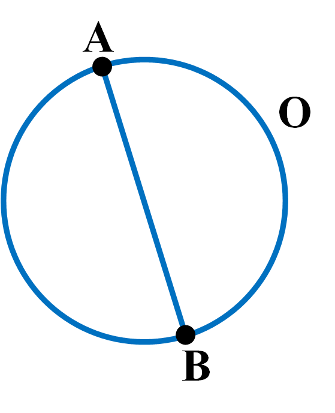

    ee_check: Line(AB)
              Cocircular(O,AB)
    fv_check: AB,O
    multi: BA,O
    extend: 
**Notes**:  
1.圆的直径  

### IsTangentOfCircle(PA,O)

    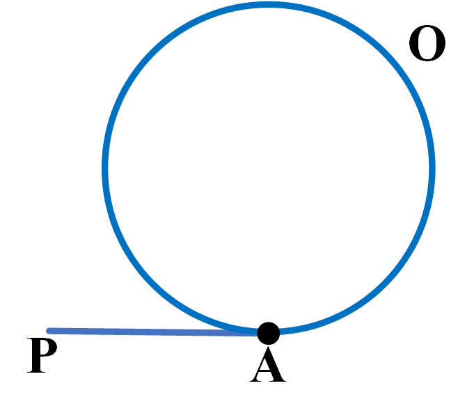

    ee_check: Line(PA)
              Cocircular(O,A)
    fv_check: PA,O
    multi: 
    extend: 
**Notes**:  
1.过P做圆的切线交圆于点A  

### IsCentreOfCircle(P,O)

    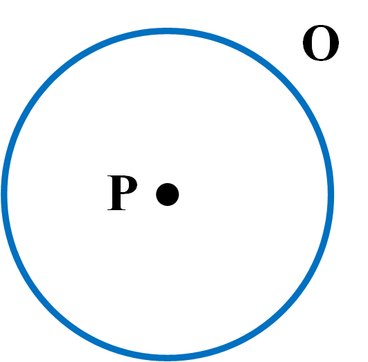

    ee_check: Point(P)
              Circle(O)
    fv_check: P,O
              O,O
    multi: 
    extend: 
**Notes**:  
1.点P是圆O的圆心  

## F、实体属性
### LengthOfLine(AB)

    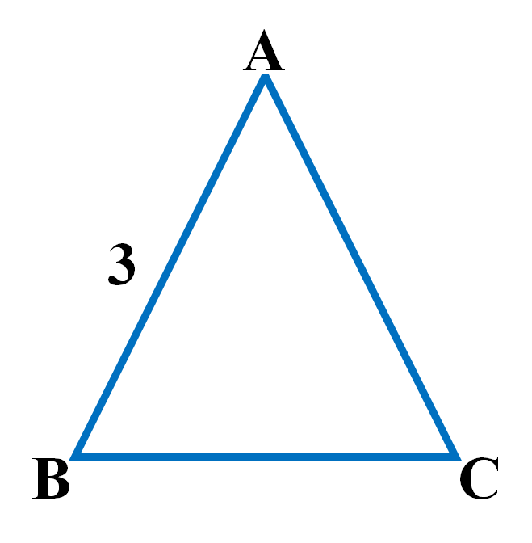

    ee_check: Line(AB)
    multi: BA
    sym: ll
**Notes**:  
1.直线AB的长度  
2.根据旋转不变性原则，有2种表示方法，选其一即可  
3.例 Equal(LengthOfLine(AB),3)  

### MeasureOfAngle(ABC)

    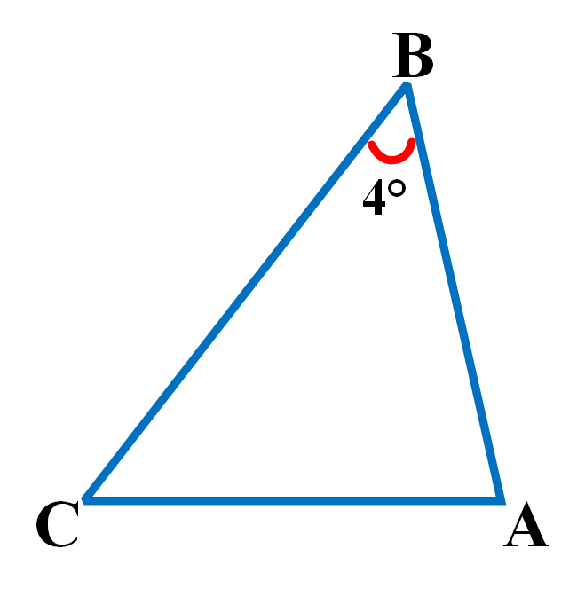

    ee_check: Angle(ABC)
    multi: 
    sym: ma
**Notes**:  
1.角ABC的大小  
2.例 Equal(MeasureOfAngle(ABC),4)  

### PerimeterOfTriangle(ABC)

    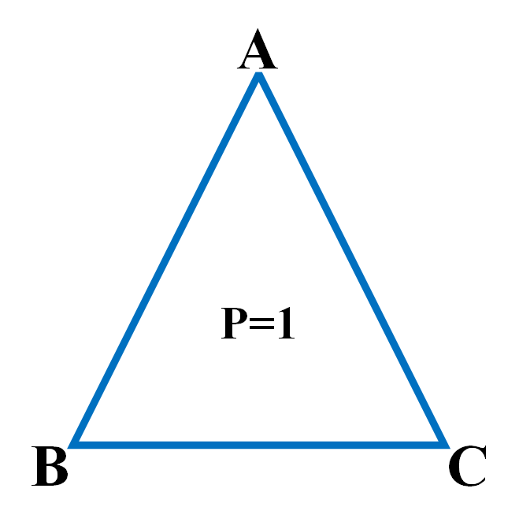

    ee_check: Polygon(ABC)
    multi: BCA
           CAB
    sym: pt
**Notes**:  
1.三角形ABC的周长  
2.根据旋转不变性原则，有3种表示方法，选其一即可  
3.例 Equal(PerimeterOfTriangle(ABC),1)  

### AreaOfTriangle(ABC)

    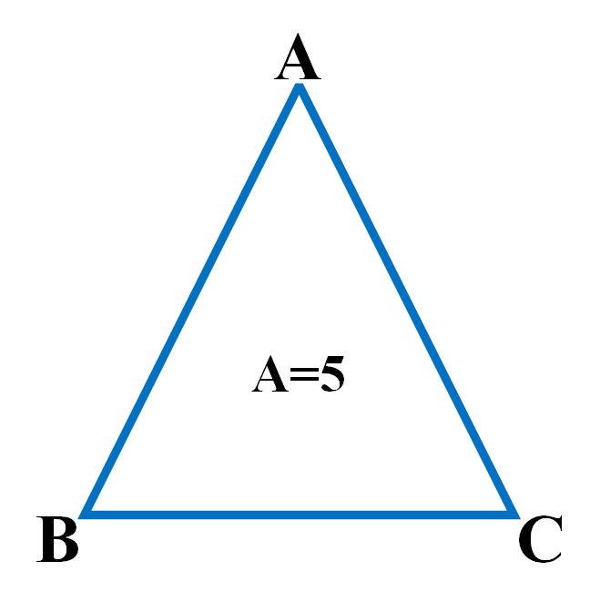

    ee_check: Polygon(ABC)
    multi: BCA
           CAB
    sym: at
**Notes**:  
1.三角形ABC的面积  
2.根据旋转不变性原则，有3种表示方法，选其一即可  
3.例 Equal(AreaOfTriangle(ABC),5)  

### HeightOfTriangle(ABC)

    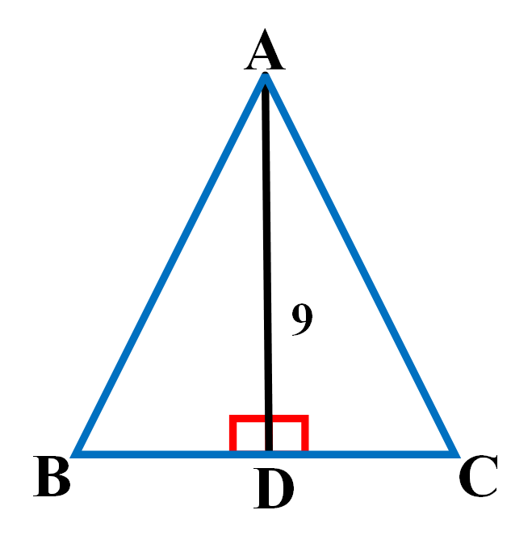

    ee_check: Polygon(ABC)
    multi: 
    sym: ht
**Notes**:  
1.三角形ABC底边BC上的高的长度  
2.例 Equal(HeightOfTriangle(ABC),9)  

### RatioOfSimilarTriangle(ABC,DEF)

    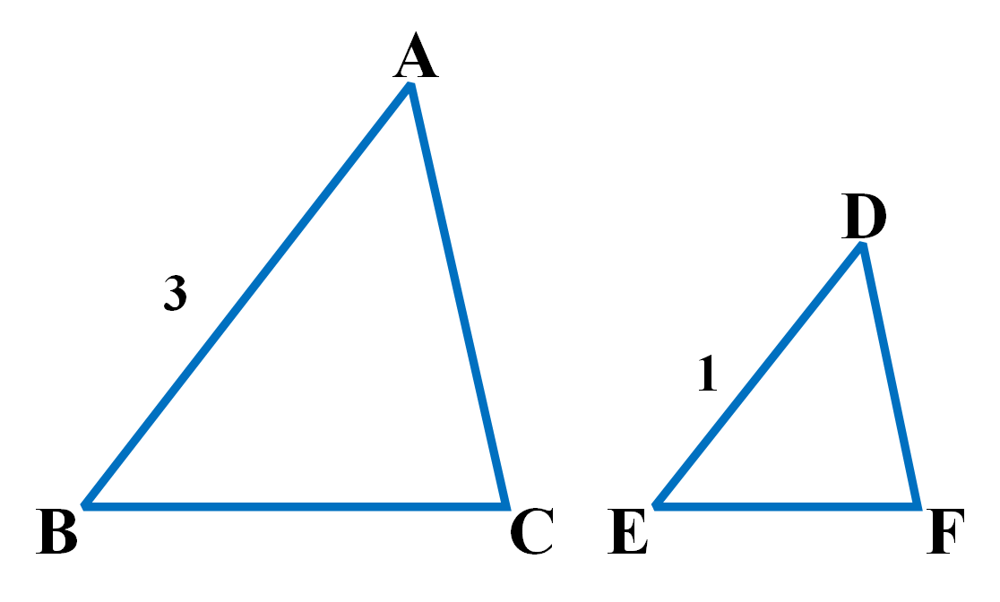

    ee_check: Polygon(ABC)
              Polygon(DEF)
    multi: BCA,EFD
           CAB,FDE
    sym: rst
**Notes**:  
1.相似三角形的相似比  
2.例 Equal(RatioOfSimilarTriangle(ABC,DEF),3)  

### RatioOfMirrorSimilarTriangle(ABC,DEF)

    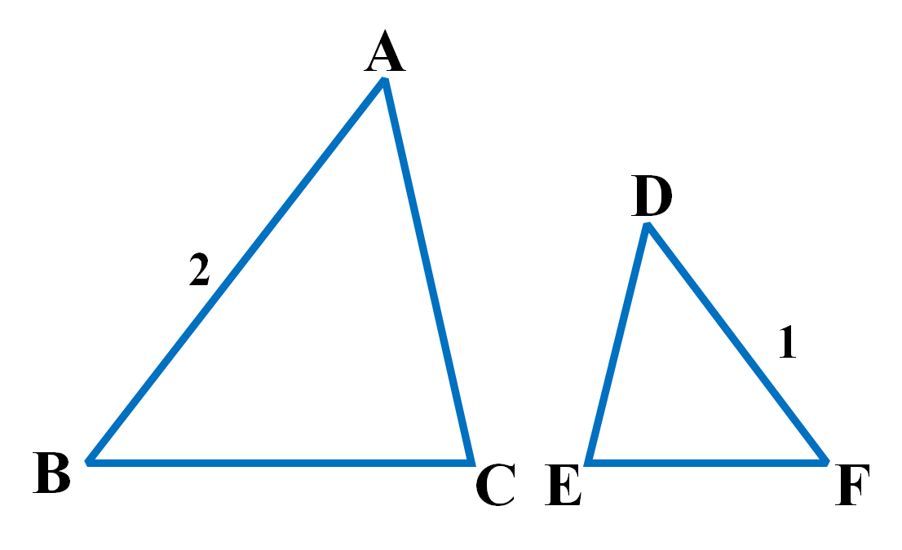

    ee_check: Polygon(ABC)
              Polygon(DEF)
    multi: BCA,FDE
           CAB,EFD
    sym: rmt
**Notes**:  
1.镜像相似三角形的相似比  
2.例 Equal(RatioOfMirrorSimilarTriangle(ABC,DEF),2)  

### PerimeterOfQuadrilateral(ABCD)

    

    ee_check: Polygon(ABCD)
    multi: BCDA
           CDAB
           DABC
    sym: pq
**Notes**:  
1.四边形ABCD的周长  
2.根据旋转不变性原则，有4种表示方法，选其一即可  
3.例 Equal(PerimeterOfQuadrilateral(ABCD),2)  

### AreaOfQuadrilateral(ABCD)

    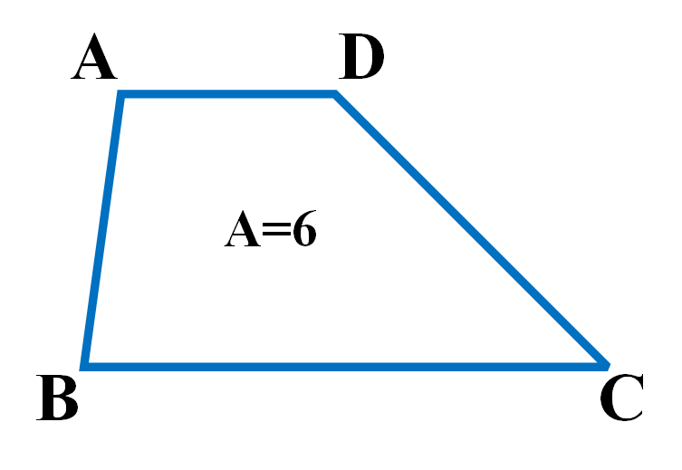

    ee_check: Polygon(ABCD)
    multi: BCDA
           CDAB
           DABC
    sym: aq
**Notes**:  
1.四边形ABCD的面积  
2.根据旋转不变性原则，有4种表示方法，选其一即可  
3.例 Equal(AreaOfQuadrilateral(ABCD),6)  

### HeightOfQuadrilateral(ABCD)

    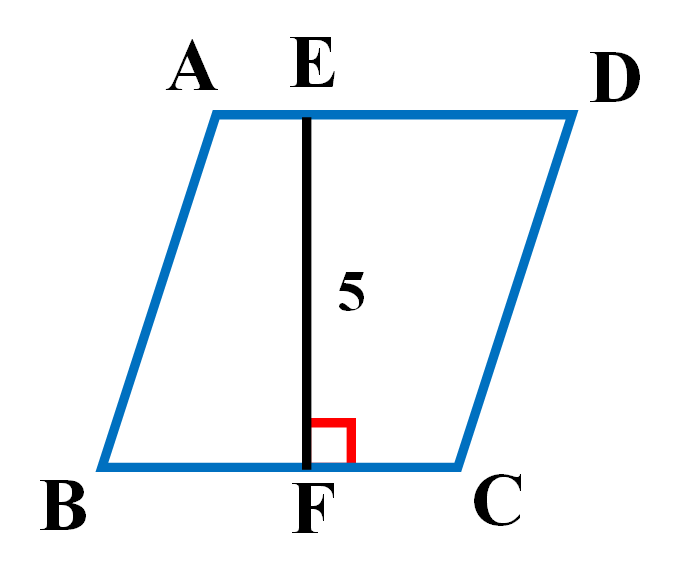

    ee_check: Polygon(ABCD)
    multi: 
    sym: hq
**Notes**:  
1.四边形ABCD底边BC上的高的长度  
2.例 Equal(HeightOfQuadrilateral(ABCD),5)  

### RatioOfSimilarQuadrilateral(ABCD,EFGH)

    

    ee_check: Polygon(ABCD)
              Polygon(EFGH)
    multi: BCDA,FGHE
           CDAB,GHEF
           DABC,HEFG
    sym: rsq
**Notes**:  
1.相似四边形的相似比  

### RatioOfMirrorSimilarQuadrilateral(ABCD,EFGH)

    

    ee_check: Polygon(ABCD)
              Polygon(EFGH)
    multi: BCDA,HEFG
           CDAB,GHEF
           DABC,FGHE
    sym: rmq
**Notes**:  
1.镜像相似四边形的相似比  

### LengthOfArc(OAB)

    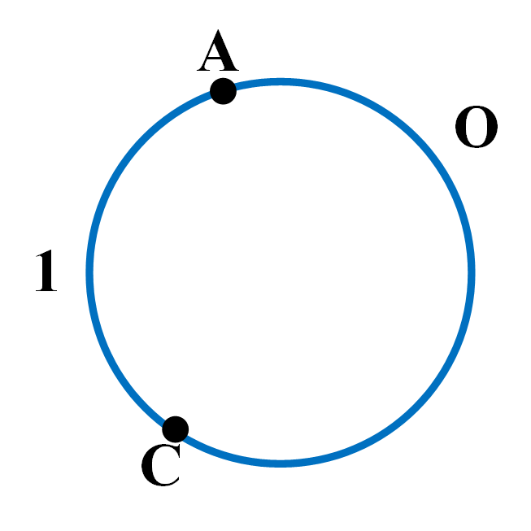

    ee_check: Arc(OAB)
    multi: 
    sym: la
**Notes**:  
1.圆O上弧AB的长度  
2.例 Equal(LengthOfArc(OAB),1)  

### MeasureOfArc(OAB)

    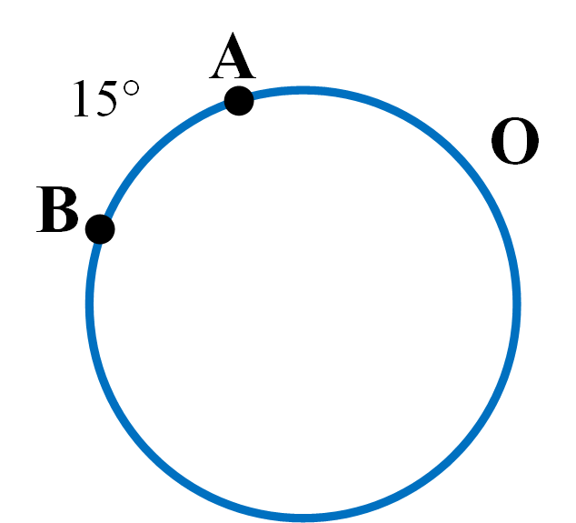

    ee_check: Arc(OAB)
    multi: 
    sym: mar
**Notes**:  
1.圆O上弧AB所对圆心角的大小  
2.例 Equal(MeasureOfArc(OAB),15)  

### RatioOfSimilarArc(OAB,OCD)

    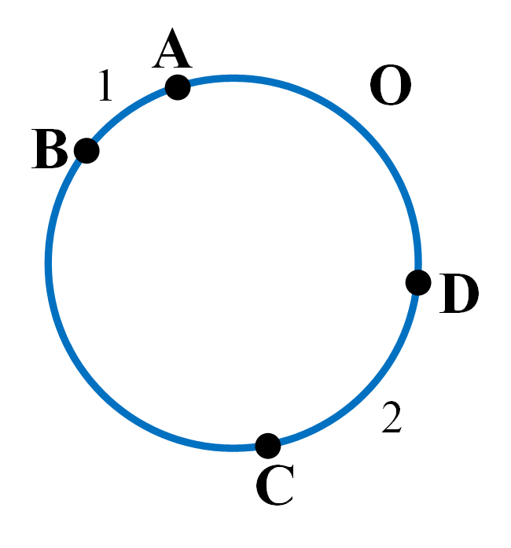

    ee_check: Arc(OAB)
              Arc(OCD)
    multi: 
    sym: rsa
**Notes**:  
1.相似弧的相似比  
2.例 Equal(RatioOfSimilarArc(OAB,OCD),2)  

### RadiusOfCircle(O)

    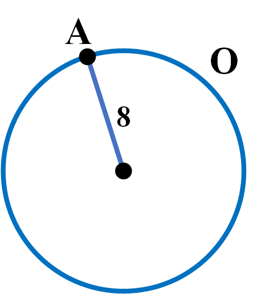

    ee_check: Circle(O)
    multi: 
    sym: rc
**Notes**:  
1.圆O半径的长度  
2.例 Equal(RadiusOfCircle(O),8)  

### DiameterOfCircle(O)

    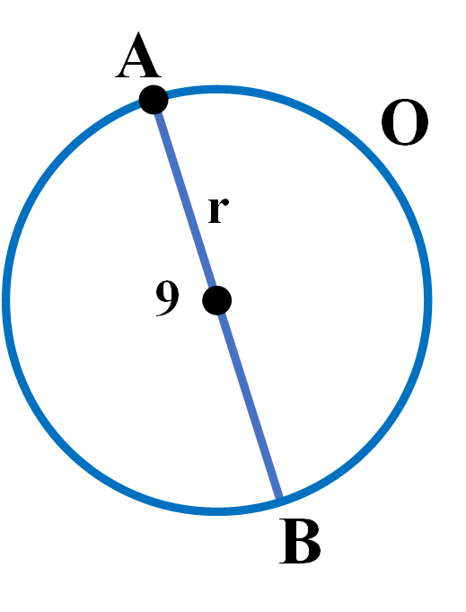

    ee_check: Circle(O)
    multi: 
    sym: dc
**Notes**:  
1.圆O直径的长度  
2.例 Equal(DiameterOfCircle(O),9)  

### PerimeterOfCircle(O)

    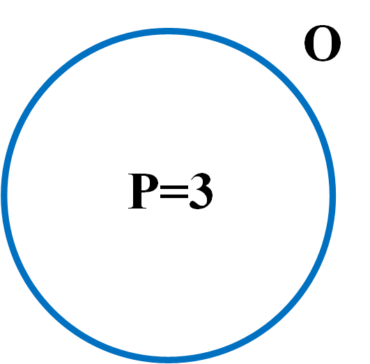

    ee_check: Circle(O)
    multi: 
    sym: pc
**Notes**:  
1.圆O的周长  
2.例 Equal(PerimeterOfCircle(O),3)  

### AreaOfCircle(O)

    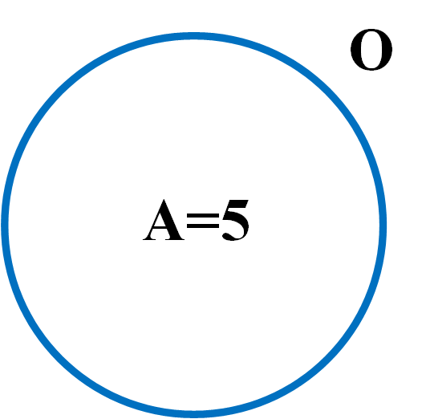

    ee_check: Circle(O)
    multi: 
    sym: ac
**Notes**:  
1.圆O的面积  
2.例 Equal(AreaOfCircle(O),5)  

### PerimeterOfSector(OAB)

    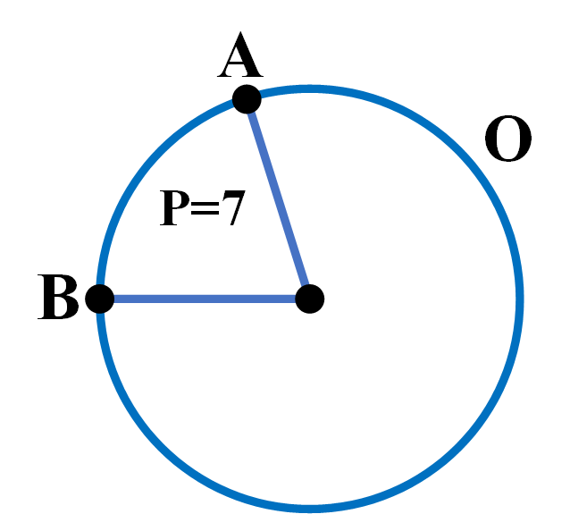

    ee_check: Arc(OAB)
    multi: 
    sym: ps
**Notes**:  
1.扇形OAB的周长  
2.例 Equal(PerimeterOfSector(OAB),7)  

### AreaOfSector(OAB)

    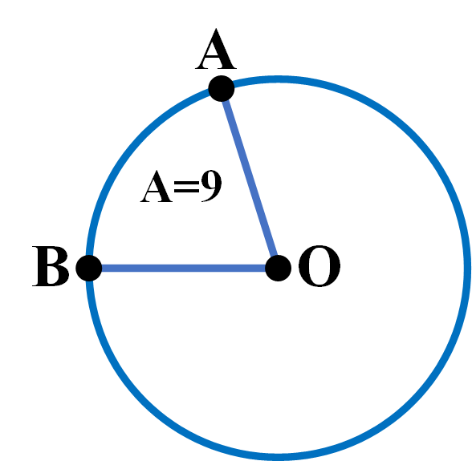

    ee_check: Arc(OAB)
    multi: 
    sym: as
**Notes**:  
1.扇形OAB的面积  
2.例 Equal(AreaOfSector(OAB),9)  

## G、代数关系
expr可以是表达式，也可以是实体属性，并且可以嵌套表示。  

    Equal(expr1,expr2)

例：  
Equal(a,5)  
Equal(MeasureOfAngle(ABC),30)  
Equal(Add(LengthOfLine(AB),a+5,x),y^2)  

## H、代数运算
|名称|格式|表达式符号|运算符优先级|
|:--:|:--:|:--:|:--:|
|加|Add(expr1,expr2,…)|+| 1 |
|减|Sub(expr1,expr2)|-| 1 |
|乘|Mul(expr1,expr2,…)|*| 2 |
|除|Div(expr1,expr2)|/| 2 |
|幂|Pow(expr1,expr2)|^| 3 |
|根号|Sqrt(expr1)|√| 4 |
|正弦|Sin(expr)|@| 4 |
|余弦|Cos(expr)|#| 4 |
|正切|Tan(expr)|$| 4 |
|实数|R|1,2,3,...| / |
|自由变量|x|a,b,c,...| / |
|左括号| / |{| 5 |
|右括号| / |}| 0 |  

在使用表达式，若无法判断运算符的优先级，可以使用中括号来强制优先级。  
前5个运算符是双目运算符，如a+5,b-c,x^2；在接下来4个运算符是单目运算符，如√2,@30,#60。

## I、解题目标
### Value(expr)
expr可以是表达式，也可以是实体属性，并且可以嵌套表示。  
代数型解题目标，求某个表达式或属性的值。  

    example: Value(LengthOfLine(AB))
             Value(Add(MeasureOfAngle(ABC),MeasureOfAngle(DEF)))
             Value(x+y)

### Equal(expr1,expr2)
expr可以是表达式，也可以是实体属性，并且可以嵌套表示。 
代数型解题目标，证明左右俩个部分相等。   

    example: Equal(LengthOfLine(AB),x+y)
             Equal(Add(MeasureOfAngle(ABC),MeasureOfAngle(DEF)),Pow(x,2))

### Relation(*)
逻辑型解题目标，求某个实体或属性。  
Relation表示任意实体、实体关系。  

    example: Relation(Parallel(AB,CD))
             Relation(RightTriangle(ABC))    

