# 附录3 定理标注对照手册
### line_addition(AB,BC)

    

    premise: Collinear(ABC)
    conclusion: Equal(LengthOfLine(AC),Add(LengthOfLine(AB),LengthOfLine(BC)))
**Notes**:  
1.常识：若ABC三点共线，则AB+BC=AC  

### midpoint_of_line_judgment(M,AB)

    

    premise: Collinear(AMB)&Equal(LengthOfLine(AM),LengthOfLine(MB))
    conclusion: IsMidpointOfLine(M,AB)
**Notes**:  
1.中点的判定：点到线段两端的距离相等  

### parallel_judgment_corresponding_angle(AB,CD,E)

    

    # branch 1
    premise: Angle(EAB)&Angle(ACD)&Collinear(EAC)&Equal(MeasureOfAngle(EAB),MeasureOfAngle(ACD))
    conclusion: ParallelBetweenLine(AB,CD)
    # branch 2
    premise: Angle(BAC)&Angle(DCE)&Collinear(ACE)&Equal(MeasureOfAngle(BAC),MeasureOfAngle(DCE))
    conclusion: ParallelBetweenLine(AB,CD)
**Notes**:  
1.平行的判定，同位角相等  
2.注意标注的参数：只判断左侧的同位角，点E是构成同位角的另外一点  

### parallel_judgment_alternate_interior_angle(AB,CD)

    

    # branch 1
    premise: Angle(BAD)&Angle(CDA)&Equal(MeasureOfAngle(BAD),MeasureOfAngle(CDA))
    conclusion: ParallelBetweenLine(AB,CD)
    # branch 2
    premise: Angle(CBA)&Angle(BCD)&Equal(MeasureOfAngle(CBA),MeasureOfAngle(BCD))
    conclusion: ParallelBetweenLine(AB,CD)
**Notes**:  
1.平行的判定：内错角相等  

### parallel_judgment_ipsilateral_internal_angle(AB,CD)

    

    premise: Angle(BAC)&Angle(ACD)&Equal(Add(MeasureOfAngle(BAC),MeasureOfAngle(ACD)),180)
    conclusion: ParallelBetweenLine(AB,CD)
**Notes**:  
1.平行的判定，同旁内角互补  
2.注意标注的参数：只判断左侧的同旁内角  

### parallel_judgment_par_par(AB,CD,EF)

    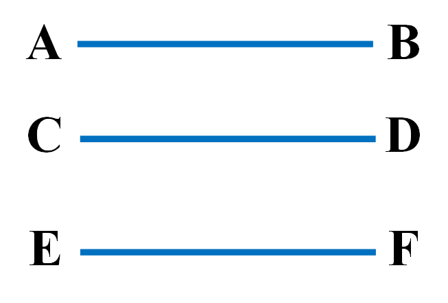

    premise: ParallelBetweenLine(AB,CD)&ParallelBetweenLine(CD,EF)
    conclusion: ParallelBetweenLine(AB,EF)
**Notes**:  
1.平行的传递性  

### parallel_judgment_per_per(AB,CD)

    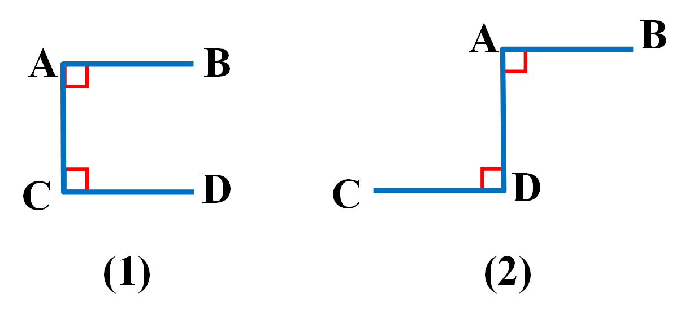

    # branch 1
    premise: PerpendicularBetweenLine(BA,CA)&PerpendicularBetweenLine(AC,DC)
    conclusion: ParallelBetweenLine(AB,CD)
    # branch 2
    premise: PerpendicularBetweenLine(CD,AD)&PerpendicularBetweenLine(BA,DA)
    conclusion: ParallelBetweenLine(AB,CD)
**Notes**:  
1.由垂直推出平行  

### parallel_property_collinear_extend(AB,CD,M)

    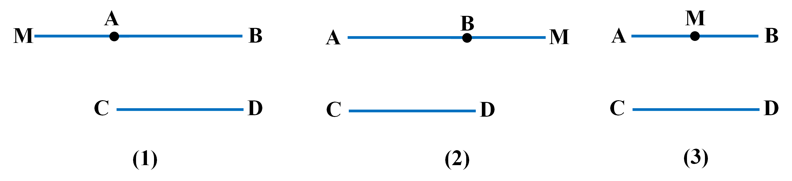

    # branch 1
    premise: ParallelBetweenLine(AB,CD)&Collinear(MAB)
    conclusion: ParallelBetweenLine(MA,CD)
                ParallelBetweenLine(MB,CD)
    # branch 2
    premise: ParallelBetweenLine(AB,CD)&Collinear(ABM)
    conclusion: ParallelBetweenLine(AM,CD)
                ParallelBetweenLine(BM,CD)
    # branch 3
    premise: ParallelBetweenLine(AB,CD)&Collinear(AMB)
    conclusion: ParallelBetweenLine(AM,CD)
                ParallelBetweenLine(MB,CD)
**Notes**:  
1.平行的共线扩展：由一个平行关系和一条平行线（上方那条）的共线点推出其他平行关系  

### parallel_property_corresponding_angle(AB,CD,E)

    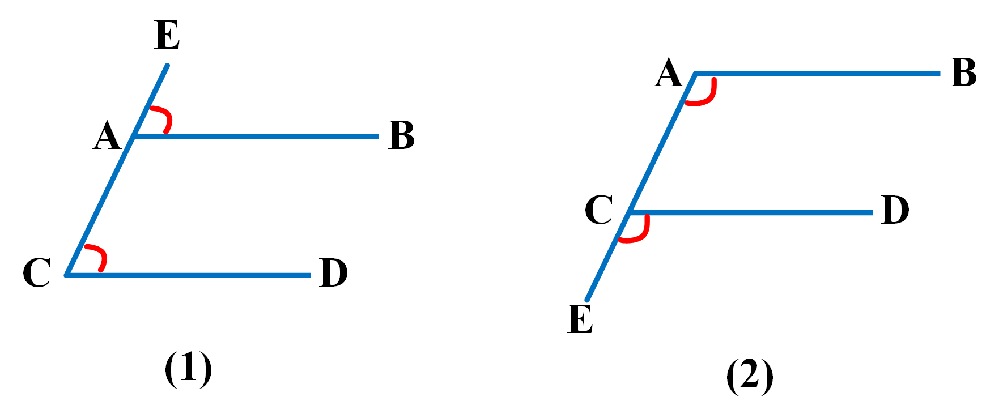

    # branch 1
    premise: ParallelBetweenLine(AB,CD)&Collinear(EAC)
    conclusion: Equal(MeasureOfAngle(EAB),MeasureOfAngle(ACD))
    # branch 2
    premise: ParallelBetweenLine(AB,CD)&Collinear(ACE)
    conclusion: Equal(MeasureOfAngle(BAC),MeasureOfAngle(DCE))
**Notes**:  
1.平行的性质：同位角相等  

### parallel_property_alternate_interior_angle(AB,CD)

    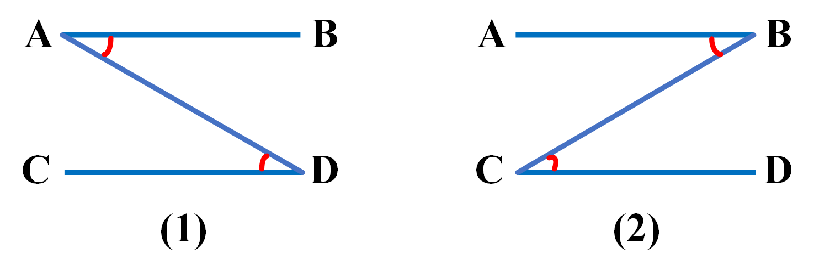

    # branch 1
    premise: ParallelBetweenLine(AB,CD)&Line(AD)
    conclusion: Equal(MeasureOfAngle(BAD),MeasureOfAngle(CDA))
    # branch 2
    premise: ParallelBetweenLine(AB,CD)&Line(BC)
    conclusion: Equal(MeasureOfAngle(CBA),MeasureOfAngle(BCD))
**Notes**:  
1.平行的性质：内错角相等  

### parallel_property_ipsilateral_internal_angle(AB,CD)

    

    premise: ParallelBetweenLine(AB,CD)&Line(AC)
    conclusion: Equal(Add(MeasureOfAngle(BAC),MeasureOfAngle(ACD)),180)
**Notes**:  
1.平行的性质：同旁内角互补  
2.左侧的同旁内角  

### parallel_property_par_per(AB,CD)

    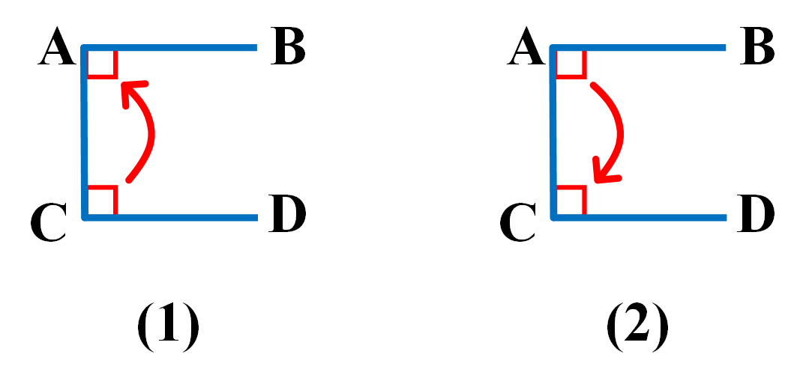

    # branch 1
    premise: ParallelBetweenLine(AB,CD)&PerpendicularBetweenLine(AC,DC)
    conclusion: PerpendicularBetweenLine(BA,CA)
    # branch 2
    premise: ParallelBetweenLine(AB,CD)&PerpendicularBetweenLine(BA,CA)
    conclusion: PerpendicularBetweenLine(AC,DC)
**Notes**:  
1.平行线的性质：垂直+平行-->垂直  

### perpendicular_judgment_angle(AO,CO)

    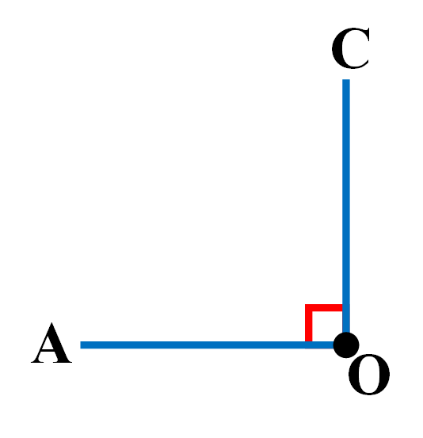

    premise: Angle(AOC)&Equal(MeasureOfAngle(AOC),90)
    conclusion: PerpendicularBetweenLine(AO,CO)
**Notes**:  
1.垂直的判定：角为90°  

### perpendicular_bisector_judgment_per_and_mid(CO,AB)

    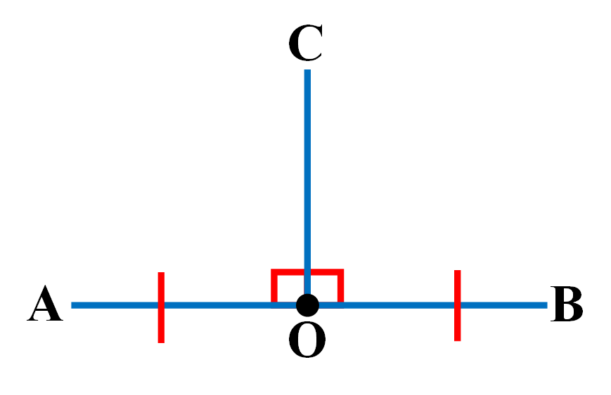

    premise: Collinear(AOB)&Angle(AOC)&Equal(MeasureOfAngle(AOC),90)&Equal(LengthOfLine(AO),LengthOfLine(BO))
    conclusion: IsPerpendicularBisectorOfLine(CO,AB)
**Notes**:  
1.垂直平分线判定：垂直且平分  

### perpendicular_bisector_judgment_distance_equal(CO,AB)

    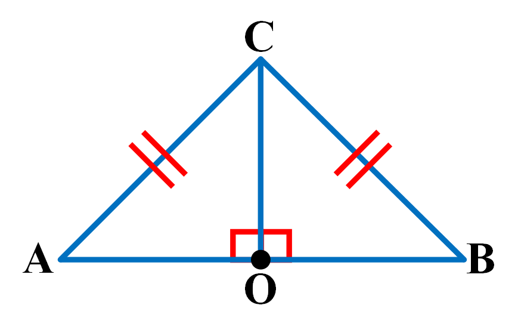

    premise: Collinear(AOB)&Angle(AOC)&Equal(MeasureOfAngle(AOC),90)&Equal(LengthOfLine(CA),LengthOfLine(CB))
    conclusion: IsPerpendicularBisectorOfLine(CO,AB)
**Notes**:  
1.垂直平分线判定：垂直平分线上的点到两个端点的距离相等  

### perpendicular_bisector_property_distance_equal(CO,AB)

    

    premise: IsPerpendicularBisectorOfLine(CO,AB)
    conclusion: Equal(LengthOfLine(CA),LengthOfLine(CB))
**Notes**:  
1.垂直平分线性质：垂直平分线上的点到两个端点的距离相等  

### perpendicular_bisector_property_bisector(CO,AB)

    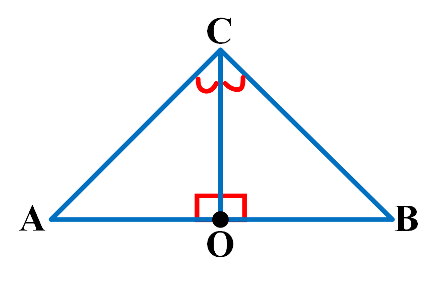

    premise: IsPerpendicularBisectorOfLine(CO,AB)&Angle(BCO)&Angle(OCA)
    conclusion: IsBisectorOfAngle(CO,BCA)
**Notes**:  
1.垂直平分线性质：垂直平分线也是角平分线  

### angle_addition(ABC,CBD)

    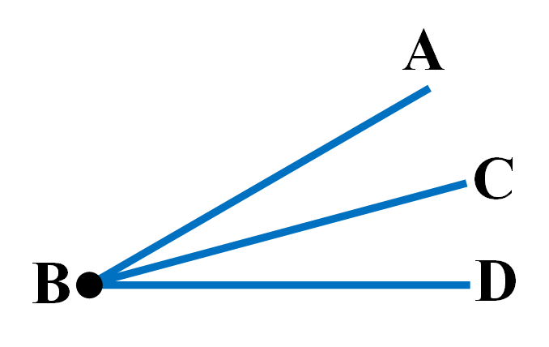

    premise: Angle(ABC)&Angle(CBD)&Angle(ABD)
    conclusion: Equal(MeasureOfAngle(ABD),Add(MeasureOfAngle(ABC),MeasureOfAngle(CBD)))
**Notes**:  
1.常识：若∠ABC与∠CBD相邻，则∠ABC+∠CBD=∠ABD  

### flat_angle(ABC)

    

    premise: Collinear(ABC)
    conclusion: Equal(MeasureOfAngle(ABC),180)
**Notes**:  
1.常识：平角为180°  

### adjacent_complementary_angle(AOB,BOC)

    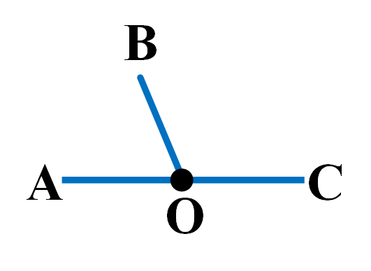

    premise: Collinear(AOC)&Angle(AOB)&Angle(BOC)
    conclusion: Equal(Add(MeasureOfAngle(AOB),MeasureOfAngle(BOC)),180)
**Notes**:  
1.邻补角定理：一对邻补角的角度和为180°  

### round_angle(AOB,BOA)

    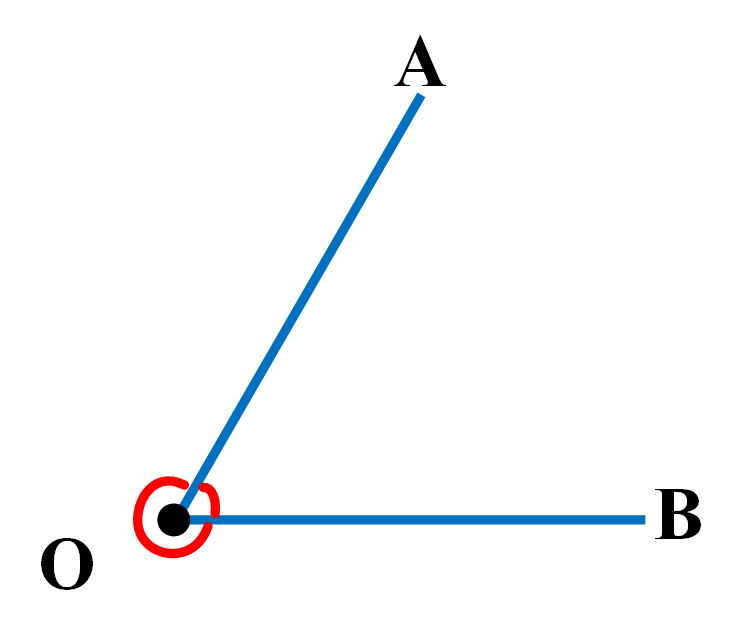

    premise: Angle(AOB)&Angle(BOA)
    conclusion: Equal(Add(MeasureOfAngle(AOB),MeasureOfAngle(BOA)),360)
**Notes**:  
1.周角定理：周角为360°  

### vertical_angle(AOC,BOD)

    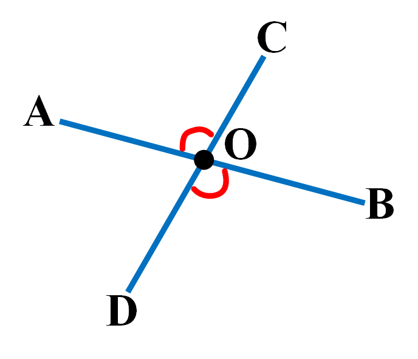

    premise: Collinear(AOB)&Collinear(COD)&Angle(AOC)&Angle(BOD)
    conclusion: Equal(MeasureOfAngle(AOC),MeasureOfAngle(BOD))
**Notes**:  
1.对顶角相等：两直线相交，对顶角相等  

### bisector_of_angle_judgment_angle_equal(BD,ABC)

    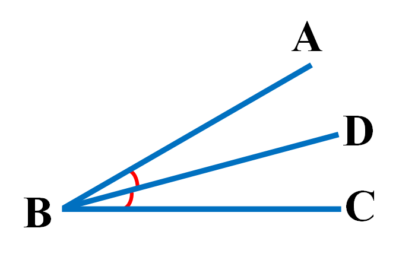

    premise: Angle(ABD)&Angle(DBC)&Equal(MeasureOfAngle(ABD),MeasureOfAngle(DBC))
    conclusion: IsBisectorOfAngle(BD,ABC)
**Notes**:  
1.角平分线的判定：平分的两角相等  

### bisector_of_angle_property_distance_equal(BD,ABC)

    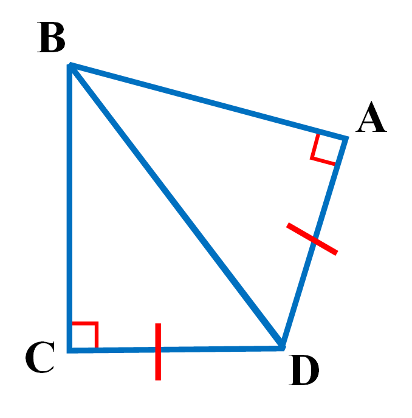

    premise: IsBisectorOfAngle(BD,ABC)&Equal(MeasureOfAngle(BCD),90)&Equal(MeasureOfAngle(DAB),90)
    conclusion: Equal(LengthOfLine(DA),LengthOfLine(DC))
**Notes**:  
1.角平分线的判定：角平分线上的点到两端的距离相等  

### bisector_of_angle_property_line_ratio(BD,ABC)

    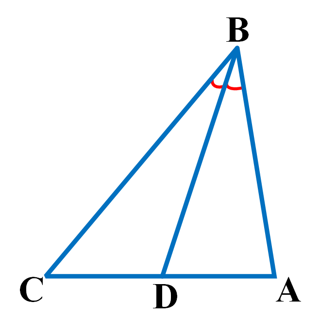

    premise: IsBisectorOfAngle(BD,ABC)&Collinear(CDA)
    conclusion: Equal(Mul(LengthOfLine(CD),LengthOfLine(BA)),Mul(LengthOfLine(DA),LengthOfLine(BC)))
**Notes**:  
1.角平分线的性质：边成比例  

### bisector_of_angle_property_length_formula(BD,ABC)

    

    premise: IsBisectorOfAngle(BD,ABC)&Collinear(CDA)
    conclusion: Equal(Mul(LengthOfLine(BD),LengthOfLine(BD)),Sub(Mul(LengthOfLine(BC),LengthOfLine(BA)),Mul(LengthOfLine(DC),LengthOfLine(DA))))
**Notes**:  
1.角平分线的性质：长度公式  

### triangle_property_angle_sum(ABC)

    

    premise: Polygon(ABC)
    conclusion: Equal(Add(MeasureOfAngle(ABC),MeasureOfAngle(BCA),MeasureOfAngle(CAB)),180)
**Notes**:  
1.三角形内角和为180°  

### sine_theorem(ABC)

    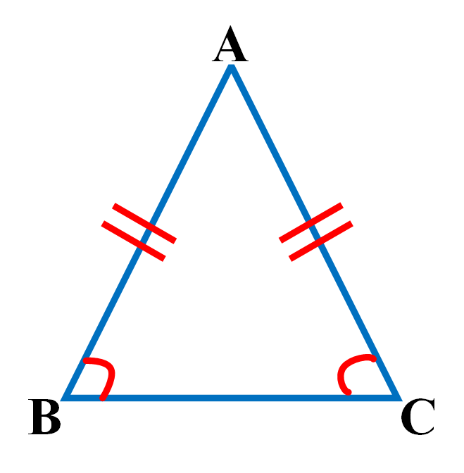

    premise: Polygon(ABC)
    conclusion: Equal(Mul(LengthOfLine(AB),Sin(MeasureOfAngle(ABC))),Mul(LengthOfLine(AC),Sin(MeasureOfAngle(BCA))))
**Notes**:  
1.正弦定理  
2.注意标注参数，三角形两腰和和两底角的正弦值成比例  

### cosine_theorem(ABC)

    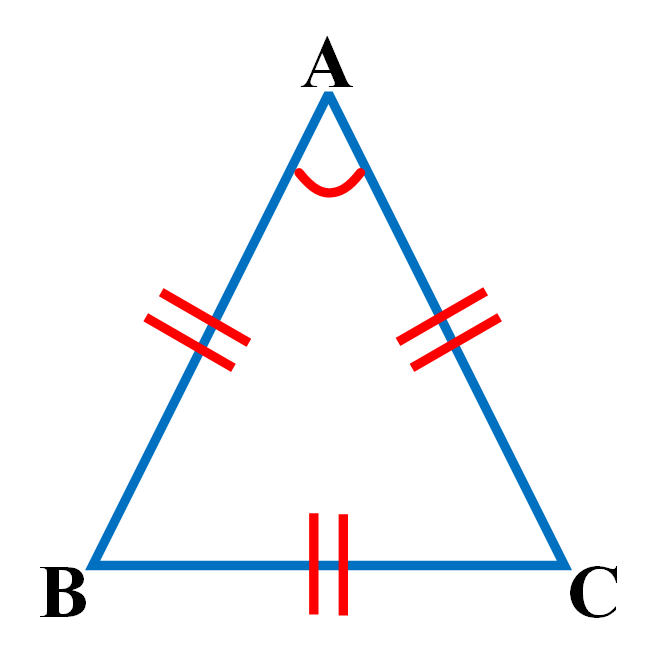

    premise: Polygon(ABC)
    conclusion: Equal(Add(Pow(LengthOfLine(BC),2),Mul(2,LengthOfLine(AB),LengthOfLine(AC),Cos(MeasureOfAngle(CAB)))),Add(Pow(LengthOfLine(AB),2),Pow(LengthOfLine(AC),2)))
**Notes**:  
1.余弦定理  
2.注意标注参数，角是顶角  

### triangle_perimeter_formula(ABC)

    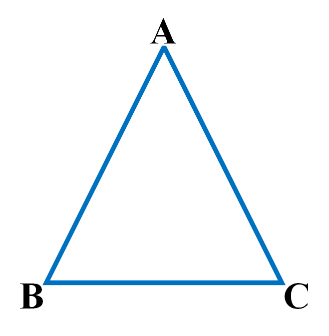

    premise: Polygon(ABC)
    conclusion: Equal(PerimeterOfTriangle(ABC),Add(LengthOfLine(AB),LengthOfLine(BC),LengthOfLine(CA)))
**Notes**:  
1.三角形周长公式：三边之和  

### triangle_area_formula_common(ABC)

    

    premise: Polygon(ABC)
    conclusion: Equal(AreaOfTriangle(ABC),Mul(HeightOfTriangle(ABC),LengthOfLine(BC),1/2))
**Notes**:  
1.三角形面积公式：底乘高除2  
2.对应的底边是BC  

### triangle_area_formula_sine(ABC)

    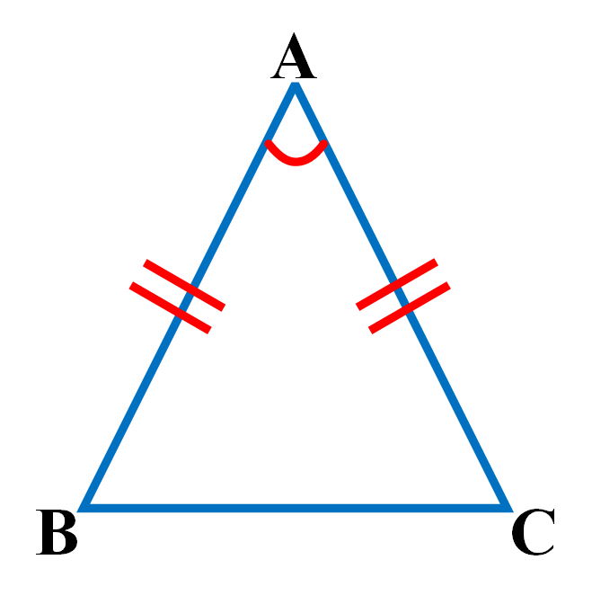

    premise: Polygon(ABC)
    conclusion: Equal(AreaOfTriangle(ABC),Mul(LengthOfLine(AB),LengthOfLine(AC),Sin(MeasureOfAngle(CAB)),1/2))
**Notes**:  
1.三角形面积公式：已知一角和两临边即可求面积  
2.角是三角形的顶角，边是三角形的两腰，如triangle_area_formula_sine(ABC)会用∠CAB、边AB和边AC  

### median_of_triangle_judgment(AD,ABC)

    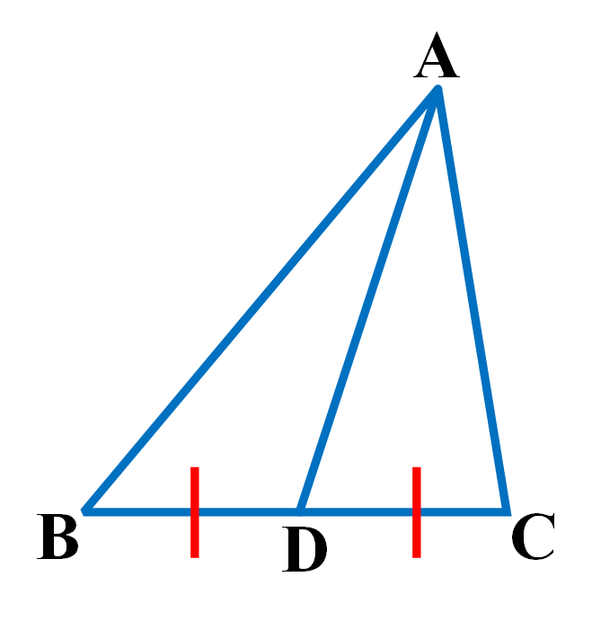

    premise: Polygon(ABC)&Line(AD)&Collinear(BDC)&Equal(LengthOfLine(BD),LengthOfLine(CD))
    conclusion: IsMedianOfTriangle(AD,ABC)
**Notes**:  
1.三角形中线的判定：顶点与底边中点的连线  

### altitude_of_triangle_judgment(AD,ABC)

    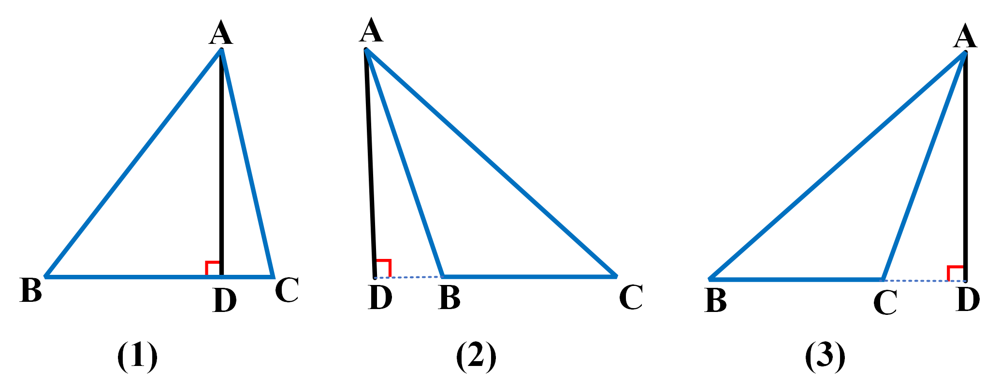

    # branch 1
    premise: Polygon(ABC)&Line(AD)&Collinear(BDC)&Equal(MeasureOfAngle(BDA),90)
    conclusion: IsAltitudeOfTriangle(AD,ABC)
    # branch 2
    premise: Polygon(ABC)&Line(AD)&Collinear(DBC)&Equal(MeasureOfAngle(ADB),90)
    conclusion: IsAltitudeOfTriangle(AD,ABC)
    # branch 3
    premise: Polygon(ABC)&Line(AD)&Collinear(BCD)&Equal(MeasureOfAngle(CDA),90)
    conclusion: IsAltitudeOfTriangle(AD,ABC)
**Notes**:  
1.三角形高的判定：垂直于底边  

### midsegment_of_triangle_judgment_midpoint(DE,ABC)

    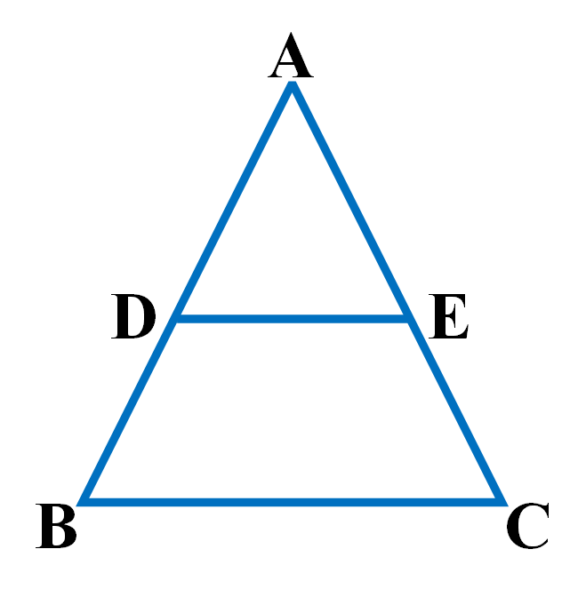

    premise: Polygon(ABC)&Collinear(ADB)&Collinear(AEC)&Line(DE)&Equal(LengthOfLine(AD),LengthOfLine(BD))&Equal(LengthOfLine(AE),LengthOfLine(CE))
    conclusion: IsMidsegmentOfTriangle(DE,ABC)
**Notes**:  
1.中位线判定：两边中点的连线  

### midsegment_of_triangle_judgment_parallel(DE,ABC)

    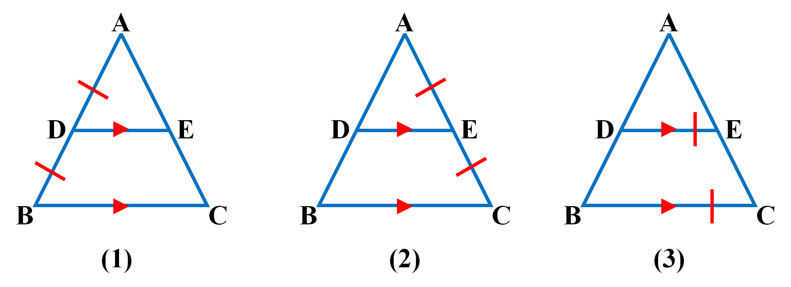

    # branch 1
    premise: Polygon(ABC)&Collinear(ADB)&Collinear(AEC)&Line(DE)&ParallelBetweenLine(DE,BC)&Equal(LengthOfLine(AD),LengthOfLine(BD))
    conclusion: IsMidsegmentOfTriangle(DE,ABC)
    # branch 2
    premise: Polygon(ABC)&Collinear(ADB)&Collinear(AEC)&Line(DE)&ParallelBetweenLine(DE,BC)&Equal(LengthOfLine(AE),LengthOfLine(CE))
    conclusion: IsMidsegmentOfTriangle(DE,ABC)
    # branch 3
    premise: Polygon(ABC)&Collinear(ADB)&Collinear(AEC)&Line(DE)&ParallelBetweenLine(DE,BC)&Equal(LengthOfLine(BC),Mul(LengthOfLine(DE),2))
    conclusion: IsMidsegmentOfTriangle(DE,ABC)
**Notes**:  
1.中位线判定：平行且与三角形某腰的交点是该腰的中点  

### midsegment_of_triangle_property_parallel(DE,ABC)

    

    premise: IsMidsegmentOfTriangle(DE,ABC)
    conclusion: ParallelBetweenLine(DE,BC)
**Notes**:  
1.中位线性质：平行于底边  

### midsegment_of_triangle_property_length(DE,ABC)

    

    premise: IsMidsegmentOfTriangle(DE,ABC)
    conclusion: Equal(LengthOfLine(DE),Mul(LengthOfLine(BC),1/2))
**Notes**:  
1.中位线性质：中位线长度等于底边的一半  

### circumcenter_of_triangle_judgment_intersection(O,ABC,D,E)

    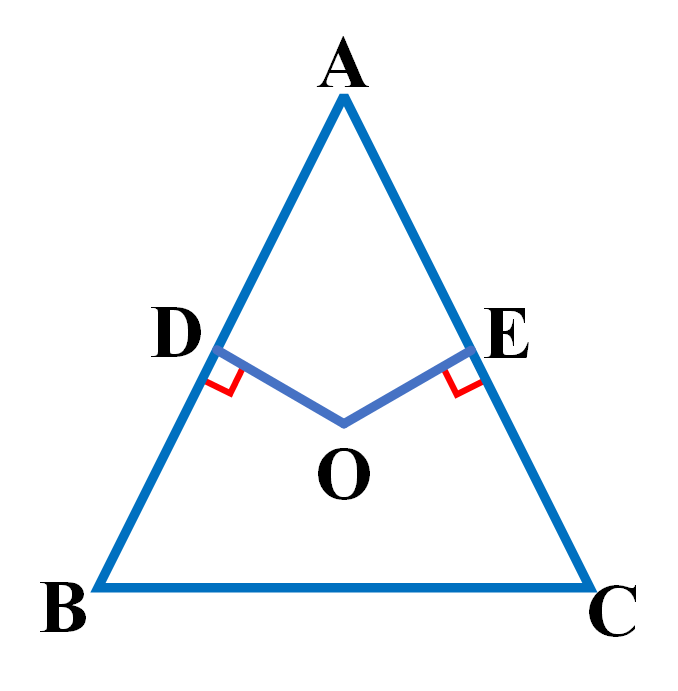

    premise: Polygon(ABC)&Collinear(ADB)&Collinear(CEA)&IsPerpendicularBisectorOfLine(OD,AB)&IsPerpendicularBisectorOfLine(OE,CA)
    conclusion: IsCircumcenterOfTriangle(O,ABC)
**Notes**:  
1.三角形外心判定：垂直平分线交点  

### circumcenter_of_triangle_property_intersection(O,ABC,D)

    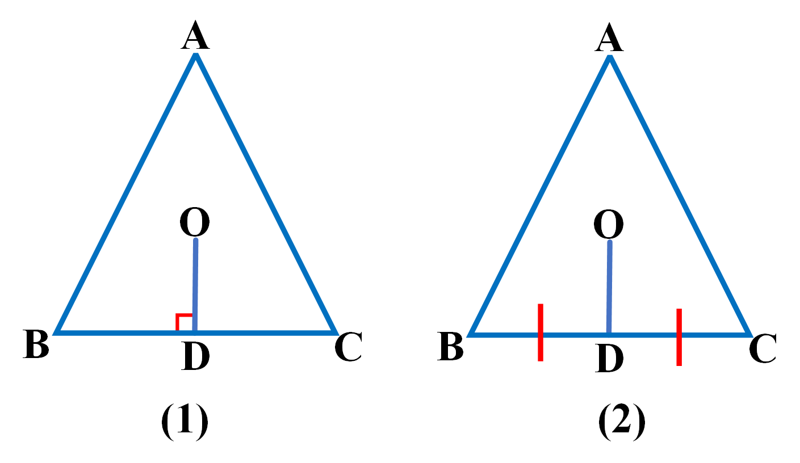

    # branch 1
    premise: IsCircumcenterOfTriangle(O,ABC)&Collinear(BDC)&Line(OD)&Equal(MeasureOfAngle(BDO),90)
    conclusion: IsPerpendicularBisectorOfLine(OD,BC)
    # branch 2
    premise: IsCircumcenterOfTriangle(O,ABC)&Collinear(BDC)&Line(OD)&Equal(LengthOfLine(BD),LengthOfLine(CD))
    conclusion: IsPerpendicularBisectorOfLine(OD,BC)
**Notes**:  
1.三角形外心性质：垂直平分线交点  

### incenter_of_triangle_judgment_intersection(O,ABC)

    

    premise: Polygon(ABC)&IsBisectorOfAngle(BO,ABC)&IsBisectorOfAngle(CO,BCA)
    conclusion: IsIncenterOfTriangle(O,ABC)
**Notes**:  
1.三角形内心判定：角平分线交点  

### centroid_of_triangle_judgment_intersection(O,ABC,M,N)

    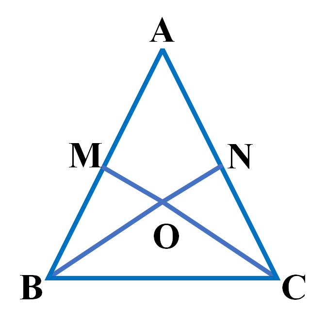

    premise: IsMedianOfTriangle(CM,CAB)&IsMedianOfTriangle(BN,BCA)&Collinear(COM)&Collinear(BON)
    conclusion: IsCentroidOfTriangle(O,ABC)
**Notes**:  
1.三角形重心判定：中线的交点  

### centroid_of_triangle_property_intersection(O,ABC,M)

    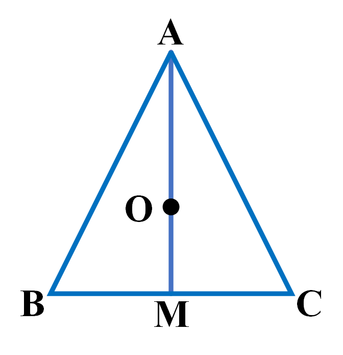

    premise: IsCentroidOfTriangle(O,ABC)&Collinear(AOM)&Collinear(BMC)
    conclusion: IsMedianOfTriangle(AM,ABC)
**Notes**:  
1.三角形重心性质：中线交点  

### centroid_of_triangle_property_line_ratio(O,ABC,M)

    

    premise: IsCentroidOfTriangle(O,ABC)&Collinear(AOM)&Collinear(BMC)
    conclusion: Equal(LengthOfLine(OA),Mul(LengthOfLine(OM),2))
**Notes**:  
1.三角形重心性质：中线被重心分开的两部分成比例  

### orthocenter_of_triangle_judgment_intersection(O,ABC,D,E)

    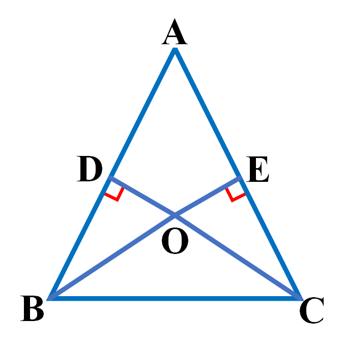

    premise: IsAltitudeOfTriangle(CD,CAB)&IsAltitudeOfTriangle(BE,BCA)&Collinear(COD)&Collinear(BOE)
    conclusion: IsOrthocenterOfTriangle(O,ABC)
**Notes**:  
1.三角形垂心判定：高的交点  

### orthocenter_of_triangle_property_intersection(O,ABC,D)

    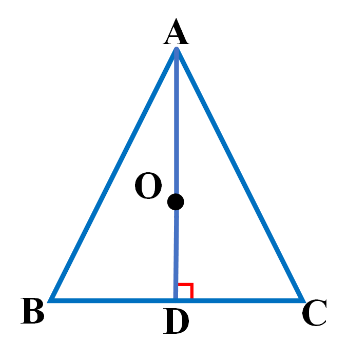

    premise: IsOrthocenterOfTriangle(O,ABC)&Collinear(AOD)&Collinear(BDC)
    conclusion: IsAltitudeOfTriangle(AD,ABC)
**Notes**:  
1.三角形垂心性质：高的交点  

### orthocenter_of_triangle_property_angle(O,ABC)

    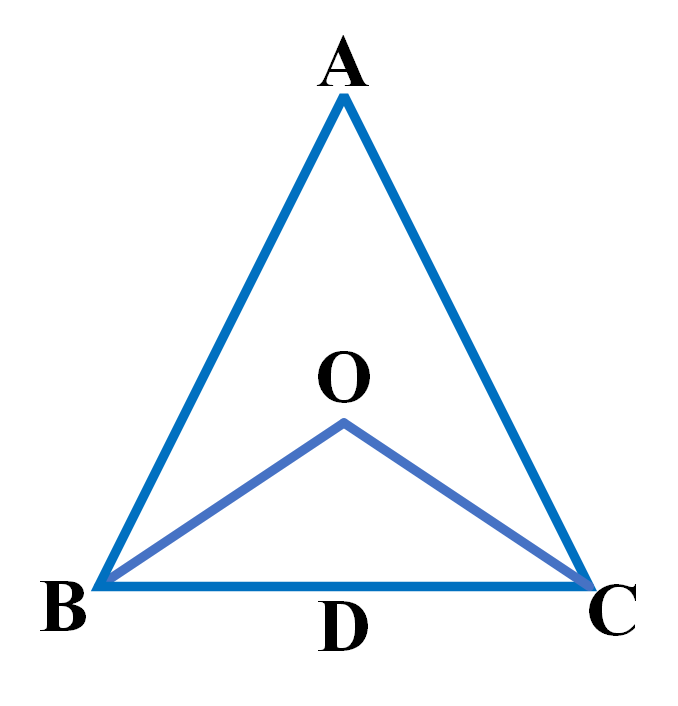

    premise: IsOrthocenterOfTriangle(O,ABC)&Angle(COB)
    conclusion: Equal(MeasureOfAngle(COB),Add(MeasureOfAngle(ABC),MeasureOfAngle(BCA)))
**Notes**:  
1.三角形垂心性质：底边两点与O构成的角的大小等于三角形两底角之和  

### congruent_triangle_judgment_sss(ABC,DEF)

    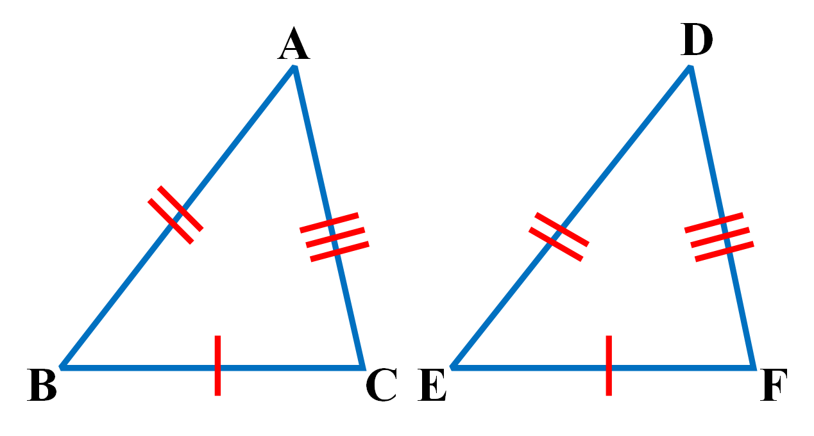

    premise: Polygon(ABC)&Polygon(DEF)&Equal(LengthOfLine(AB),LengthOfLine(DE))&Equal(LengthOfLine(BC),LengthOfLine(EF))&Equal(LengthOfLine(CA),LengthOfLine(FD))
    conclusion: CongruentBetweenTriangle(ABC,DEF)
**Notes**:  
1.全等三角形判定：SSS  

### congruent_triangle_judgment_sas(ABC,DEF)

    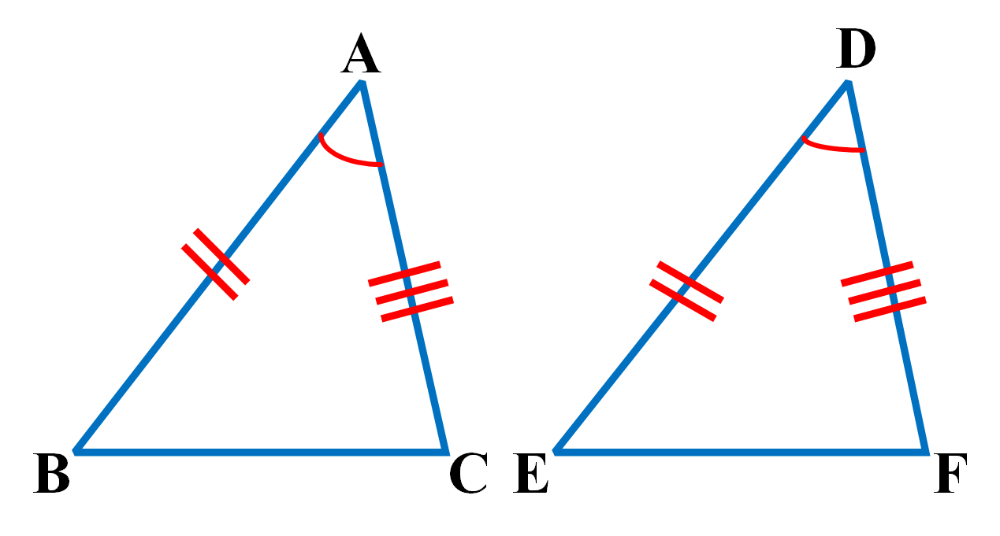

    premise: Polygon(ABC)&Polygon(DEF)&Equal(LengthOfLine(AB),LengthOfLine(DE))&Equal(MeasureOfAngle(CAB),MeasureOfAngle(FDE))&Equal(LengthOfLine(AC),LengthOfLine(DF))
    conclusion: CongruentBetweenTriangle(ABC,DEF)
**Notes**:  
1.全等三角形判定：SAS  

### congruent_triangle_judgment_aas(ABC,DEF)

    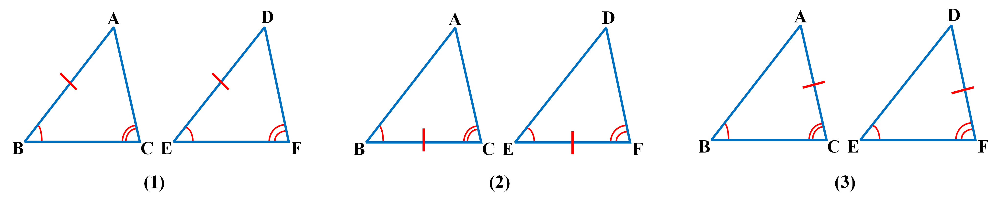

    # branch 1
    premise: Polygon(ABC)&Polygon(DEF)&Equal(MeasureOfAngle(ABC),MeasureOfAngle(DEF))&Equal(MeasureOfAngle(BCA),MeasureOfAngle(EFD))&Equal(LengthOfLine(AB),LengthOfLine(DE))
    conclusion: CongruentBetweenTriangle(ABC,DEF)
    # branch 2
    premise: Polygon(ABC)&Polygon(DEF)&Equal(MeasureOfAngle(ABC),MeasureOfAngle(DEF))&Equal(MeasureOfAngle(BCA),MeasureOfAngle(EFD))&Equal(LengthOfLine(BC),LengthOfLine(EF))
    conclusion: CongruentBetweenTriangle(ABC,DEF)
    # branch 3
    premise: Polygon(ABC)&Polygon(DEF)&Equal(MeasureOfAngle(ABC),MeasureOfAngle(DEF))&Equal(MeasureOfAngle(BCA),MeasureOfAngle(EFD))&Equal(LengthOfLine(AC),LengthOfLine(DF))
    conclusion: CongruentBetweenTriangle(ABC,DEF)
**Notes**:  
1.全等三角形判定：AAS  

### congruent_triangle_judgment_hl(ABC,DEF)

    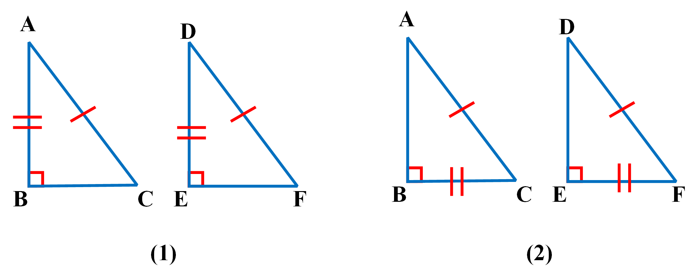

    premise: Polygon(ABC)&Polygon(DEF)&Equal(MeasureOfAngle(ABC),90)&Equal(MeasureOfAngle(DEF),90)&Equal(LengthOfLine(AC),LengthOfLine(DF))&(Equal(LengthOfLine(AB),LengthOfLine(DE))|Equal(LengthOfLine(BC),LengthOfLine(EF)))
    conclusion: CongruentBetweenTriangle(ABC,DEF)
**Notes**:  
1.全等三角形判定：HL  

### congruent_triangle_property_line_equal(ABC,DEF)

    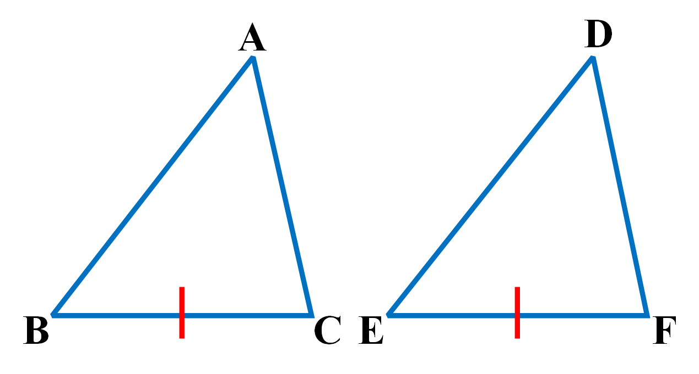

    premise: CongruentBetweenTriangle(ABC,DEF)
    conclusion: Equal(LengthOfLine(BC),LengthOfLine(EF))
**Notes**:  
1.全等三角形性质：边相等  

### congruent_triangle_property_angle_equal(ABC,DEF)

    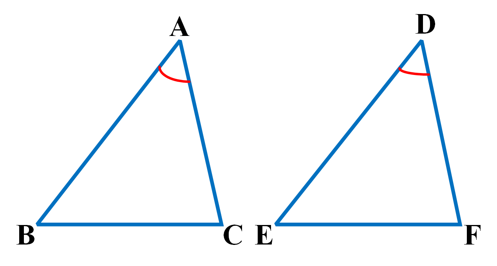

    premise: CongruentBetweenTriangle(ABC,DEF)
    conclusion: Equal(MeasureOfAngle(CAB),MeasureOfAngle(FDE))
**Notes**:  
1.全等三角形性质：角相等  

### congruent_triangle_property_perimeter_equal(ABC,DEF)

    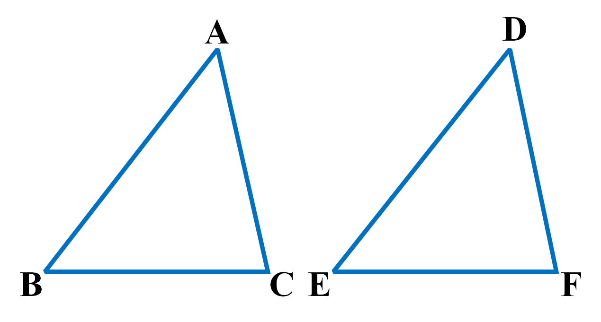

    premise: CongruentBetweenTriangle(ABC,DEF)
    conclusion: Equal(PerimeterOfTriangle(ABC),PerimeterOfTriangle(DEF))
**Notes**:  
1.全等三角形性质：周长相等  

### congruent_triangle_property_area_equal(ABC,DEF)

    

    premise: CongruentBetweenTriangle(ABC,DEF)
    conclusion: Equal(AreaOfTriangle(ABC),AreaOfTriangle(DEF))
**Notes**:  
1.全等三角形性质：面积相等  

### congruent_triangle_property_exchange(ABC,DEF)

    

    premise: CongruentBetweenTriangle(ABC,DEF)
    conclusion: CongruentBetweenTriangle(DEF,ABC)
**Notes**:  
1.全等三角形性质：先后顺序不影响三角形的全等  

### mirror_congruent_triangle_judgment_sss(ABC,DEF)

    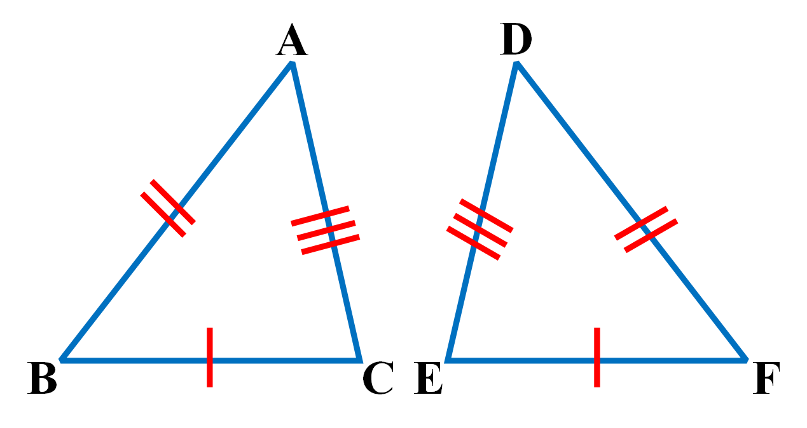

    premise: Polygon(ABC)&Polygon(DEF)&Equal(LengthOfLine(AB),LengthOfLine(FD))&Equal(LengthOfLine(BC),LengthOfLine(EF))&Equal(LengthOfLine(CA),LengthOfLine(DE))
    conclusion: MirrorCongruentBetweenTriangle(ABC,DEF)
**Notes**:  
1.镜像全等三角形判定：SSS  

### mirror_congruent_triangle_judgment_sas(ABC,DEF)

    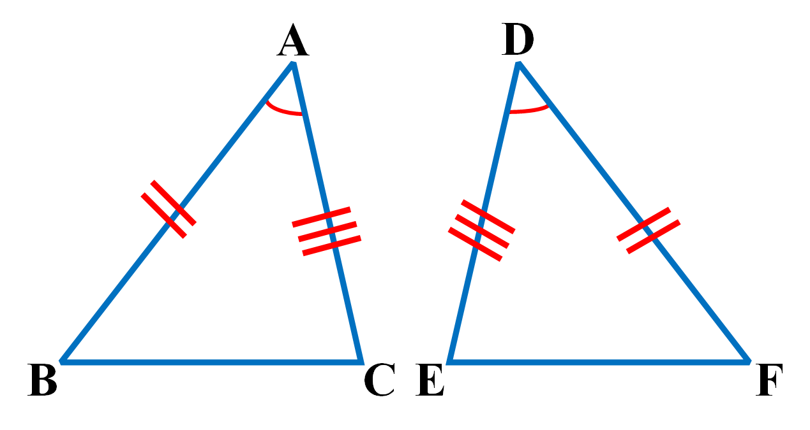

    premise: Polygon(ABC)&Polygon(DEF)&Equal(LengthOfLine(AB),LengthOfLine(DF))&Equal(MeasureOfAngle(CAB),MeasureOfAngle(FDE))&Equal(LengthOfLine(AC),LengthOfLine(DE))
    conclusion: MirrorCongruentBetweenTriangle(ABC,DEF)
**Notes**:  
1.镜像全等三角形判定：SAS  

### mirror_congruent_triangle_judgment_aas(ABC,DEF)

    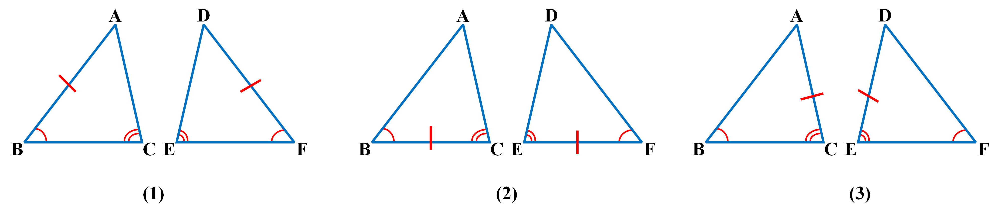

    # branch 1
    premise: Polygon(ABC)&Polygon(DEF)&Equal(MeasureOfAngle(ABC),MeasureOfAngle(EFD))&Equal(MeasureOfAngle(BCA),MeasureOfAngle(DEF))&Equal(LengthOfLine(AB),LengthOfLine(DF))
    conclusion: MirrorCongruentBetweenTriangle(ABC,DEF)
    # branch 2
    premise: Polygon(ABC)&Polygon(DEF)&Equal(MeasureOfAngle(ABC),MeasureOfAngle(EFD))&Equal(MeasureOfAngle(BCA),MeasureOfAngle(DEF))&Equal(LengthOfLine(BC),LengthOfLine(EF))
    conclusion: MirrorCongruentBetweenTriangle(ABC,DEF)
    # branch 3
    premise: Polygon(ABC)&Polygon(DEF)&Equal(MeasureOfAngle(ABC),MeasureOfAngle(EFD))&Equal(MeasureOfAngle(BCA),MeasureOfAngle(DEF))&Equal(LengthOfLine(CA),LengthOfLine(DE))
    conclusion: MirrorCongruentBetweenTriangle(ABC,DEF)
**Notes**:  
1.镜像全等三角形判定：AAS  

### mirror_congruent_triangle_judgment_hl(ABC,DEF)

    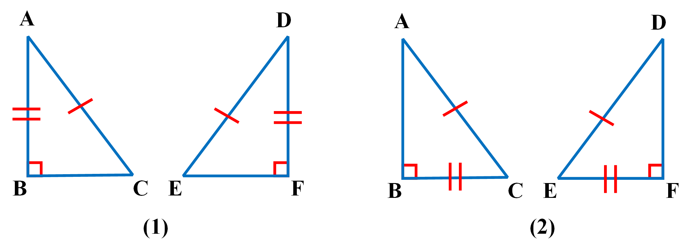

    premise: Polygon(ABC)&Polygon(DEF)&Equal(MeasureOfAngle(ABC),90)&Equal(MeasureOfAngle(EFD),90)&Equal(LengthOfLine(AC),LengthOfLine(DE))&(Equal(LengthOfLine(BC),LengthOfLine(EF))|Equal(LengthOfLine(AB),LengthOfLine(DF)))
    conclusion: MirrorCongruentBetweenTriangle(ABC,DEF)
**Notes**:  
1.镜像全等三角形判定：HL  

### mirror_congruent_triangle_property_line_equal(ABC,DEF)

    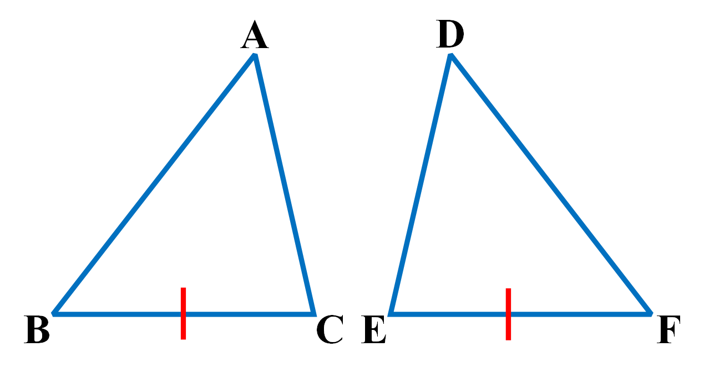

    premise: MirrorCongruentBetweenTriangle(ABC,DEF)
    conclusion: Equal(LengthOfLine(BC),LengthOfLine(EF))
**Notes**:  
1.镜像全等三角形性质：边相等  

### mirror_congruent_triangle_property_angle_equal(ABC,DEF)

    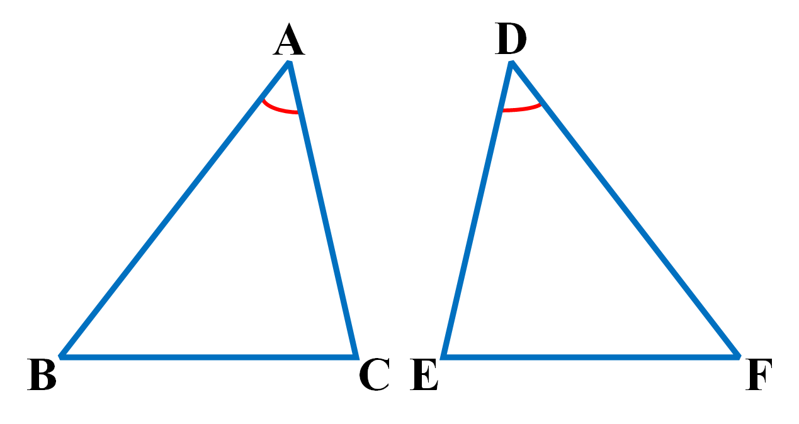

    premise: MirrorCongruentBetweenTriangle(ABC,DEF)
    conclusion: Equal(MeasureOfAngle(CAB),MeasureOfAngle(FDE))
**Notes**:  
1.镜像全等三角形性质：角相等  

### mirror_congruent_triangle_property_perimeter_equal(ABC,DEF)

    

    premise: MirrorCongruentBetweenTriangle(ABC,DEF)
    conclusion: Equal(PerimeterOfTriangle(ABC),PerimeterOfTriangle(DEF))
**Notes**:  
1.镜像全等三角形性质：周长相等  

### mirror_congruent_triangle_property_area_equal(ABC,DEF)

    

    premise: MirrorCongruentBetweenTriangle(ABC,DEF)
    conclusion: Equal(AreaOfTriangle(ABC),AreaOfTriangle(DEF))
**Notes**:  
1.镜像全等三角形性质：面积相等  

### mirror_congruent_triangle_property_exchange(ABC,DEF)

    

    premise: MirrorCongruentBetweenTriangle(ABC,DEF)
    conclusion: MirrorCongruentBetweenTriangle(DEF,ABC)
**Notes**:  
1.镜像全等三角形性质：先后顺序不影响三角形的镜像全等  

### similar_triangle_judgment_sss(ABC,DEF)

    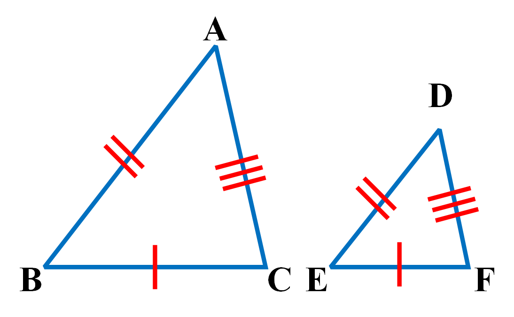

    premise: Polygon(ABC)&Polygon(DEF)&Equal(Mul(LengthOfLine(AB),LengthOfLine(EF)),Mul(LengthOfLine(DE),LengthOfLine(BC)))&Equal(Mul(LengthOfLine(AB),LengthOfLine(DF)),Mul(LengthOfLine(DE),LengthOfLine(CA)))
    conclusion: SimilarBetweenTriangle(ABC,DEF)
**Notes**:  
1.相似三角形判定：SSS  

### similar_triangle_judgment_sas(ABC,DEF)

    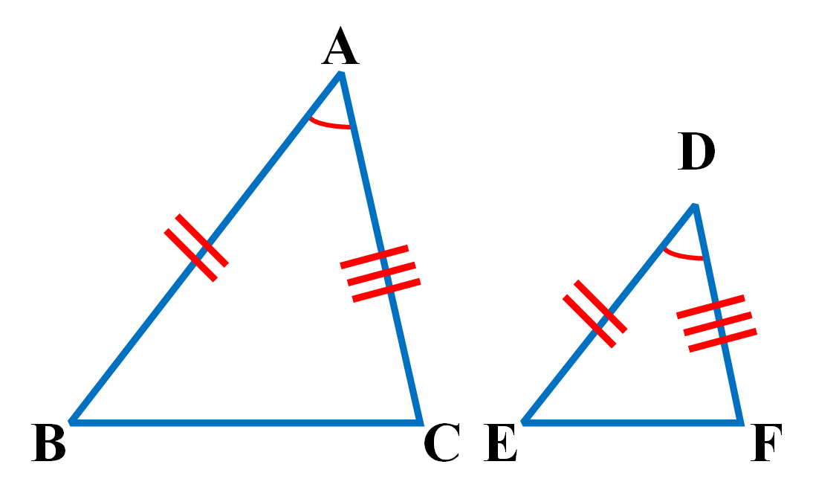

    premise: Polygon(ABC)&Polygon(DEF)&Equal(Mul(LengthOfLine(AB),LengthOfLine(DF)),Mul(LengthOfLine(DE),LengthOfLine(AC)))&Equal(MeasureOfAngle(CAB),MeasureOfAngle(FDE))
    conclusion: SimilarBetweenTriangle(ABC,DEF)
**Notes**:  
1.相似三角形判定：SAS  

### similar_triangle_judgment_aa(ABC,DEF)

    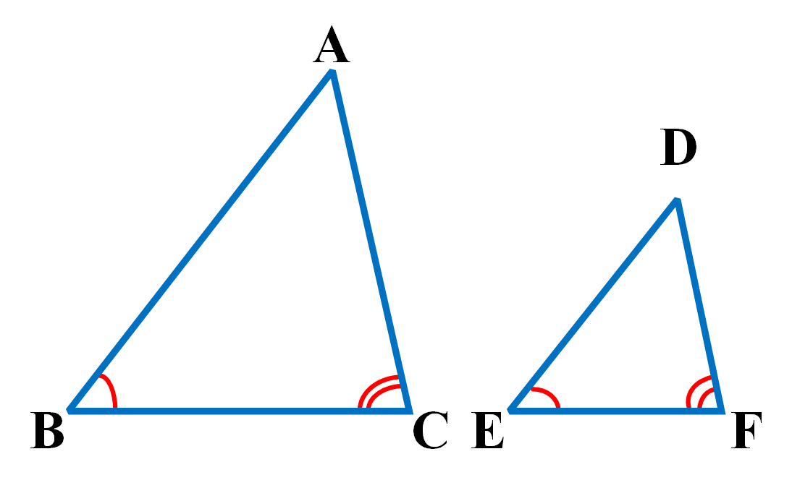

    premise: Polygon(ABC)&Polygon(DEF)&Equal(MeasureOfAngle(ABC),MeasureOfAngle(DEF))&Equal(MeasureOfAngle(BCA),MeasureOfAngle(EFD))
    conclusion: SimilarBetweenTriangle(ABC,DEF)
**Notes**:  
1.相似三角形判定：AA  

### similar_triangle_judgment_hl(ABC,DEF)

    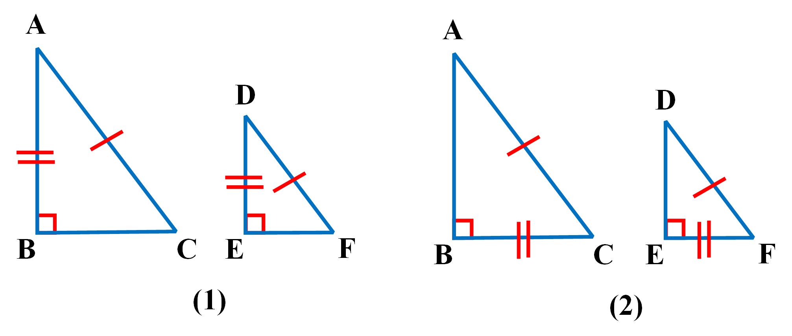

    # branch 1
    premise: Polygon(ABC)&Polygon(DEF)&Equal(MeasureOfAngle(ABC),90)&Equal(MeasureOfAngle(DEF),90)&Equal(Mul(LengthOfLine(AB),LengthOfLine(DF)),Mul(LengthOfLine(AC),LengthOfLine(DE)))
    conclusion: SimilarBetweenTriangle(ABC,DEF)
    # branch 2
    premise: Polygon(ABC)&Polygon(DEF)&PerpendicularBetweenLine(AB,CB)&PerpendicularBetweenLine(DE,FE)&Equal(Mul(LengthOfLine(BC),LengthOfLine(DF)),Mul(LengthOfLine(AC),LengthOfLine(EF)))
    conclusion: SimilarBetweenTriangle(ABC,DEF)
**Notes**:  
1.全等三角形判定：HL  

### similar_triangle_property_ratio(ABC,DEF)

    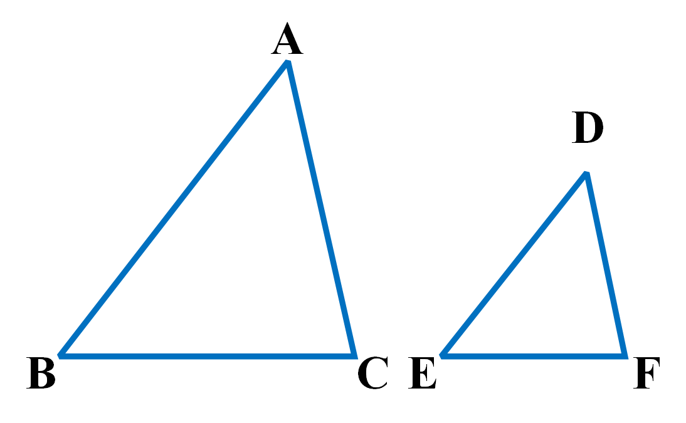

    premise: SimilarBetweenTriangle(ABC,DEF)
    conclusion: SimilarBetweenTriangle(DEF,ABC)
                Equal(Mul(RatioOfSimilarTriangle(ABC,DEF),RatioOfSimilarTriangle(DEF,ABC)),1)
**Notes**:  
1.相似三角形的比值 ABC/DEF * DEF/ABC = 1  

### similar_triangle_property_line_ratio(ABC,DEF)

    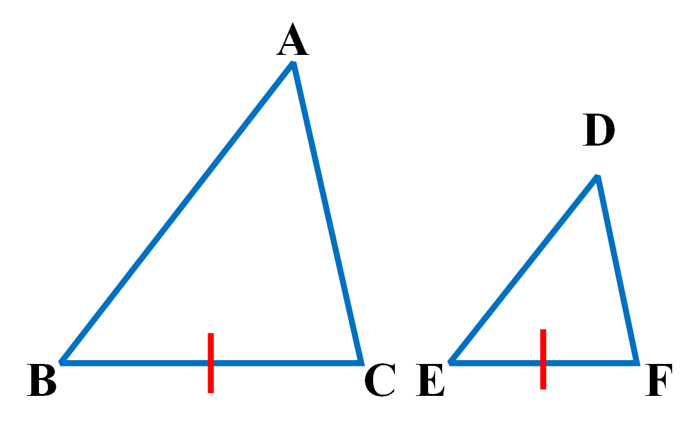

    premise: SimilarBetweenTriangle(ABC,DEF)
    conclusion: Equal(LengthOfLine(BC),Mul(LengthOfLine(EF),RatioOfSimilarTriangle(ABC,DEF)))
**Notes**:  
1.相似三角形性质：边成比例  
2.使用一次定理只得到底边成比例  

### similar_triangle_property_angle_equal(ABC,DEF)

    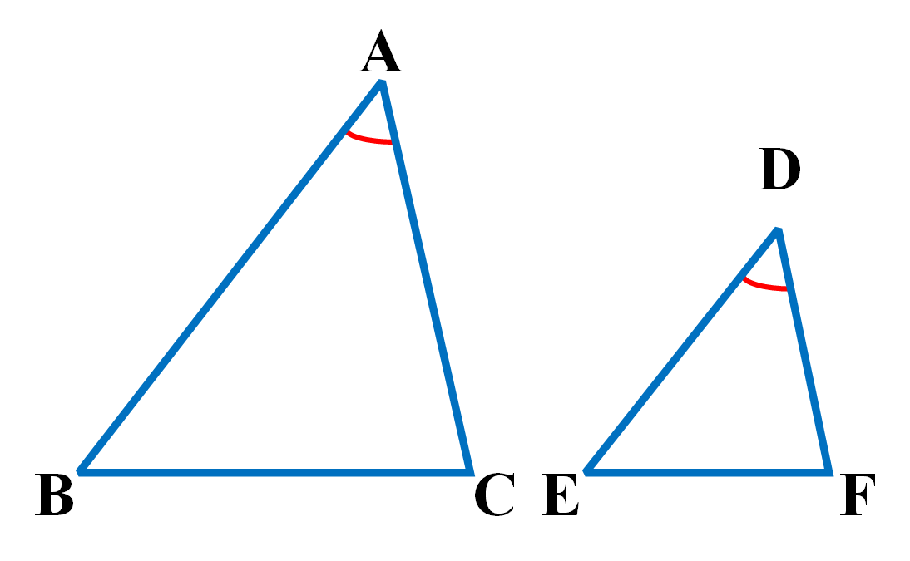

    premise: SimilarBetweenTriangle(ABC,DEF)
    conclusion: Equal(MeasureOfAngle(CAB),MeasureOfAngle(FDE))
**Notes**:  
1.相似三角形性质：角相等  

### similar_triangle_property_perimeter_ratio(ABC,DEF)

    

    premise: SimilarBetweenTriangle(ABC,DEF)
    conclusion: Equal(PerimeterOfTriangle(ABC),Mul(PerimeterOfTriangle(DEF),RatioOfSimilarTriangle(ABC,DEF)))
**Notes**:  
1.相似三角形性质：周长成比例  

### similar_triangle_property_area_square_ratio(ABC,DEF)

    

    premise: SimilarBetweenTriangle(ABC,DEF)
    conclusion: Equal(AreaOfTriangle(ABC),Mul(AreaOfTriangle(DEF),RatioOfSimilarTriangle(ABC,DEF),RatioOfSimilarTriangle(ABC,DEF)))
**Notes**:  
1.相似三角形性质：面积成比例  

### mirror_similar_triangle_judgment_sss(ABC,DEF)

    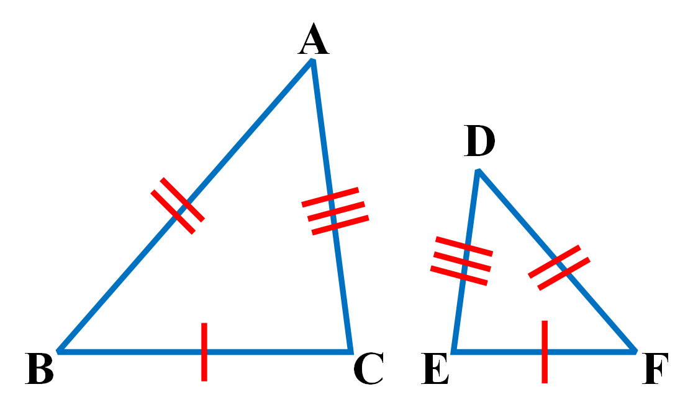

    premise: Polygon(ABC)&Polygon(DEF)&Equal(Mul(LengthOfLine(AB),LengthOfLine(EF)),Mul(LengthOfLine(FD),LengthOfLine(BC)))&Equal(Mul(LengthOfLine(AB),LengthOfLine(DE)),Mul(LengthOfLine(FD),LengthOfLine(CA)))
    conclusion: MirrorSimilarBetweenTriangle(ABC,DEF)
**Notes**:  
1.相似三角形判定：SSS  

### mirror_similar_triangle_judgment_sas(ABC,DEF)

    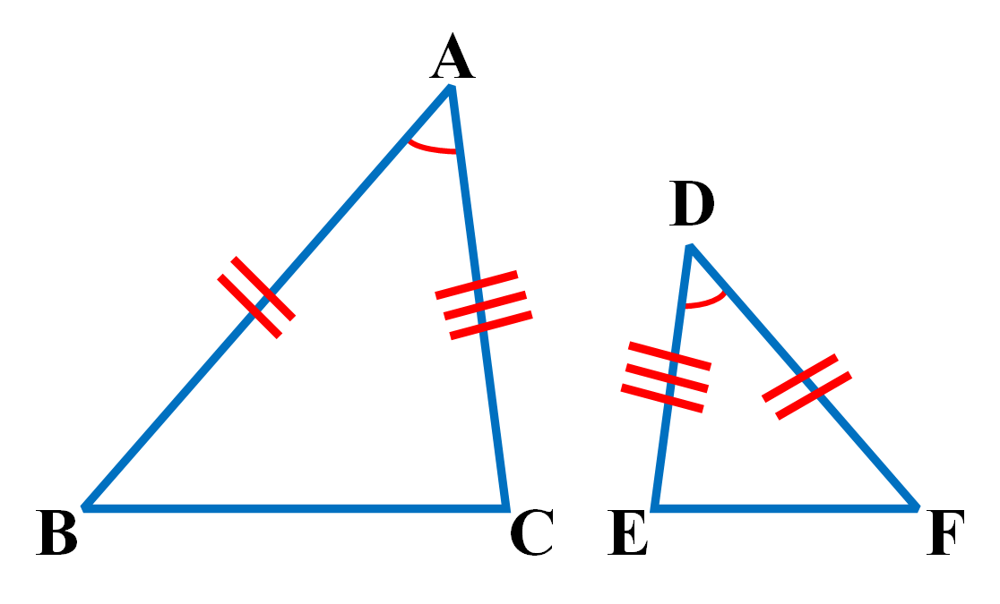

    premise: Polygon(ABC)&Polygon(DEF)&Equal(Mul(LengthOfLine(AB),LengthOfLine(DE)),Mul(LengthOfLine(DF),LengthOfLine(AC)))&Equal(MeasureOfAngle(CAB),MeasureOfAngle(FDE))
    conclusion: MirrorSimilarBetweenTriangle(ABC,DEF)
**Notes**:  
1.相似三角形判定：SAS  

### mirror_similar_triangle_judgment_aa(ABC,DEF)

    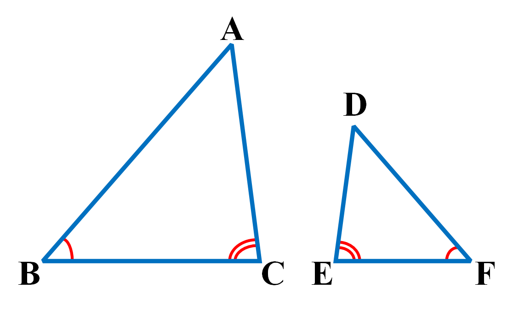

    premise: Polygon(ABC)&Polygon(DEF)&Equal(MeasureOfAngle(ABC),MeasureOfAngle(EFD))&Equal(MeasureOfAngle(BCA),MeasureOfAngle(DEF))
    conclusion: MirrorSimilarBetweenTriangle(ABC,DEF)
**Notes**:  
1.相似三角形判定：AA  

### mirror_similar_triangle_judgment_hl(ABC,DEF)

    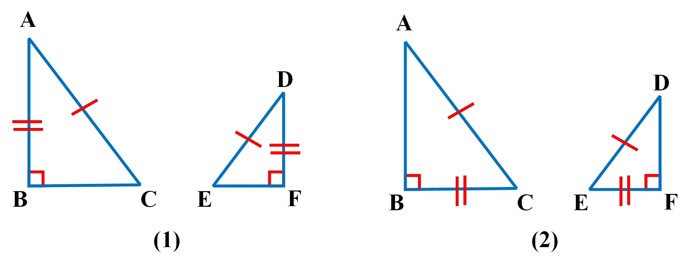

    # branch 1
    premise: Polygon(BCA)&Polygon(DEF)&Equal(MeasureOfAngle(ABC),90)&Equal(MeasureOfAngle(DEF),90)&Equal(Mul(LengthOfLine(AB),LengthOfLine(DE)),Mul(LengthOfLine(DF),LengthOfLine(AC)))
    conclusion: MirrorSimilarBetweenTriangle(ABC,DEF)
    # branch 2
    premise: Polygon(BCA)&Polygon(DEF)&Equal(MeasureOfAngle(ABC),90)&Equal(MeasureOfAngle(EFD),90)&Equal(Mul(LengthOfLine(BC),LengthOfLine(DE)),Mul(LengthOfLine(AC),LengthOfLine(EF)))
    conclusion: MirrorSimilarBetweenTriangle(ABC,DEF)
**Notes**:  
1.镜像相似三角形判定：HL  

### mirror_similar_triangle_property_ratio(ABC,DEF)

    

    premise: MirrorSimilarBetweenTriangle(ABC,DEF)
    conclusion: MirrorSimilarBetweenTriangle(DEF,ABC)
                Equal(Mul(RatioOfMirrorSimilarTriangle(ABC,DEF),RatioOfMirrorSimilarTriangle(DEF,ABC)),1)
**Notes**:  
1.镜像相似三角形的比值 ABC/DEF * DEF/ABC = 1  

### mirror_similar_triangle_property_line_ratio(ABC,DEF)

    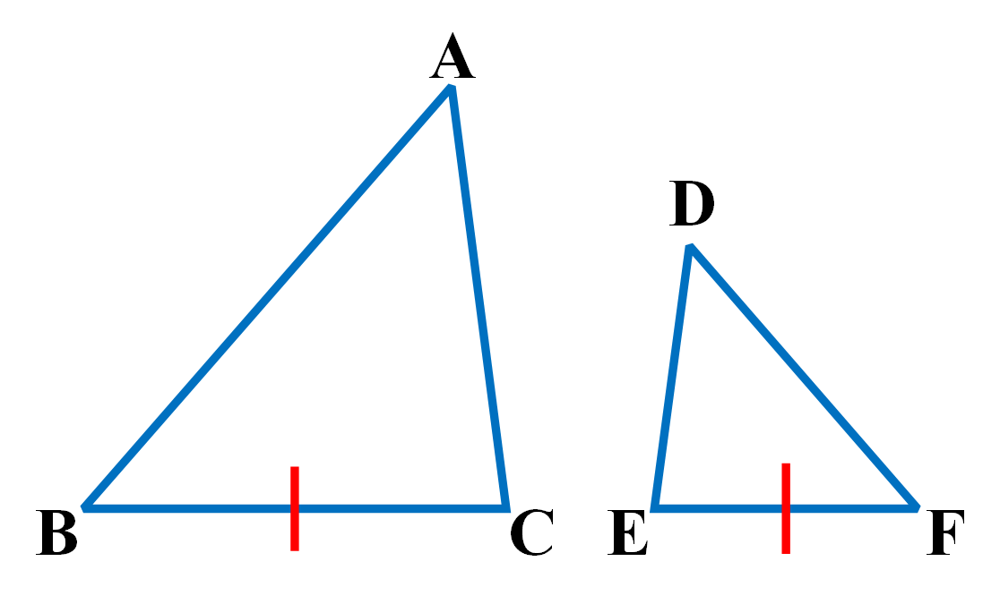

    premise: MirrorSimilarBetweenTriangle(ABC,DEF)
    conclusion: Equal(LengthOfLine(BC),Mul(LengthOfLine(EF),RatioOfMirrorSimilarTriangle(ABC,DEF)))
**Notes**:  
1.相似三角形性质：边成比例  
2.使用一次定理只声明底边成比例  

### mirror_similar_triangle_property_angle_equal(ABC,DEF)

    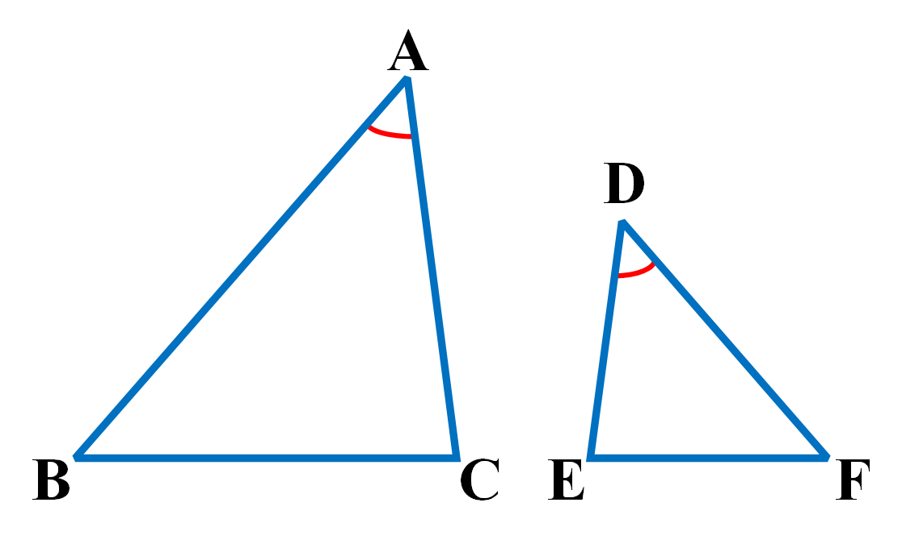

    premise: MirrorSimilarBetweenTriangle(ABC,DEF)
    conclusion: Equal(MeasureOfAngle(CAB),MeasureOfAngle(FDE))
**Notes**:  
1.相似三角形性质：角相等  

### mirror_similar_triangle_property_perimeter_ratio(ABC,DEF)

    

    premise: MirrorSimilarBetweenTriangle(ABC,DEF)
    conclusion: Equal(PerimeterOfTriangle(ABC),Mul(PerimeterOfTriangle(DEF),RatioOfMirrorSimilarTriangle(ABC,DEF)))
**Notes**:  
1.相似三角形性质：周长成比例  

### mirror_similar_triangle_property_area_square_ratio(ABC,DEF)

    

    premise: MirrorSimilarBetweenTriangle(ABC,DEF)
    conclusion: Equal(AreaOfTriangle(ABC),Mul(AreaOfTriangle(DEF),RatioOfMirrorSimilarTriangle(ABC,DEF),RatioOfMirrorSimilarTriangle(ABC,DEF)))
**Notes**:  
1.相似三角形性质：面积成比例  

### right_triangle_judgment_angle(ABC)

    

    premise: Polygon(ABC)&Equal(MeasureOfAngle(ABC),90)
    conclusion: RightTriangle(ABC)
**Notes**:  
1.直角三角形判定：有一个角是直角  

### right_triangle_judgment_pythagorean_inverse(ABC)

    

    premise: Polygon(ABC)&Equal(Add(Pow(LengthOfLine(AB),2),Pow(LengthOfLine(BC),2)),Pow(LengthOfLine(AC),2))
    conclusion: RightTriangle(ABC)
**Notes**:  
1.直角三角形判定：勾股定理  

### right_triangle_property_pythagorean(ABC)

    

    premise: RightTriangle(ABC)
    conclusion: Equal(Add(Pow(LengthOfLine(AB),2),Pow(LengthOfLine(BC),2)),Pow(LengthOfLine(AC),2))
**Notes**:  
1.直角三角形性质：勾股定理  

### right_triangle_property_length_of_median(ABC,M)

    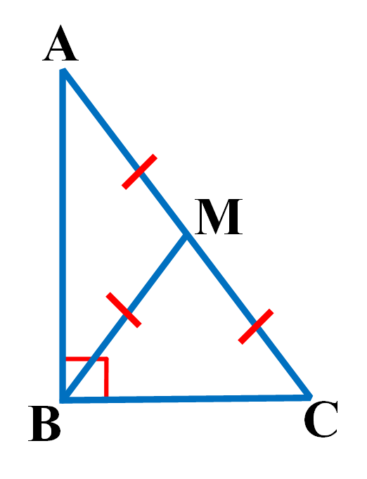

    premise: RightTriangle(ABC)&IsMedianOfTriangle(BM,BCA)
    conclusion: Equal(Mul(LengthOfLine(BM),2),LengthOfLine(CA))
**Notes**:  
1.直角三角形性质：斜边的中线等于斜边的一半  

### isosceles_triangle_judgment_line_equal(ABC)

    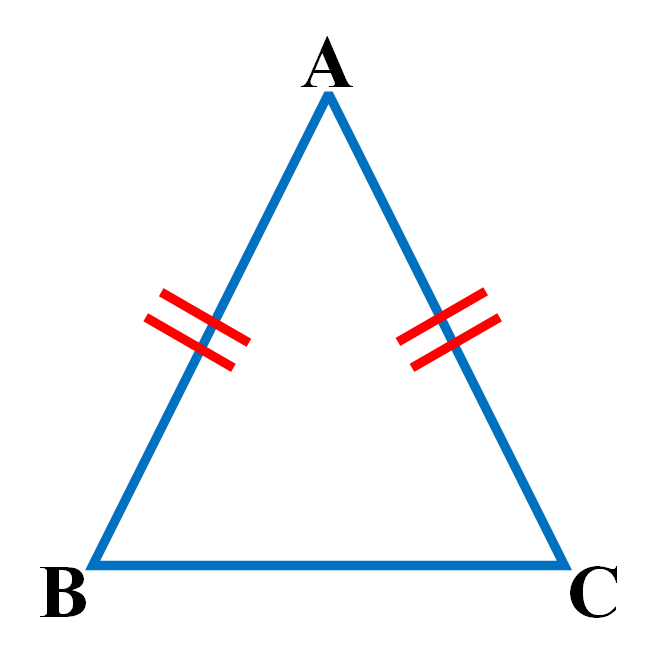

    premise: Polygon(ABC)&Equal(LengthOfLine(AB),LengthOfLine(AC))
    conclusion: IsoscelesTriangle(ABC)
**Notes**:  
1.等腰三角形判定：两腰相等  

### isosceles_triangle_judgment_angle_equal(ABC)

    

    premise: Polygon(ABC)&Equal(MeasureOfAngle(ABC),MeasureOfAngle(BCA))
    conclusion: IsoscelesTriangle(ABC)
**Notes**:  
1.等腰三角形判定：两底角相等  

### isosceles_triangle_property_angle_equal(ABC)

    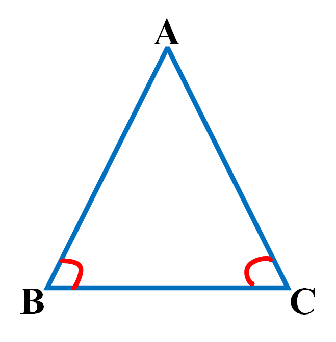

    premise: IsoscelesTriangle(ABC)
    conclusion: Equal(MeasureOfAngle(ABC),MeasureOfAngle(BCA))
**Notes**:  
1.等腰三角形性质：两底角相等  

### isosceles_triangle_property_line_coincidence(ABC,M)

    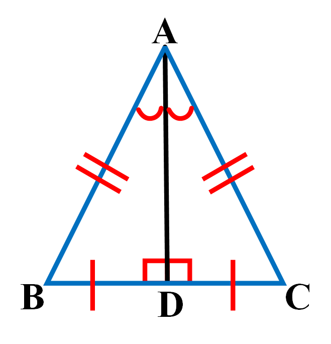

    # branch 1
    premise: IsoscelesTriangle(ABC)&IsAltitudeOfTriangle(AM,ABC)
    conclusion: IsMedianOfTriangle(AM,ABC)
                IsBisectorOfAngle(AM,CAB)
    # branch 2
    premise: IsoscelesTriangle(ABC)&IsMedianOfTriangle(AM,ABC)
    conclusion: IsAltitudeOfTriangle(AM,ABC)
                IsBisectorOfAngle(AM,CAB)
    # branch 3
    premise: IsoscelesTriangle(ABC)&Collinear(BMC)&IsBisectorOfAngle(AM,CAB)
    conclusion: IsAltitudeOfTriangle(AM,ABC)
                IsMedianOfTriangle(AM,ABC)
**Notes**:  
1.等腰三角形性质：三线合一  

### isosceles_right_triangle_judgment_isosceles_and_right(ABC)

    

    premise: IsoscelesTriangle(ABC)&RightTriangle(CAB)
    conclusion: IsoscelesRightTriangle(ABC)
**Notes**:  
1.等腰直角三角形判定：即是等腰三角形也是直角三角形  

### isosceles_right_triangle_property_angle(ABC)

    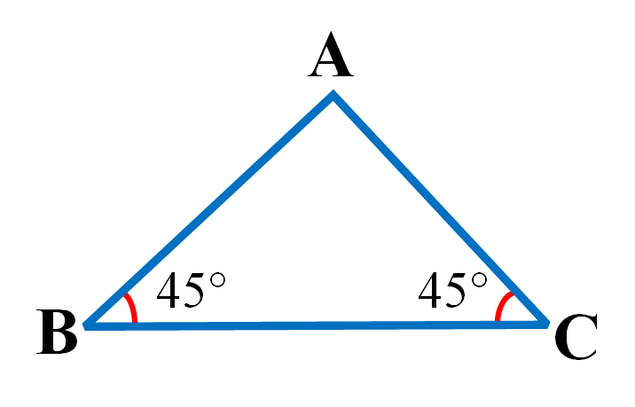

    premise: IsoscelesRightTriangle(ABC)
    conclusion: Equal(MeasureOfAngle(ABC),45)
                Equal(MeasureOfAngle(BCA),45)
**Notes**:  
1.等腰直角三角形性质：两直角边为45°  

### equilateral_triangle_judgment_isosceles_and_isosceles(ABC)

    

    premise: IsoscelesTriangle(ABC)&IsoscelesTriangle(BCA)
    conclusion: EquilateralTriangle(ABC)
**Notes**:  
1.等边三角形判定：两个等腰三角形  

### equilateral_triangle_property_angle(ABC)

    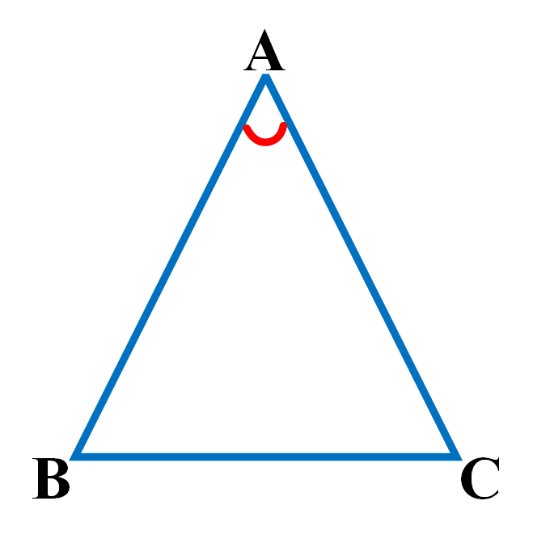

    premise: EquilateralTriangle(ABC)
    conclusion: Equal(MeasureOfAngle(CAB),60)
**Notes**:  
1.等边三角形性质：内角为60°  
2.内角指的是顶角，应用一次定理只得到一个角的角度  

### quadrilateral_property_angle_sum(ABCD)

    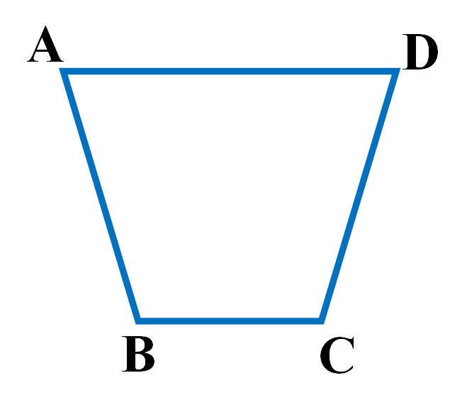

    premise: Polygon(ABCD)
    conclusion: Equal(Add(MeasureOfAngle(ABC),MeasureOfAngle(BCD),MeasureOfAngle(CDA),MeasureOfAngle(DAB)),360)
**Notes**:  
1.四边形性质：内角为360°  

### quadrilateral_perimeter_formula(ABCD)

    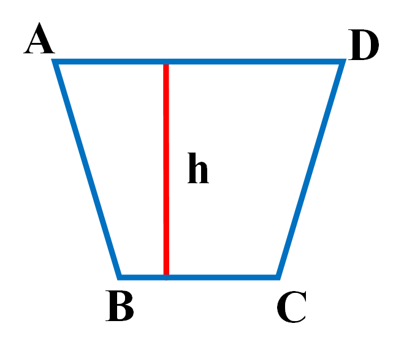

    premise: Polygon(ABCD)
    conclusion: Equal(Add(LengthOfLine(AB),LengthOfLine(BC),LengthOfLine(CD),LengthOfLine(DA)),PerimeterOfQuadrilateral(ABCD))
**Notes**:  
1.四边形周长公式  

### altitude_of_quadrilateral_judgment(EF,ABCD)

    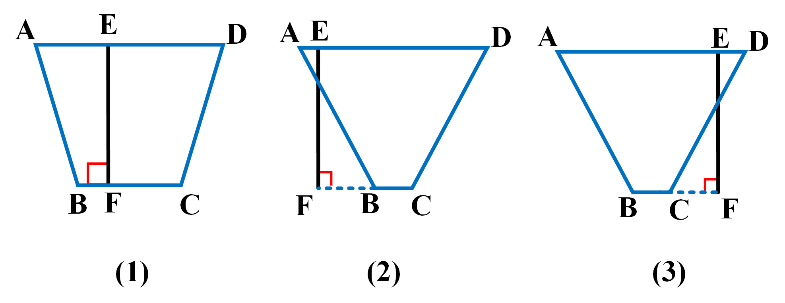

    # branch 1
    premise: (Parallelogram(ABCD)|Trapezoid(ABCD))&Line(EF)&Collinear(AED)&Collinear(BFC)&Equal(MeasureOfAngle(BFE),90)
    conclusion: IsAltitudeOfQuadrilateral(EF,ABCD)
    # branch 2
    premise: (Parallelogram(ABCD)|Trapezoid(ABCD))&Line(EF)&Collinear(AED)&Collinear(FBC)&Equal(MeasureOfAngle(EFB),90)
    conclusion: IsAltitudeOfQuadrilateral(EF,ABCD)
    # branch 3
    premise: (Parallelogram(ABCD)|Trapezoid(ABCD))&Line(EF)&Collinear(AED)&Collinear(BCF)&Equal(MeasureOfAngle(CFE),90)
    conclusion: IsAltitudeOfQuadrilateral(EF,ABCD)
**Notes**:  
1.平行四边形/梯形高的判定：垂直于底边  

### altitude_of_quadrilateral_judgment_left_vertex(AF,ABCD)

    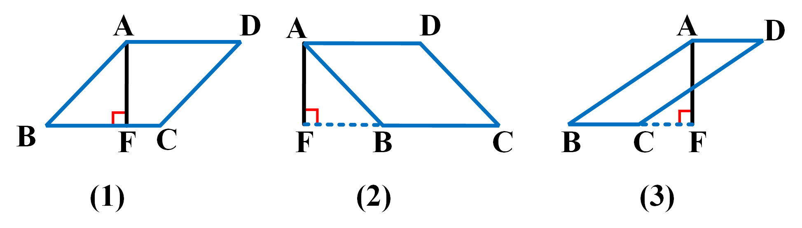

    # branch 1
    premise: (Parallelogram(ABCD)|Trapezoid(ABCD))&Line(AF)&Collinear(BFC)&Equal(MeasureOfAngle(BFA),90)
    conclusion: IsAltitudeOfQuadrilateral(AF,ABCD)
    # branch 2
    premise: (Parallelogram(ABCD)|Trapezoid(ABCD))&Line(AF)&Collinear(FBC)&Equal(MeasureOfAngle(AFB),90)
    conclusion: IsAltitudeOfQuadrilateral(AF,ABCD)
    # branch 3
    premise: (Parallelogram(ABCD)|Trapezoid(ABCD))&Line(AF)&Collinear(BCF)&Equal(MeasureOfAngle(CFA),90)
    conclusion: IsAltitudeOfQuadrilateral(AF,ABCD)
**Notes**:  
1.平行四边形/梯形高的判定：垂直于底边  

### altitude_of_quadrilateral_judgment_right_vertex(DF,ABCD)

    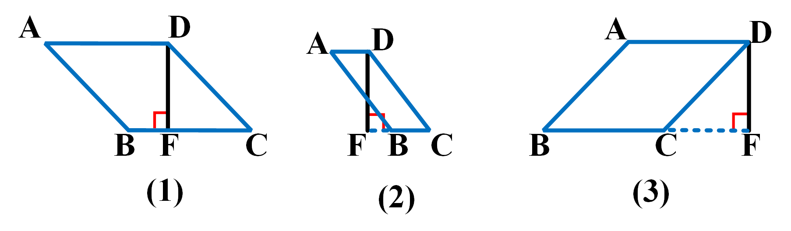

    # branch 1
    premise: (Parallelogram(ABCD)|Trapezoid(ABCD))&Line(DF)&Collinear(BFC)&Equal(MeasureOfAngle(BFD),90)
    conclusion: IsAltitudeOfQuadrilateral(DF,ABCD)
    # branch 2
    premise: (Parallelogram(ABCD)|Trapezoid(ABCD))&Line(DF)&Collinear(FBC)&Equal(MeasureOfAngle(DFB),90)
    conclusion: IsAltitudeOfQuadrilateral(DF,ABCD)
    # branch 3
    premise: (Parallelogram(ABCD)|Trapezoid(ABCD))&Line(DF)&Collinear(BCF)&Equal(MeasureOfAngle(CFD),90)
    conclusion: IsAltitudeOfQuadrilateral(DF,ABCD)
**Notes**:  
1.平行四边形/梯形高的判定：垂直于底边  

### altitude_of_quadrilateral_judgment_diagonal(ABCD)

    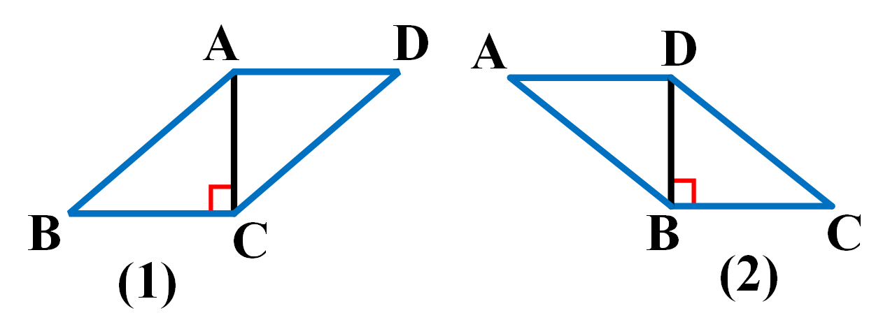

    # branch 1
    premise: (Parallelogram(ABCD)|Trapezoid(ABCD))&Line(AC)&Equal(MeasureOfAngle(BCA),90)
    conclusion: IsAltitudeOfQuadrilateral(AC,ABCD)
    # branch 2
    premise: (Parallelogram(ABCD)|Trapezoid(ABCD))&Line(DB)&Equal(MeasureOfAngle(DBC),90)
    conclusion: IsAltitudeOfQuadrilateral(DB,ABCD)
**Notes**:  
1.平行四边形/梯形高的判定：垂直于底边  

### midsegment_of_quadrilateral_judgment_midpoint(EF,ABCD)

    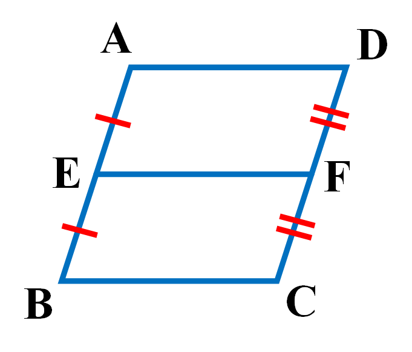

    premise: Collinear(AEB)&Collinear(DFC)&Line(EF)&Equal(LengthOfLine(AE),LengthOfLine(BE))&Equal(LengthOfLine(DF),LengthOfLine(CF))
    conclusion: IsMidsegmentOfQuadrilateral(EF,ABCD)
**Notes**:  
1.四边形中位线判定：两边中点的连线  

### midsegment_of_quadrilateral_judgment_parallel(EF,ABCD)

    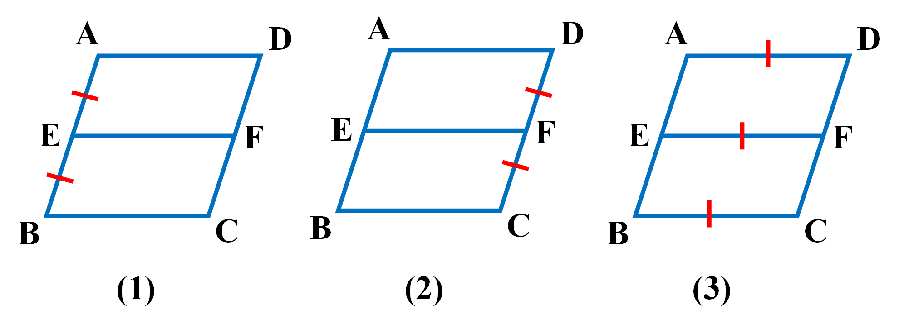

    # branch 1
    premise: Collinear(AEB)&Collinear(DFC)&Line(EF)&(Trapezoid(ABCD)|Parallelogram(ABCD))&ParallelBetweenLine(EF,BC)&Equal(LengthOfLine(AE),LengthOfLine(BE))
    conclusion: IsMidsegmentOfQuadrilateral(EF,ABCD)
    # branch 2
    premise: Collinear(AEB)&Collinear(DFC)&Line(EF)&(Trapezoid(ABCD)|Parallelogram(ABCD))&ParallelBetweenLine(EF,BC)&Equal(LengthOfLine(DF),LengthOfLine(CF))
    conclusion: IsMidsegmentOfQuadrilateral(EF,ABCD)
    # branch 3
    premise: Collinear(AEB)&Collinear(DFC)&Line(EF)&(Trapezoid(ABCD)|Parallelogram(ABCD))&ParallelBetweenLine(EF,BC)&Equal(Add(LengthOfLine(AD),LengthOfLine(BC)),Mul(LengthOfLine(EF),2))
    conclusion: IsMidsegmentOfQuadrilateral(EF,ABCD)
**Notes**:  
1.四边形中位线判定：是梯形或平行四边形、平行且某边成比例  

### midsegment_of_quadrilateral_property_length(EF,ABCD)

    

    premise: IsMidsegmentOfQuadrilateral(EF,ABCD)
    conclusion: Equal(Add(LengthOfLine(AD),LengthOfLine(BC)),Mul(LengthOfLine(EF),2))
**Notes**:  
1.四边形中位线性质：上底和下底的一半  

### midsegment_of_quadrilateral_property_parallel(EF,ABCD)

    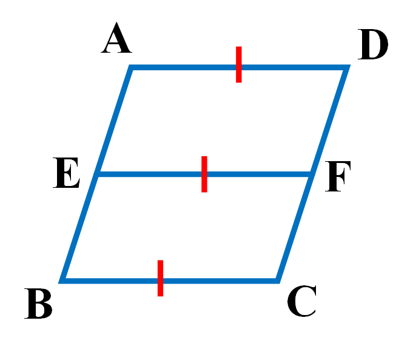

    premise: IsMidsegmentOfQuadrilateral(EF,ABCD)&(Trapezoid(ABCD)|Parallelogram(ABCD))
    conclusion: ParallelBetweenLine(AD,EF)
                ParallelBetweenLine(EF,BC)
**Notes**:  
1.四边形中位线性质：梯形、平行四边形的中位线平行于底边  

### circumcenter_of_quadrilateral_property_intersection(O,ABCD,E)

    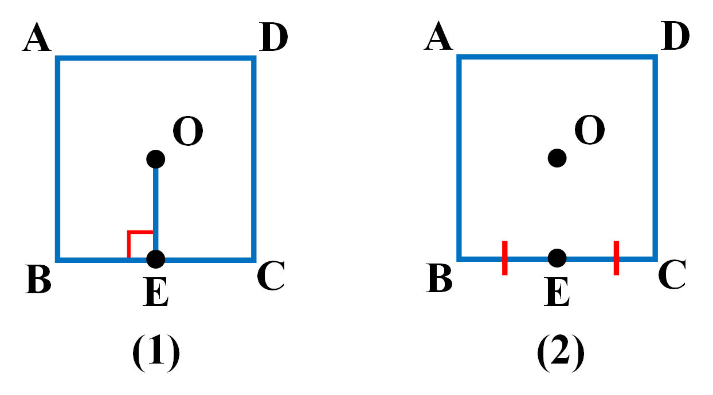

    # branch 1
    premise: IsCircumcenterOfQuadrilateral(O,ABCD)&Collinear(BEC)&Equal(MeasureOfAngle(DEO),90)
    conclusion: IsPerpendicularBisectorOfLine(OE,BC)
    # branch 2
    premise: IsCircumcenterOfQuadrilateral(O,ABCD)&Equal(LengthOfLine(BE),LengthOfLine(CE))
    conclusion: IsPerpendicularBisectorOfLine(OE,BC)
**Notes**:  
1.四边形外心性质：垂直平分线交点  

### congruent_quadrilateral_property_line_equal(ABCD,EFGH)

    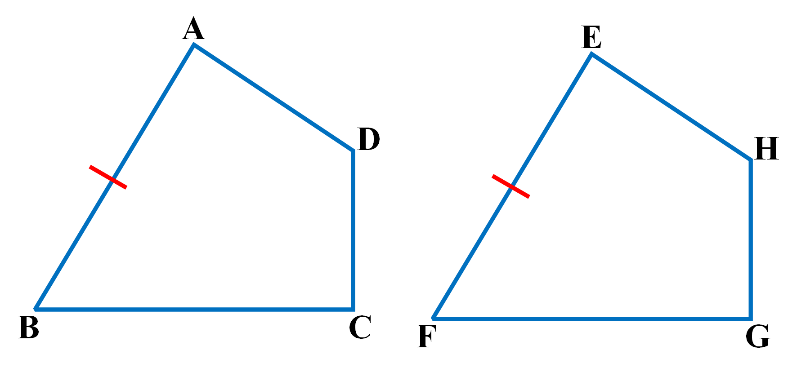

    premise: CongruentBetweenQuadrilateral(ABCD,EFGH)
    conclusion: Equal(LengthOfLine(AB),LengthOfLine(EF))
**Notes**:  
1.全等四边形性质：边相等  

### congruent_quadrilateral_property_angle_equal(ABCD,EFGH)

    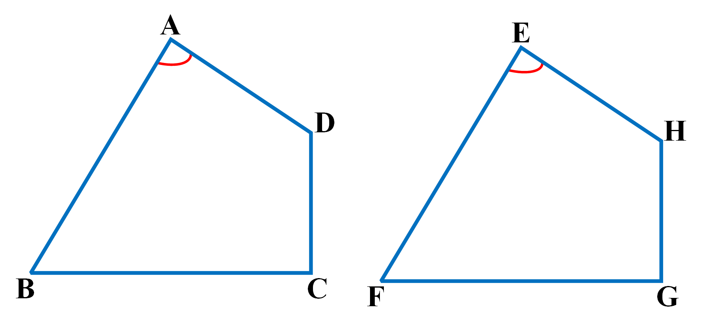

    premise: CongruentBetweenQuadrilateral(ABCD,EFGH)
    conclusion: Equal(MeasureOfAngle(DAB),MeasureOfAngle(HEF))
**Notes**:  
1.全等四边形性质：角相等  

### congruent_quadrilateral_property_perimeter_equal(ABCD,EFGH)

    

    premise: CongruentBetweenQuadrilateral(ABCD,EFGH)
    conclusion: Equal(PerimeterOfQuadrilateral(ABC),PerimeterOfQuadrilateral(DEF))
**Notes**:  
1.全等四边形性质：周长相等  

### congruent_quadrilateral_property_area_equal(ABCD,EFGH)

    

    premise: CongruentBetweenQuadrilateral(ABCD,EFGH)
    conclusion: Equal(AreaOfQuadrilateral(ABC),AreaOfQuadrilateral(DEF))
**Notes**:  
1.全等四边形性质：面积相等  

### congruent_quadrilateral_property_exchange(ABCD,EFGH)

    

    premise: CongruentBetweenQuadrilateral(ABCD,EFGH)
    conclusion: CongruentBetweenQuadrilateral(EFGH,ABCD)
**Notes**:  
1.全等四边形性质：先后顺序不影响三角形的全等  

### mirror_congruent_quadrilateral_property_line_equal(ABCD,EFGH)

    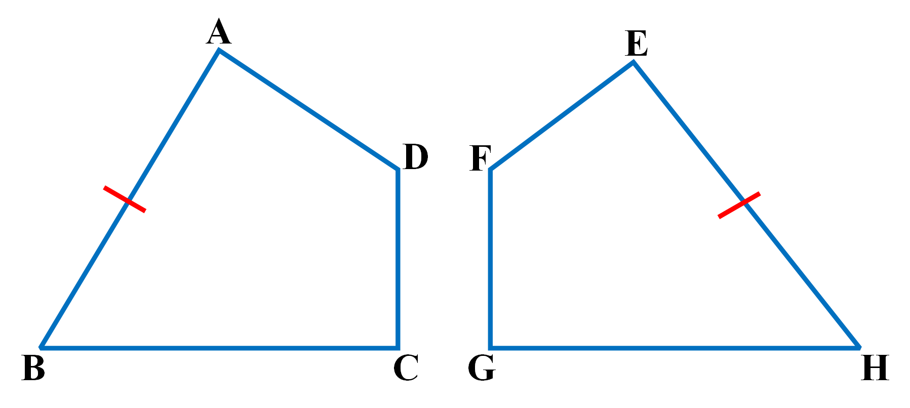

    premise: MirrorCongruentBetweenQuadrilateral(ABCD,EFGH)
    conclusion: Equal(LengthOfLine(AB),LengthOfLine(EH))
**Notes**:  
1.全等四边形性质：边相等  

### mirror_congruent_quadrilateral_property_angle_equal(ABCD,EFGH)

    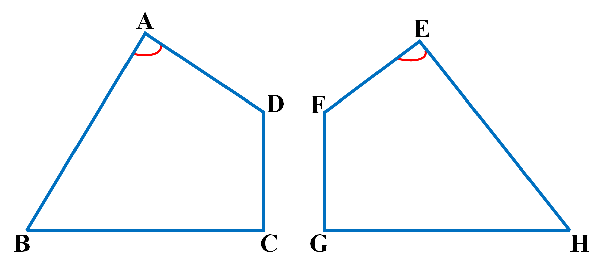

    premise: MirrorCongruentBetweenQuadrilateral(ABCD,EFGH)
    conclusion: Equal(MeasureOfAngle(DAB),MeasureOfAngle(HEF))
**Notes**:  
1.全等四边形性质：角相等  

### mirror_congruent_quadrilateral_property_perimeter_equal(ABCD,EFGH)

    

    premise: MirrorCongruentBetweenQuadrilateral(ABCD,EFGH)
    conclusion: Equal(PerimeterOfQuadrilateral(ABCD),PerimeterOfQuadrilateral(EFGH))
**Notes**:  
1.全等四边形性质：周长相等  

### mirror_congruent_quadrilateral_property_area_equal(ABCD,EFGH)

    

    premise: MirrorCongruentBetweenQuadrilateral(ABCD,EFGH)
    conclusion: Equal(AreaOfQuadrilateral(ABCD),AreaOfQuadrilateral(EFGH))
**Notes**:  
1.全等四边形性质：面积相等  

### mirror_congruent_quadrilateral_property_exchange(ABCD,EFGHF)

    

    premise: MirrorCongruentBetweenQuadrilateral(ABCD,EFGH)
    conclusion: MirrorCongruentBetweenQuadrilateral(EFGH,ABCD)
**Notes**:  
1.镜像全等四边形性质：先后顺序不影响四边形的镜像全等  

### similar_quadrilateral_property_ratio(ABCD,EFGH)

    

    premise: SimilarBetweenQuadrilateral(ABCD,EFGH)
    conclusion: SimilarBetweenQuadrilateral(EFGH,ABCD)
                Equal(Mul(RatioOfSimilarQuadrilateral(ABCD,EFGH),RatioOfSimilarQuadrilateral(EFGH,ABCD)),1)
**Notes**:  
1.相似四边形的比值  

### similar_quadrilateral_property_line_ratio(ABCD,EFGH)

    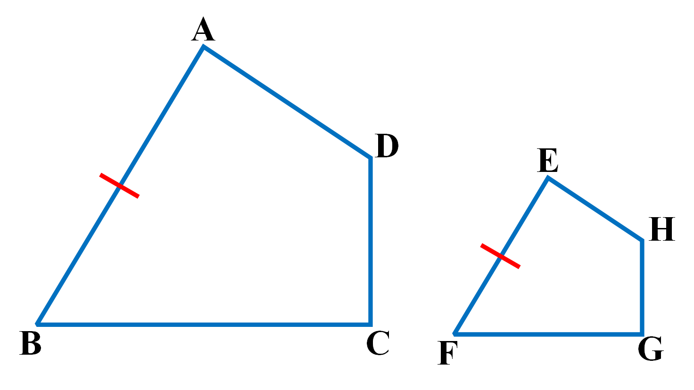

    premise: SimilarBetweenQuadrilateral(ABCD,EFGH)
    conclusion: Equal(LengthOfLine(AB),Mul(LengthOfLine(EF),RatioOfSimilarQuadrilateral(ABCD,EFGH)))
**Notes**:  
1.相似四边形性质：边成比例  

### similar_quadrilateral_property_angle_equal(ABCD,EFGH)

    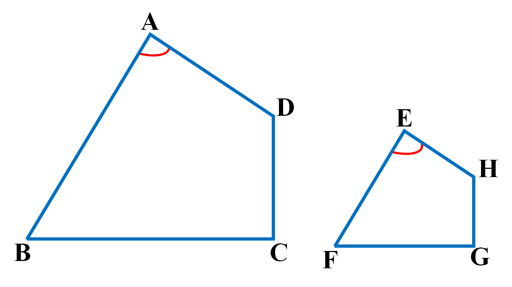

    premise: SimilarBetweenQuadrilateral(ABCD,EFGH)
    conclusion: Equal(MeasureOfAngle(DAB),MeasureOfAngle(HEF))
**Notes**:  
1.相似四边形性质：角相等  

### similar_quadrilateral_property_perimeter_ratio(ABCD,EFGH)

    

    premise: SimilarBetweenQuadrilateral(ABCD,EFGH)
    conclusion: Equal(PerimeterOfQuadrilateral(ABCD),Mul(PerimeterOfQuadrilateral(EFGH),RatioOfSimilarQuadrilateral(ABCD,EFGH)))
**Notes**:  
1.相似四边形性质：周长成比例  

### similar_quadrilateral_property_area_square_ratio(ABCD,EFGH)

    

    premise: SimilarBetweenQuadrilateral(ABCD,EFGH)
    conclusion: Equal(AreaOfQuadrilateral(ABCD),Mul(AreaOfQuadrilateral(EFGH),RatioOfSimilarQuadrilateral(ABCD,EFGH),RatioOfSimilarQuadrilateral(ABCD,EFGH)))
**Notes**:  
1.相似四边形性质：面积成比例  

### mirror_similar_quadrilateral_property_ratio(ABCD,EFGH)

    

    premise: MirrorSimilarBetweenQuadrilateral(ABCD,EFGH)
    conclusion: MirrorSimilarBetweenQuadrilateral(EFGH,ABCD)
                Equal(Mul(RatioOfMirrorSimilarQuadrilateral(ABCD,EFGH),RatioOfMirrorSimilarQuadrilateral(EFGH,ABCD)),1)
**Notes**:  
1.镜像相似四边形的比值  

### mirror_similar_quadrilateral_property_line_ratio(ABCD,EFGH)

    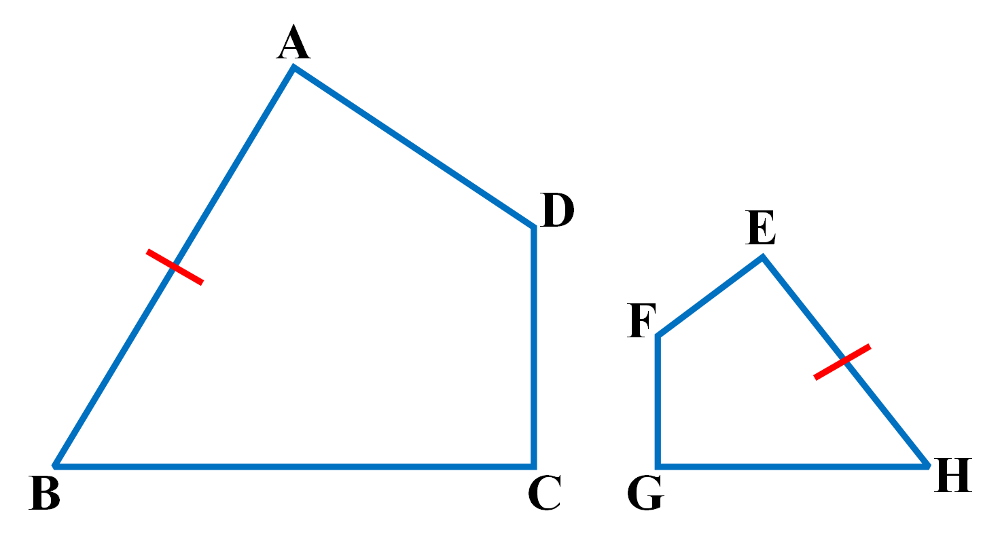

    premise: MirrorSimilarBetweenQuadrilateral(ABCD,EFGH)
    conclusion: Equal(LengthOfLine(AB),Mul(LengthOfLine(EH),RatioOfMirrorSimilarQuadrilateral(ABCD,EFGH)))
**Notes**:  
1.相似四边形性质：边成比例  

### mirror_similar_quadrilateral_property_angle_equal(ABCD,EFGH)

    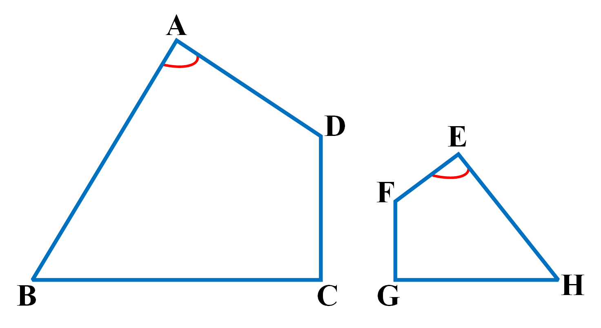

    premise: MirrorSimilarBetweenQuadrilateral(ABCD,EFGH)
    conclusion: Equal(MeasureOfAngle(DAB),MeasureOfAngle(HEF))
**Notes**:  
1.相似四边形性质：角相等  

### mirror_similar_quadrilateral_property_perimeter_ratio(ABCD,EFGH)

    

    premise: MirrorSimilarBetweenQuadrilateral(ABCD,EFGH)
    conclusion: Equal(PerimeterOfQuadrilateral(ABCD),Mul(PerimeterOfQuadrilateral(EFGH),RatioOfMirrorSimilarQuadrilateral(ABCD,EFGH)))
**Notes**:  
1.相似四边形性质：周长成比例  

### mirror_similar_quadrilateral_property_area_square_ratio(ABCD,EFGH)

    

    premise: MirrorSimilarBetweenQuadrilateral(ABCD,EFGH)
    conclusion: Equal(AreaOfQuadrilateral(ABCD),Mul(AreaOfQuadrilateral(EFGH),RatioOfMirrorSimilarQuadrilateral(ABCD,EFGH),RatioOfMirrorSimilarQuadrilateral(ABCD,EFGH)))
**Notes**:  
1.相似四边形性质：面积成比例  

### parallelogram_judgment_parallel_and_parallel(ABCD)

    

    premise: Polygon(ABCD)&ParallelBetweenLine(AD,BC)&ParallelBetweenLine(BA,CD)
    conclusion: Parallelogram(ABCD)
**Notes**:  
1.平行四边形判定：两组对边分别平行  

### parallelogram_judgment_parallel_and_equal(ABCD)

    

    premise: Polygon(ABCD)&ParallelBetweenLine(BA,CD)&Equal(LengthOfLine(BA),LengthOfLine(CD))
    conclusion: Parallelogram(ABCD)
**Notes**:  
1.平行四边形判定：一组对边平行且相等  

### parallelogram_judgment_equal_and_equal(ABCD)

    

    premise: Polygon(ABCD)&Equal(LengthOfLine(AD),LengthOfLine(BC))&Equal(LengthOfLine(BA),LengthOfLine(CD))
    conclusion: Parallelogram(ABCD)
**Notes**:  
1.平行四边形判定：两组对边分别相等  

### parallelogram_judgment_angle_and_angle(ABCD)

    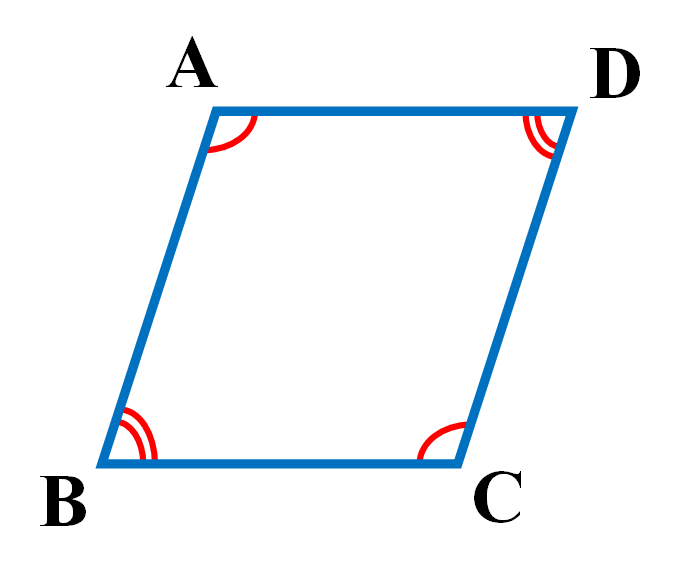

    premise: Polygon(ABCD)&Equal(MeasureOfAngle(DAB),MeasureOfAngle(BCD))&Equal(MeasureOfAngle(ABC),MeasureOfAngle(CDA))
    conclusion: Parallelogram(ABCD)
**Notes**:  
1.平行四边形判定：两组对角分别相等  

### parallelogram_judgment_diagonal_bisection(ABCD,O)

    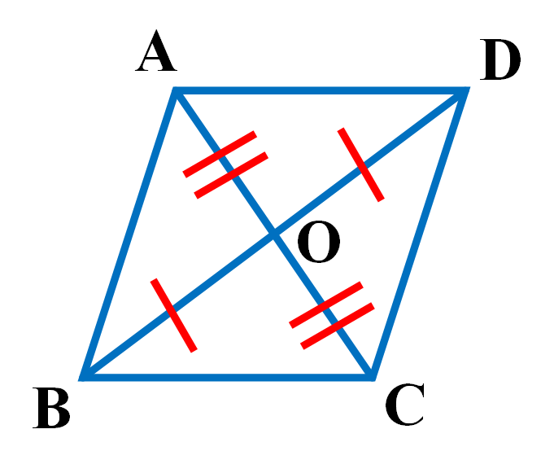

    premise: Polygon(ABCD)&Collinear(AOC)&Collinear(BOD)&IsMidpointOfLine(O,AC)&IsMidpointOfLine(O,BD)
    conclusion: Parallelogram(ABCD)
**Notes**:  
1.平行四边形判定：对角线相互平分  

### parallelogram_property_opposite_line_equal(ABCD)

    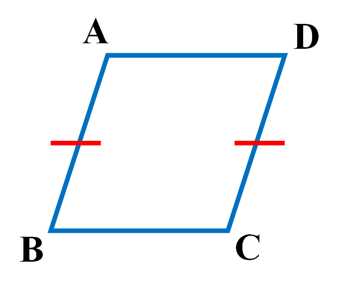

    premise: Parallelogram(ABCD)
    conclusion: Equal(LengthOfLine(BA),LengthOfLine(CD))
**Notes**:  
1.平行四边形性质：对边相等  

### parallelogram_property_opposite_angle_equal(ABCD)

    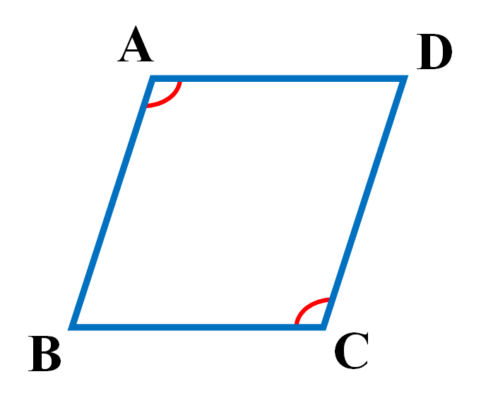

    premise: Parallelogram(ABCD)
    conclusion: Equal(MeasureOfAngle(DAB),MeasureOfAngle(BCD))
**Notes**:  
1.平行四边形性质：对角相等  

### parallelogram_property_diagonal_bisection(ABCD,O)

    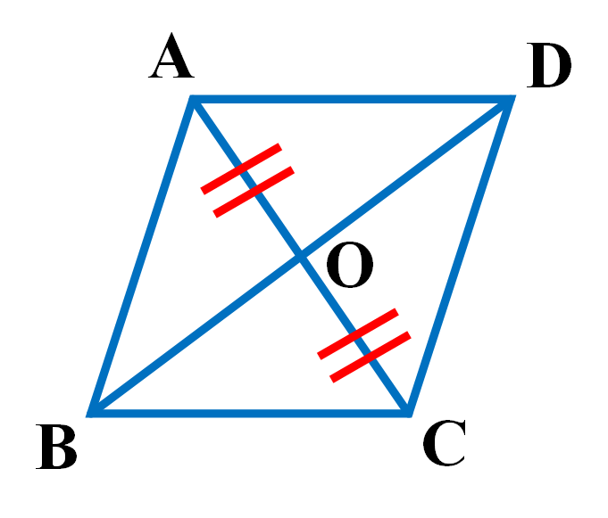

    premise: Parallelogram(ABCD)&Collinear(AOC)&Collinear(BOD)
    conclusion: IsMidpointOfLine(O,AC)
**Notes**:  
1.平行四边形性质：对角线相互平分  

### parallelogram_area_formula_common(ABCD)

    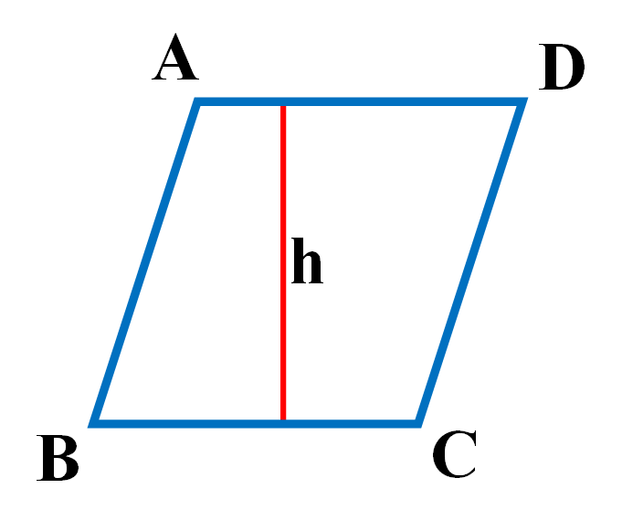

    premise: Parallelogram(ABCD)
    conclusion: Equal(AreaOfQuadrilateral(ABCD),Mul(HeightOfQuadrilateral(ABCD),LengthOfLine(BC)))
**Notes**:  
1.平行四边形的面积公式：S=底*高  
1.高是底边BC的高  

### parallelogram_area_formula_sine(ABCD)

    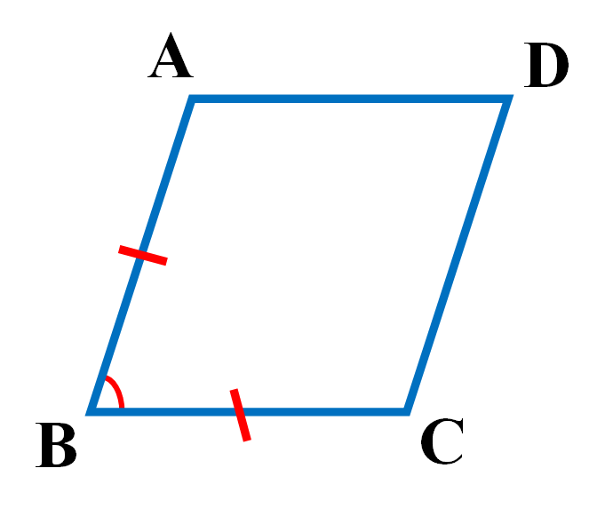

    premise: Parallelogram(ABCD)
    conclusion: Equal(AreaOfQuadrilateral(ABCD),Mul(LengthOfLine(AB),LengthOfLine(BC),Sin(MeasureOfAngle(ABC))))
**Notes**:  
1.平行四边形面积公式：S=AB*BC*sinB  

### kite_judgment_equal_and_equal(ABCD)

    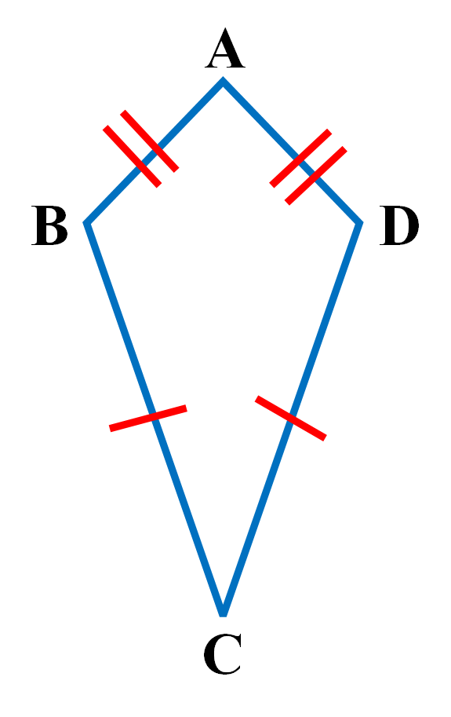

    premise: Polygon(ABCD)&Equal(LengthOfLine(AB),LengthOfLine(AD))&Equal(LengthOfLine(CB),LengthOfLine(CD))
    conclusion: Kite(ABCD)
**Notes**:  
1.筝形判定：两组临边分别相等  

### kite_property_diagonal_perpendicular_bisection(ABCD,O)

    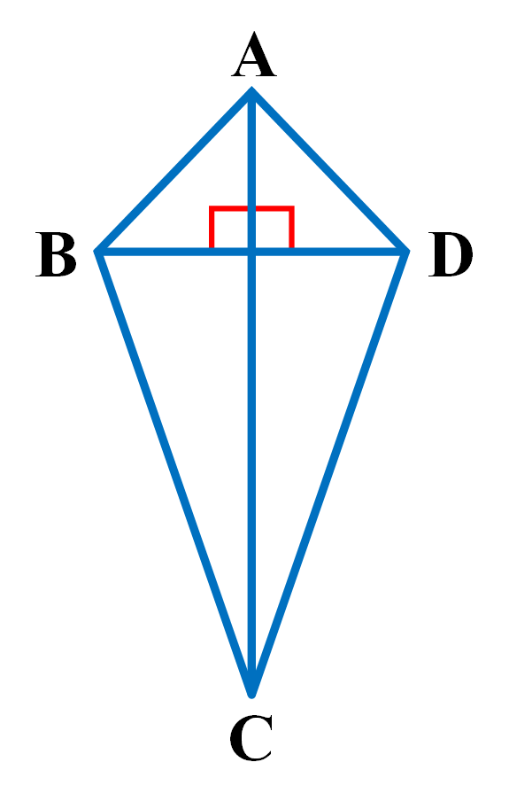

    premise: Kite(ABCD)&Collinear(AOC)&Collinear(BOD)
    conclusion: IsPerpendicularBisectorOfLine(AO,BD)
**Notes**:  
1.筝形性质：一个对角线是另一个的垂直平分线  

### kite_property_opposite_angle_equal(ABCD)

    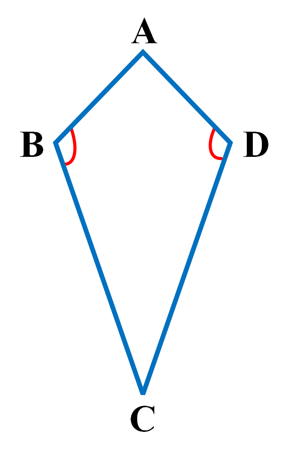

    premise: Kite(ABCD)
    conclusion: Equal(MeasureOfAngle(ABC),MeasureOfAngle(CDA))
**Notes**:  
1.筝形性质：一组对角(等角)相等  

### kite_area_formula_diagonal(ABCD)

    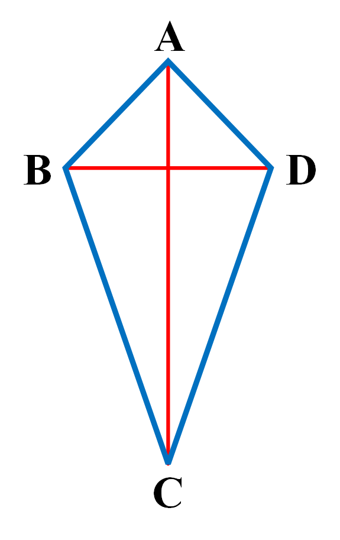

    premise: Kite(ABCD)&Line(BD)&Line(AC)
    conclusion: Equal(AreaOfQuadrilateral(ABCD),Mul(LengthOfLine(BD),LengthOfLine(AC),1/2))
**Notes**:  
1.筝形面积公式：S=m*l /2  

### kite_area_formula_sine(ABCD)

    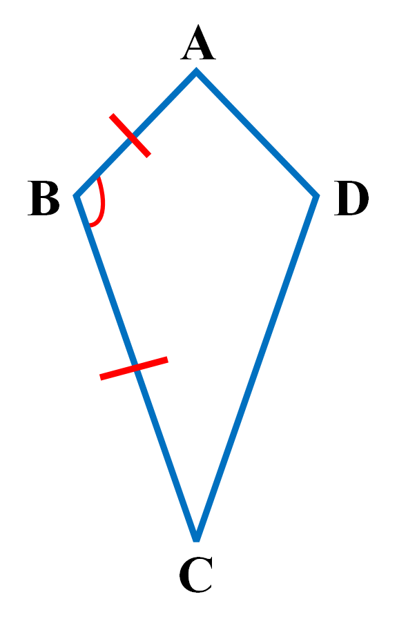

    premise: Kite(ABCD)
    conclusion: Equal(AreaOfQuadrilateral(ABCD),Mul(LengthOfLine(AB),LengthOfLine(BC),Sin(MeasureOfAngle(ABC))))
**Notes**:  
1.筝形面积公式：S=AB*BC*sinB  

### rectangle_judgment_right_angle(ABCD)

    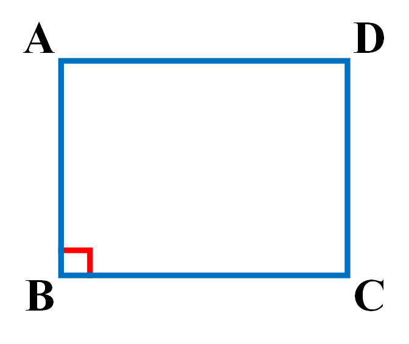

    premise: Parallelogram(ABCD)&Equal(MeasureOfAngle(ABC),90)
    conclusion: Rectangle(ABCD)
**Notes**:  
1.矩形判定：有一个角是直角的平行四边形  

### rectangle_judgment_diagonal_equal(ABCD)

    

    premise: Parallelogram(ABCD)&Line(AC)&Line(BD)&Equal(LengthOfLine(AC),LengthOfLine(BD))
    conclusion: Rectangle(ABCD)
**Notes**:  
1.矩形判定：对角线相等的平行四边形  

### rectangle_property_diagonal_equal(ABCD)

    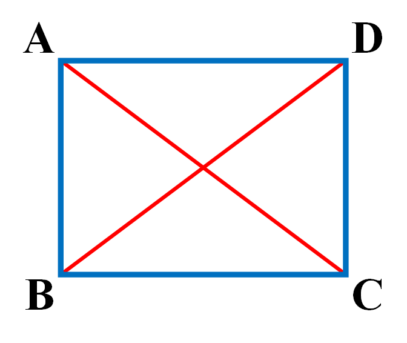

    premise: Rectangle(ABCD)&Line(AC)&Line(BD)
    conclusion: Equal(LengthOfLine(AC),LengthOfLine(BD))
**Notes**:  
1.矩形性质：对角线相等  

### rhombus_judgment_parallelogram_and_kite(ABCD)

    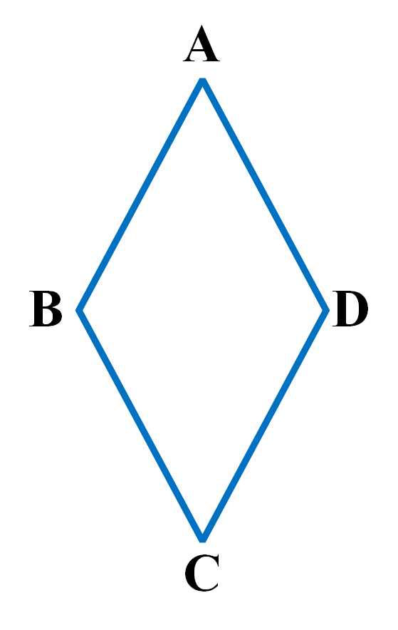

    premise: Parallelogram(ABCD)&Kite(ABCD)
    conclusion: Rhombus(ABCD)
**Notes**:  
1.菱形判定：既是平行四边形又是筝形  

### square_judgment_rhombus_and_rectangle(ABCD)

    

    premise: Rhombus(ABCD)&Rectangle(ABCD)
    conclusion: Square(ABCD)
**Notes**:  
1.正方形判定：既是菱形也是矩形  

### trapezoid_judgment_parallel(ABCD)

    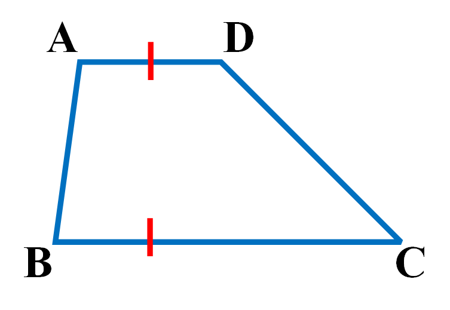

    premise: Polygon(ABCD)&ParallelBetweenLine(AD,BC)&~ParallelBetweenLine(BA,CD)
    conclusion: Trapezoid(ABCD)
**Notes**:  
1.梯形判定：两边平行的四边形  

### trapezoid_area_formula(ABCD)

    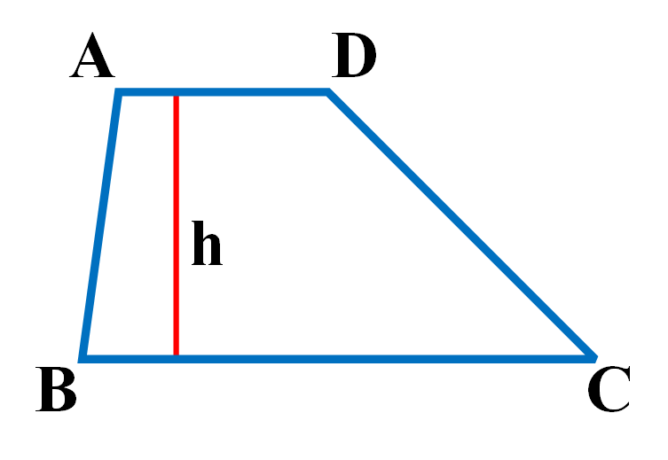

    premise: Trapezoid(ABCD)
    conclusion: Equal(AreaOfQuadrilateral(ABCD),Mul(Add(LengthOfLine(AD),LengthOfLine(BC)),HeightOfQuadrilateral(ABCD),1/2))
**Notes**:  
1.梯形的面积公式：S=(上底+下底)*高/2  

### right_trapezoid_judgment_right_angle(ABCD)

    

    premise: Trapezoid(ABCD)&Equal(MeasureOfAngle(ABC),90)
    conclusion: RightTrapezoid(ABCD)
**Notes**:  
1.直角梯形的判定：有一侧是直角的梯形  

### right_trapezoid_area_formular(ABCD)

    

    premise: RightTrapezoid(ABCD)
    conclusion: Equal(AreaOfQuadrilateral(ABCD),Mul(Add(LengthOfLine(AD),LengthOfLine(BC)),LengthOfLine(AB),1/2))
**Notes**:  
1.直角梯形面积公式：S=(AD+BC)*AB/2  

### isosceles_trapezoid_judgment_line_equal(ABCD)

    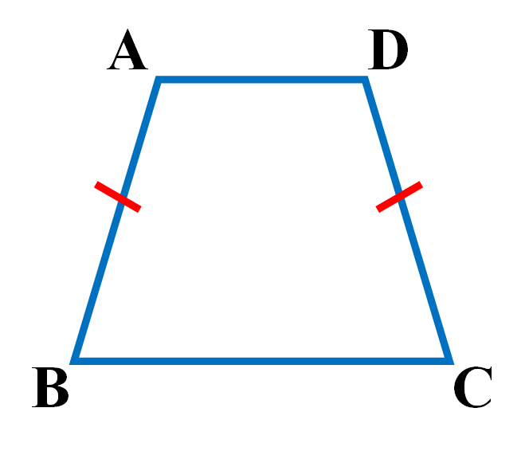

    premise: Trapezoid(ABCD)&Equal(LengthOfLine(AB),LengthOfLine(CD))
    conclusion: IsoscelesTrapezoid(ABCD)
**Notes**:  
1.等腰梯形的判定：腰相等的梯形  

### isosceles_trapezoid_judgment_angle_equal(ABCD)

    

    premise: Trapezoid(ABCD)&Equal(MeasureOfAngle(ABC),MeasureOfAngle(BCD))
    conclusion: IsoscelesTrapezoid(ABCD)
**Notes**:  
1.等腰梯形的判定：底角相等的梯形  

### isosceles_trapezoid_judgment_diagonal_equal(ABCD)

    

    premise: Trapezoid(ABCD)&Line(AC)&Line(BD)&Equal(LengthOfLine(AC),LengthOfLine(BD))
    conclusion: IsoscelesTrapezoid(ABCD)
**Notes**:  
1.等腰梯形的判定：对角线相等的梯形  

### isosceles_trapezoid_property_angle_equal(ABCD)

    

    premise: IsoscelesTrapezoid(ABCD)
    conclusion: Equal(MeasureOfAngle(ABC),MeasureOfAngle(BCD))
**Notes**:  
1.等腰梯形的性质：底角相等  

### isosceles_trapezoid_property_diagonal_equal(ABCD)

    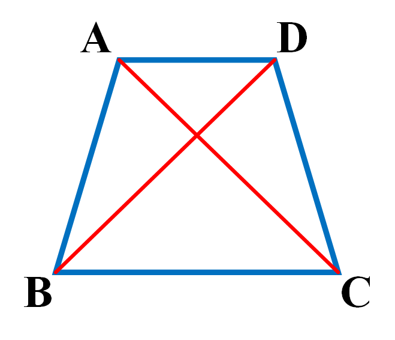

    premise: IsoscelesTrapezoid(ABCD)
    conclusion: Equal(LengthOfLine(AC),LengthOfLine(BD))
**Notes**:  
1.等腰梯形的性质：对角线相等  

### round_arc(OAB,OBA)

    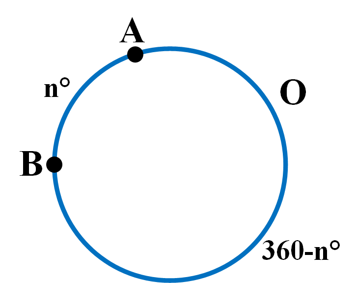

    premise: Arc(OAB)&Arc(OBA)
    conclusion: Equal(Add(MeasureOfArc(OAB),MeasureOfArc(OBA)),360)
**Notes**:  
1.常识：一整个圆弧为360°  

### arc_addition_length(OAB,OBC)

    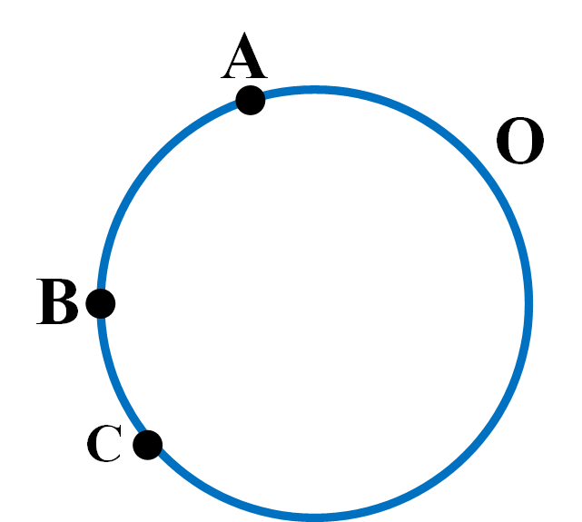

    premise: Arc(OAB)&Arc(OBC)&Arc(OAC)
    conclusion: Equal(LengthOfArc(OAC),Add(LengthOfArc(OAB),LengthOfArc(OBC)))
**Notes**:  
1.常识：临弧弧长相加  

### arc_addition_measure(OAB,OBC)

    

    premise: Arc(OAB)&Arc(OBC)&Arc(OAC)
    conclusion: Equal(MeasureOfArc(OAC),Add(MeasureOfArc(OAB),MeasureOfArc(OBC)))
**Notes**:  
1.常识：临弧角度相加  

### arc_property_center_angle(OAB,P)

    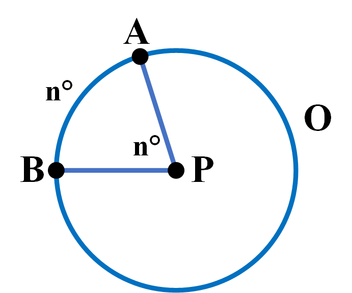

    premise: Arc(OAB)&Angle(BPA)&IsCentreOfCircle(P,O)
    conclusion: Equal(MeasureOfArc(OAB),MeasureOfAngle(BPA))
**Notes**:  
1.常识：弧所对的角度等于弧所对圆心角角度  

### arc_property_circumference_angle_external(OAB,C)

    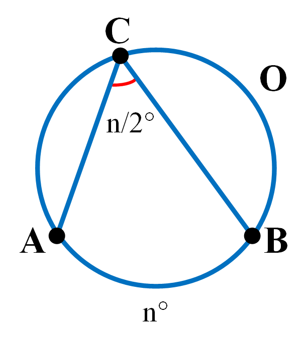

    premise: Cocircular(O,ABC)&Angle(BCA)
    conclusion: Equal(MeasureOfAngle(BCA),Mul(MeasureOfArc(OAB),1/2))
**Notes**:  
1.同弧所对的圆周角等于圆心角的一半  

### arc_property_circumference_angle_internal(OAB,D)

    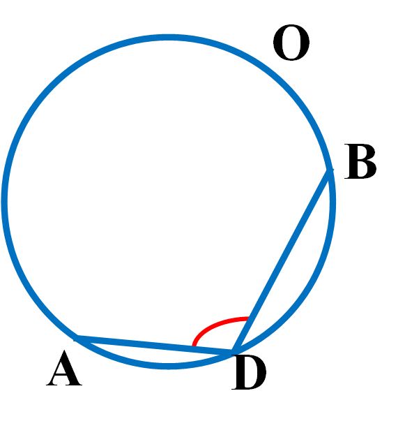

    premise: Cocircular(O,ADB)&Angle(ADB)
    conclusion: Equal(MeasureOfAngle(ADB),Sub(180,Mul(MeasureOfArc(OAB),1/2)))
**Notes**:  
1.由圆内接四边形对角互补得此定理  

### arc_length_formula(OAB)

    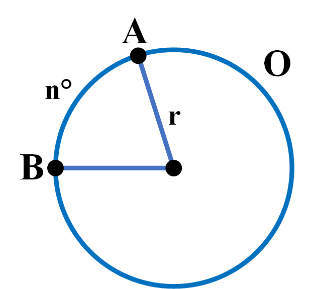

    premise: Arc(OAB)
    conclusion: Equal(LengthOfArc(OAB),Mul(MeasureOfArc(OAB),1/180*π,RadiusOfCircle(O)))
**Notes**:  
1.弧长公式：L=n/180*pi*r  

### congruent_arc_judgment_length_equal(XAB,YCD)

    

    premise: Arc(XAB)&Arc(YCD)&Cocircular(X,CD)&Equal(LengthOfArc(XAB),LengthOfArc(YCD))
    conclusion: CongruentBetweenArc(XAB,YCD)
**Notes**:  
1.全等弧判定：同圆且长度相等  

### congruent_arc_judgment_measure_equal(XAB,YCD)

    

    premise: Arc(XAB)&Arc(YCD)&Cocircular(X,CD)&Equal(MeasureOfArc(XAB),MeasureOfArc(YCD))
    conclusion: CongruentBetweenArc(XAB,YCD)
**Notes**:  
1.全等弧判定：同圆且所对圆心角相等  

### congruent_arc_judgment_chord_equal(XAB,YCD)

    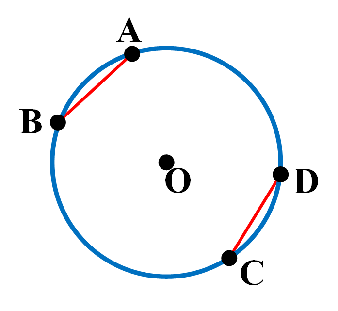

    premise: Arc(XAB)&Arc(YCD)&Cocircular(X,CD)&Line(AB)&Line(CD)&Equal(LengthOfLine(AB),LengthOfLine(CD))
    conclusion: CongruentBetweenArc(XAB,YCD)
**Notes**:  
1.全等弧判定：同圆且所对弦长度相等  

### congruent_arc_property_length_equal(XAB,YCD)

    

    premise: CongruentBetweenArc(XAB,YCD)
    conclusion: Equal(LengthOfArc(XAB),LengthOfArc(YCD))
**Notes**:  
1.全等弧性质：长度相等  

### congruent_arc_property_measure_equal(XAB,YCD)

    

    premise: CongruentBetweenArc(XAB,YCD)
    conclusion: Equal(MeasureOfArc(XAB),MeasureOfArc(YCD))
**Notes**:  
1.全等弧性质：所对圆心角相等  

### congruent_arc_property_chord_equal(XAB,YCD)

    

    premise: CongruentBetweenArc(XAB,YCD)&Line(AB)&Line(CD)
    conclusion: Equal(LengthOfLine(AB),LengthOfLine(CD))
**Notes**:  
1.全等弧性质：所对弦长度相等  

### similar_arc_judgment_cocircular(XAB,YCD)

    

    premise: Arc(XAB)&Arc(YCD)&Cocircular(X,CD)
    conclusion: SimilarBetweenArc(XAB,YCD)
**Notes**:  
1.相似弧判定：同圆  

### similar_arc_property_ratio(XAB,YCD)

    

    premise: SimilarBetweenArc(XAB,YCD)&SimilarBetweenArc(YCD,XAB)
    conclusion: Equal(Mul(RatioOfSimilarArc(XAB,YCD),RatioOfSimilarArc(YCD,XAB)),1)
**Notes**:  
1.相似弧性质：成比例  

### similar_arc_property_length_ratio(XAB,YCD)

    

    premise: SimilarBetweenArc(XAB,YCD)
    conclusion: Equal(LengthOfArc(XAB),Mul(LengthOfArc(YCD),RatioOfSimilarArc(YCD,XAB)))
**Notes**:  
1.相似弧性质：长度成比例  

### similar_arc_property_measure_ratio(XAB,YCD)

    

    premise: SimilarBetweenArc(XAB,YCD)
    conclusion: Equal(MeasureOfArc(XAB),Mul(MeasureOfArc(YCD),RatioOfSimilarArc(YCD,XAB)))
**Notes**:  
1.相似弧性质：角度成比例  

### similar_arc_property_chord_ratio(XAB,YCD)

    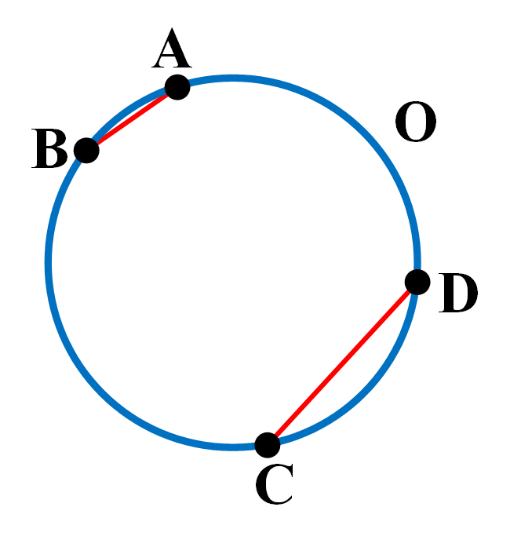

    premise: SimilarBetweenArc(XAB,YCD)&Line(AB)&Line(CD)
    conclusion: Equal(LengthOfLine(AB),Mul(LengthOfLine(CD),RatioOfSimilarArc(YCD,XAB)))
**Notes**:  
1.相似弧性质：所对弦长成比例  

### circle_property_length_of_radius_and_diameter(O)

    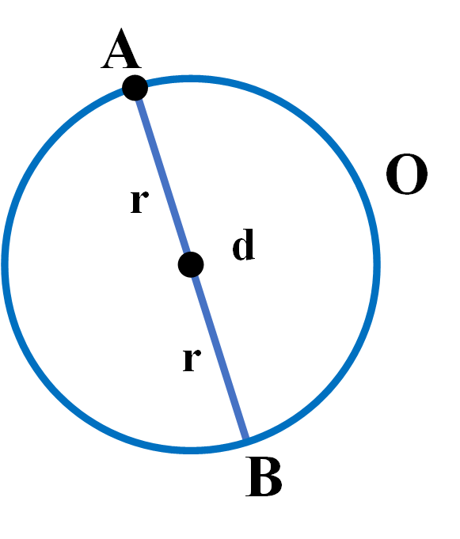

    premise: Circle(O)
    conclusion: Equal(DiameterOfCircle(O),Mul(RadiusOfCircle(O),2))
**Notes**:  
1.常识：圆的直径是半径的两倍  

### circle_property_circular_power_chord_and_chord(AEB,CED,O)

    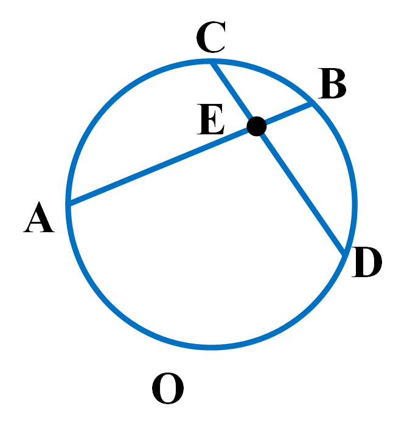

    premise: Cocircular(O,AB)&Cocircular(O,CD)&Collinear(AEB)&Collinear(CED)
    conclusion: Equal(Mul(LengthOfLine(EC),LengthOfLine(ED)),Mul(LengthOfLine(EA),LengthOfLine(EB)))
**Notes**:  
1.圆幂定理之相交弦定理：圆O的两个弦AB和CD交与点E，则EA*EB=EC*ED  

### circle_property_circular_power_tangent_and_segment_line(PA,PCD,O)

    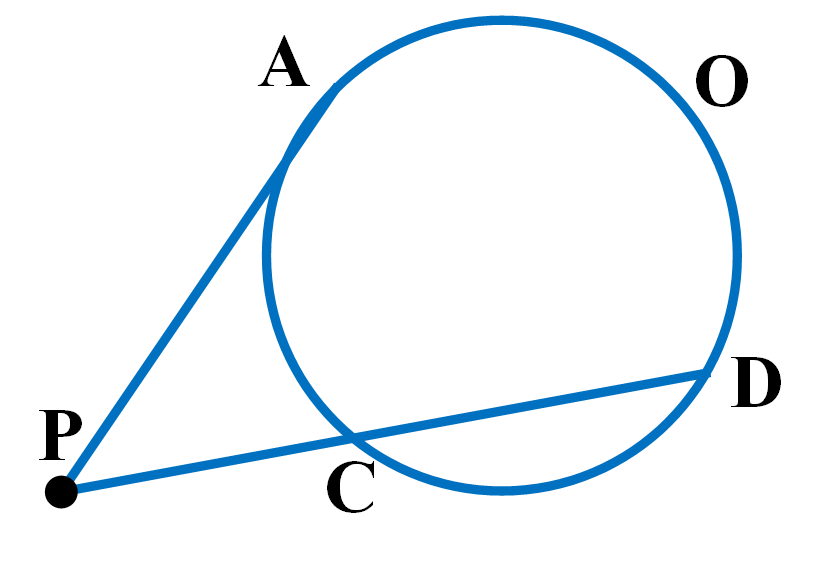

    premise: IsTangentOfCircle(PA,O)&Cocircular(O,CD)&Collinear(PCD)
    conclusion: Equal(Mul(LengthOfLine(PA),LengthOfLine(PA)),Mul(LengthOfLine(PC),LengthOfLine(PD)))
**Notes**:  
1.圆幂定理之切割线定理：P引直线PAB切圆O于A，引割线PCD交圆O于CD，则PA*PA=PC*PD  

### circle_property_circular_power_segment_and_segment_line(PAB,PCD,O)

    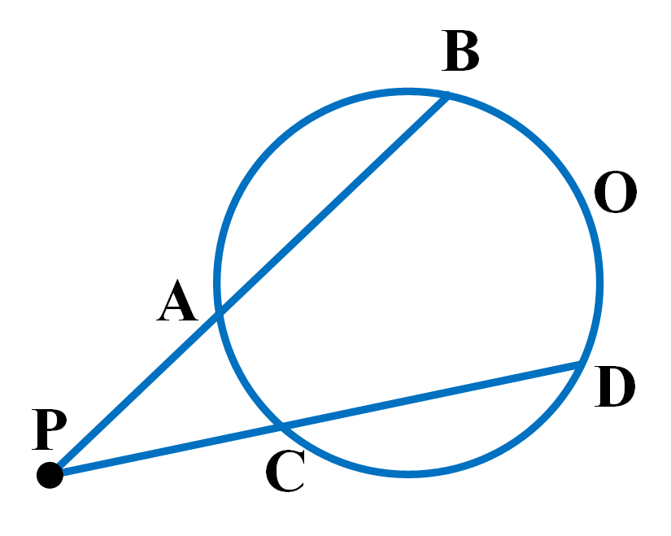

    premise: Cocircular(O,AB)&Cocircular(O,CD)&Collinear(PAB)&Collinear(PCD)
    conclusion: Equal(Mul(LengthOfLine(PA),LengthOfLine(PB)),Mul(LengthOfLine(PC),LengthOfLine(PD)))
**Notes**:  
1.圆幂定理之割线定理：园外P引割线PAB切圆O于AB，引割线PCD交圆O于CD，则PA*PB=PC*PD  

### circle_property_circular_power_tangent_and_segment_angle(PA,PCD,O)

    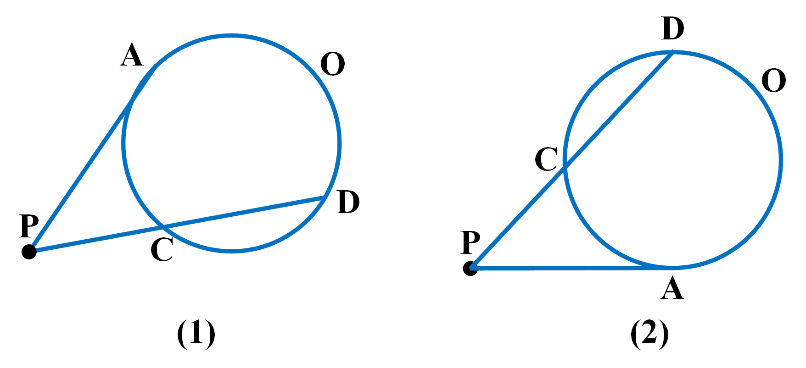

    # branch 1
    premise: Cocircular(O,ACD)&Collinear(PCD)
    conclusion: Equal(Sub(MeasureOfArc(ODA),MeasureOfArc(OAC)),Mul(MeasureOfAngle(APC),2))
    # branch 2
    premise: Cocircular(O,CAD)&Collinear(PCD)
    conclusion: Equal(Sub(MeasureOfArc(OAD),MeasureOfArc(OCA)),Mul(MeasureOfAngle(CPA),2))
**Notes**:  
1.圆幂定理之割线角度关系：P引切线PA切圆O于A，引割线PCD交圆O于CD，则两端弧所对圆心角之差等于2倍角P  

### circle_property_circular_power_segment_and_segment_angle(PAB,PCD,O)

    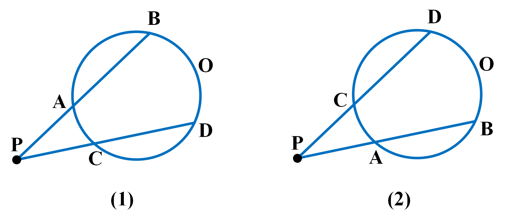

    # branch 1
    premise: Cocircular(O,ACDB)&Collinear(PAB)&Collinear(PCD)
    conclusion: Equal(Sub(MeasureOfArc(ODB),MeasureOfArc(OAC)),Mul(MeasureOfAngle(APC),2))
    # branch 2
    premise: Cocircular(O,CABD)&Collinear(PAB)&Collinear(PCD)
    conclusion: Equal(Sub(MeasureOfArc(OBD),MeasureOfArc(OCA)),Mul(MeasureOfAngle(CPA),2))
**Notes**:  
1.圆幂定理之割线角度关系：P引割线PAB切圆O于AB，引割线PCD交圆O于CD，则两端弧所对圆心角之差等于2倍角P  

### circle_property_chord_perpendicular_bisect_chord(O,PM,AB)

    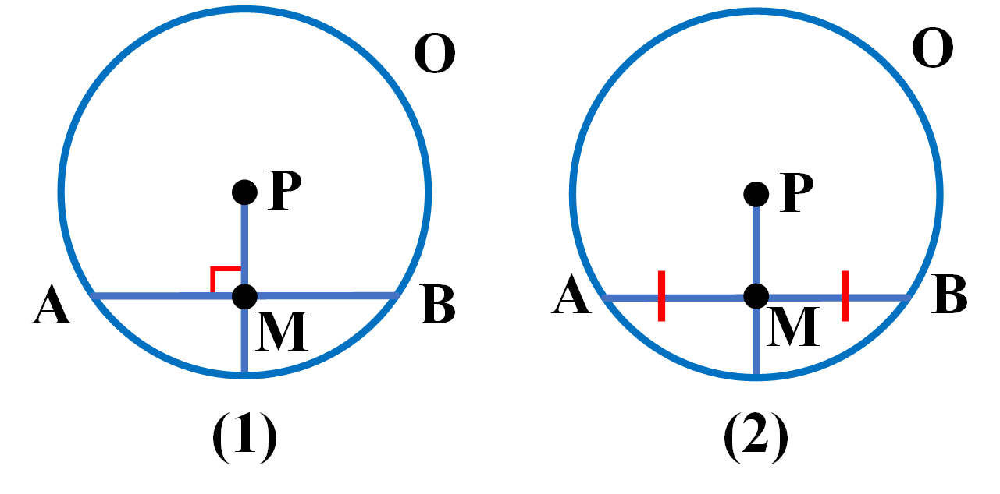

    # branch 1
    premise: Cocircular(O,AB)&Collinear(AMB)&IsCentreOfCircle(P,O)&Equal(MeasureOfAngle(AMP),90)
    conclusion: IsPerpendicularBisectorOfLine(PM,AB)
    # branch 2
    premise: Cocircular(O,AB)&Collinear(AMB)&IsCentreOfCircle(P,O)&Equal(LengthOfLine(AM),LengthOfLine(MB))
    conclusion: IsPerpendicularBisectorOfLine(PM,AB)
**Notes**:  
1.弦中点和圆心的连线是弦的垂直平分线（垂径定理）  

### circle_property_chord_perpendicular_bisect_arc(OAB,PMD)

    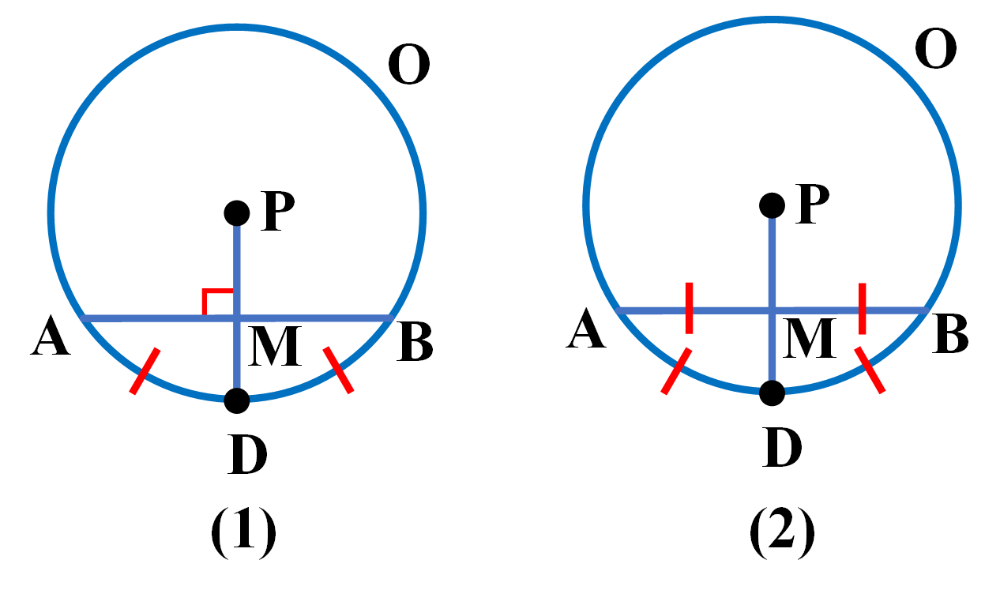

    # branch 1
    premise: Arc(OAB)&Cocircular(O,ADB)&Collinear(AMB)&Collinear(PMD)&IsCentreOfCircle(P,O)&Equal(MeasureOfAngle(AMO),90)
    conclusion: Equal(LengthOfArc(OAD),LengthOfArc(ODB))
    # branch 2
    premise: Arc(OAB)&Cocircular(O,ADB)&Collinear(AMB)&Collinear(PMD)&IsCentreOfCircle(P,O)&Equal(LengthOfLine(AM),LengthOfLine(MB))
    conclusion: Equal(LengthOfArc(OAD),LengthOfArc(ODB))
**Notes**:  
1.圆心过弦中点与弦所对的弧的交点平分弧  

### circle_property_angle_of_osculation(OAB,P)

    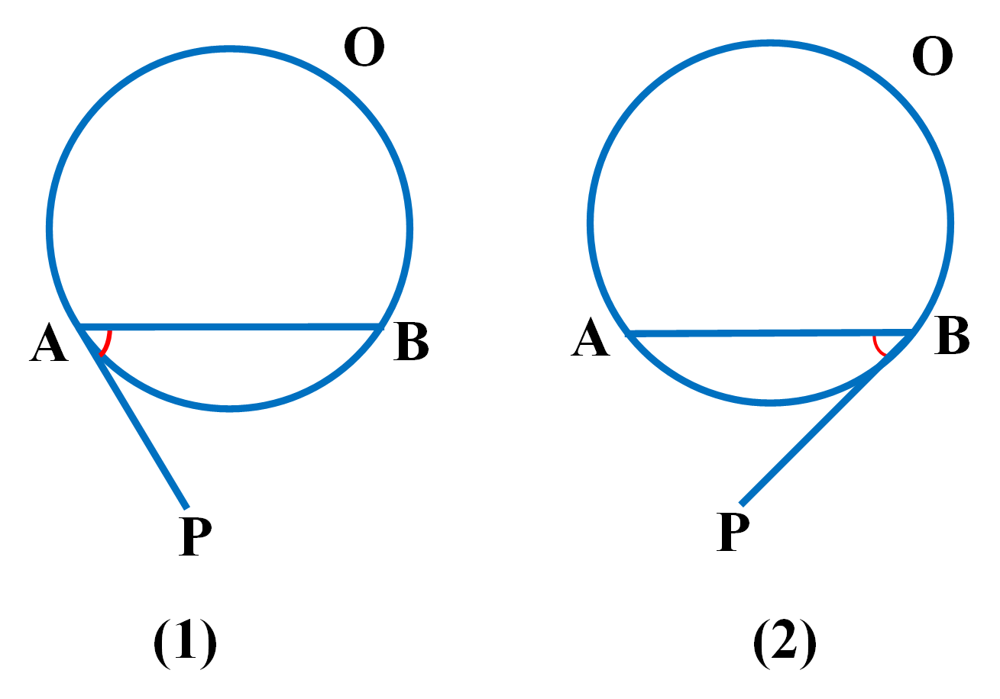

    # branch 1
    premise: Arc(OAB)&Angle(BAP)&IsTangentOfCircle(PA,O)
    conclusion: Equal(MeasureOfAngle(BAP),Mul(MeasureOfArc(OAB),1/2))
    # branch 2
    premise: Arc(OAB)&Angle(PBA)&IsTangentOfCircle(PB,O)
    conclusion: Equal(MeasureOfAngle(PBA),Mul(MeasureOfArc(OAB),1/2))
**Notes**:  
1.弦切角定理：弦切角的度数等于它所夹的弧的圆心角度数的一半  

### circle_perimeter_formula(O)

    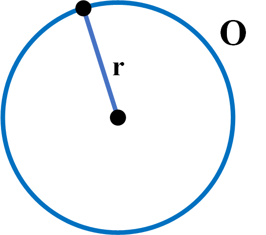

    premise: Circle(O)
    conclusion: Equal(PerimeterOfCircle(O),Mul(2*π,RadiusOfCircle(O)))
**Notes**:  
1.圆的周长公式：P=2*pi*r  

### circle_area_formula(O)

    

    premise: Circle(O)
    conclusion: Equal(AreaOfCircle(O),Mul(π,RadiusOfCircle(O),RadiusOfCircle(O)))
**Notes**:  
1.圆的面积公式：S=pi*r*r  

### radius_of_circle_property_length_equal(PA,O)

    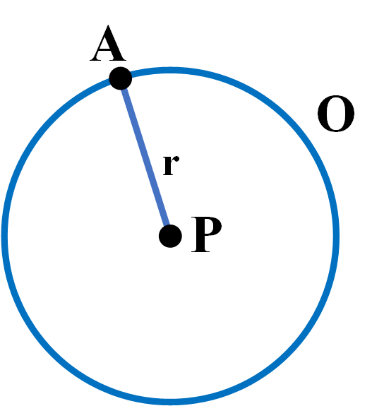

    premise: Cocircular(O,A)&Line(PA)&IsCentreOfCircle(P,O)
    conclusion: Equal(LengthOfLine(PA),RadiusOfCircle(O))
**Notes**:  
1.圆的所有半径长度相等  

### diameter_of_circle_judgment_pass_centre(APB,O)

    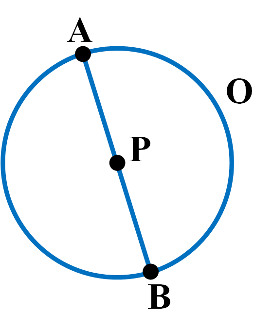

    premise: Cocircular(O,AB)&Collinear(APB)&IsCentreOfCircle(P,O)
    conclusion: IsDiameterOfCircle(AB,O)
**Notes**:  
1.圆的直径的判定：过圆心且两端在圆上的直线  

### diameter_of_circle_judgment_length_equal(AB,O)

    

    premise: Cocircular(O,AB)&Equal(DiameterOfCircle(O),LengthOfLine(AB))
    conclusion: IsDiameterOfCircle(AB,O)
**Notes**:  
1.圆的直径的判定：两端在圆上且长度与圆直径相等的直线  

### diameter_of_circle_judgment_right_angle(BCA,O)

    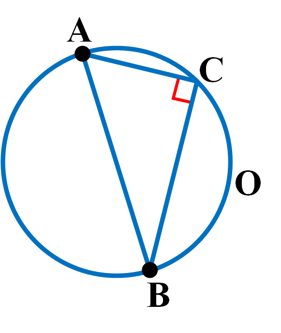

    premise: Cocircular(O,BCA)&Equal(MeasureOfAngle(BCA),90)
    conclusion: IsDiameterOfCircle(AB,O)
**Notes**:  
1.圆的直径的判定：两端在圆上且所对圆周角是直角  

### diameter_of_circle_property_length_equal(AB,O)

    

    premise: IsDiameterOfCircle(AB,O)
    conclusion: Equal(LengthOfLine(AB),DiameterOfCircle(O))
**Notes**:  
1.圆的所有直径长度相等  

### diameter_of_circle_property_right_angle(BCA,O)

    

    premise: IsDiameterOfCircle(AB,O)&Cocircular(O,BCA)&Angle(BCA)
    conclusion: PerpendicularBetweenLine(BC,AC)
**Notes**:  
1.直径所对的圆周角是直角  

### tangent_of_circle_judgment_perpendicular(PA,O,Q)

    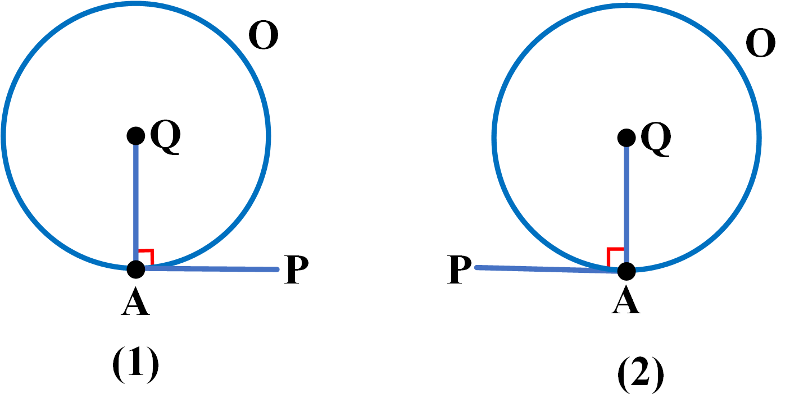

    # branch 1
    premise: Cocircular(O,A)&IsCentreOfCircle(Q,O)&Angle(QAP)&Equal(MeasureOfAngle(QAP),90)
    conclusion: IsTangentOfCircle(PA,O)
    # branch 2
    premise: Cocircular(O,A)&IsCentreOfCircle(Q,O)&Angle(PAQ)&Equal(MeasureOfAngle(PAQ),90)
    conclusion: IsTangentOfCircle(PA,O)
**Notes**:  
1.圆切线的判定：垂直  

### tangent_of_circle_property_perpendicular(PA,O,Q)

    

    # branch 1
    premise: IsTangentOfCircle(PA,O)&Angle(QAP)&IsCentreOfCircle(Q,O)
    conclusion: PerpendicularBetweenLine(QA,PA)
    # branch 2
    premise: IsTangentOfCircle(PA,O)&Angle(PAQ)&IsCentreOfCircle(Q,O)
    conclusion: PerpendicularBetweenLine(PA,QA)
**Notes**:  
1.圆切线的性质：垂直  

### tangent_of_circle_property_length_equal(PA,PB,O)

    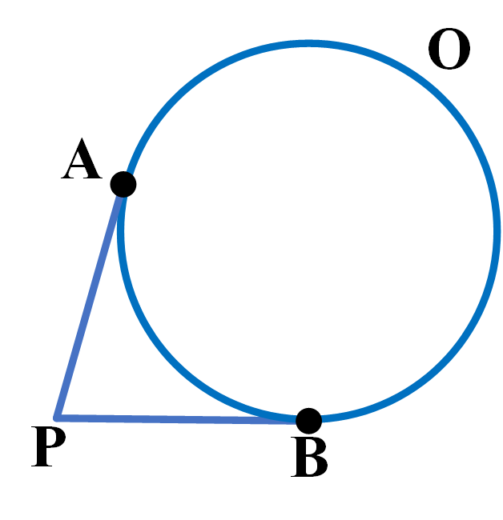

    premise: IsTangentOfCircle(PA,O)&IsTangentOfCircle(PB,O)
    conclusion: Equal(LengthOfLine(PA),LengthOfLine(PB))
**Notes**:  
1.圆切线的性质：圆外一点到圆的两条切线长度相等  

### sector_perimeter_formula(OAB)

    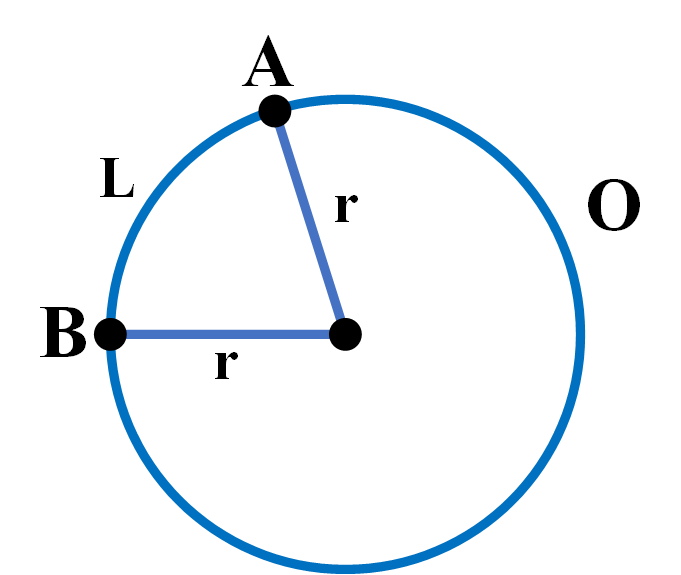

    premise: Arc(OAB)
    conclusion: Equal(PerimeterOfSector(OAB),Add(RadiusOfCircle(O),RadiusOfCircle(O),LengthOfArc(OAB)))
**Notes**:  
1.扇形周长公式：P=2*r+L  

### sector_area_formula(OAB)

    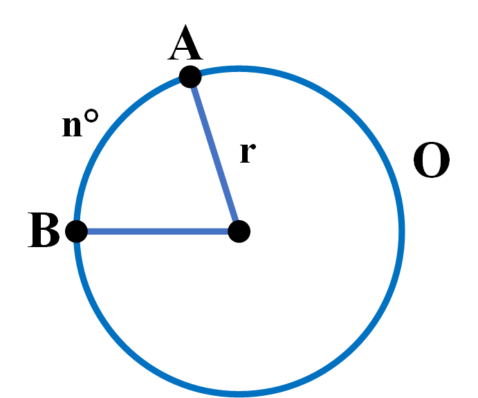

    premise: Arc(OAB)
    conclusion: Equal(AreaOfSector(OAB),Mul(MeasureOfArc(OAB),1/360*π,RadiusOfCircle(O),RadiusOfCircle(O)))
**Notes**:  
1.扇形面积公式：S=n/360*pi*r*r  

### perpendicular_bisector_judgment_per_and_bisect(AD,BC)

    

    premise: IsBisectorOfAngle(AD,CAB)&Collinear(BDC)&Equal(LengthOfLine(BD),LengthOfLine(DC))
    conclusion: IsPerpendicularBisectorOfLine(AD,BC)
**Notes**:  
1.垂直平分线判定：AD是角平分线且BD=DC  

### leva(ABC,DEF,O)

    

    premise: Polygon(ABC)&Collinear(ADB)&Collinear(BEC)&Collinear(CFA)&Collinear(AOE)&Collinear(BOF)&Collinear(COD)
    conclusion: Equal(Mul(LengthOfLine(AD),LengthOfLine(BE),LengthOfLine(CF)),Mul(LengthOfLine(DB),LengthOfLine(EC),LengthOfLine(FA)))
**Notes**:  
1.塞瓦定理  

